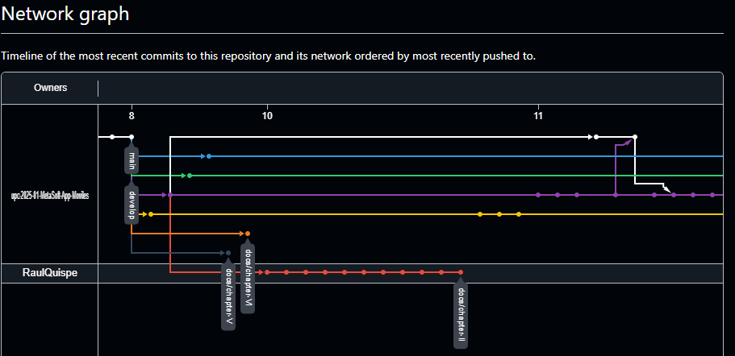
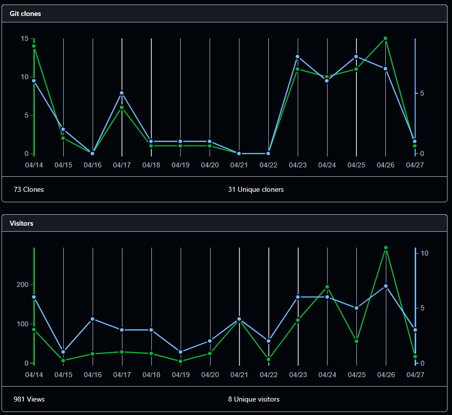
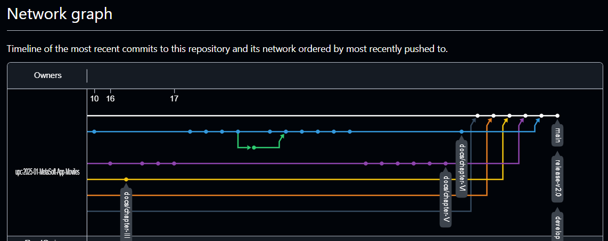
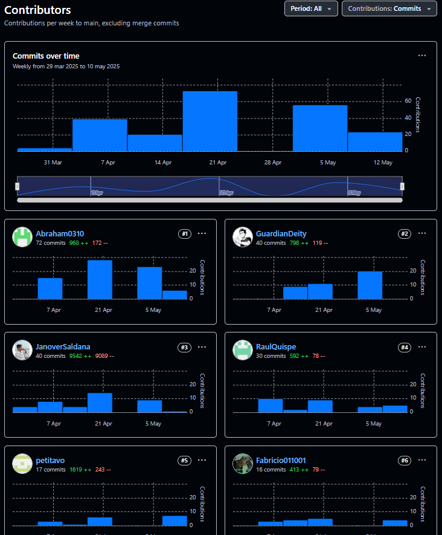
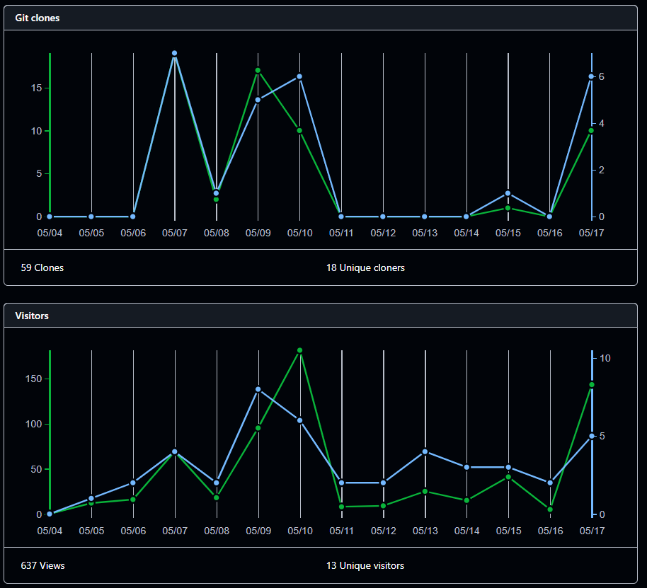
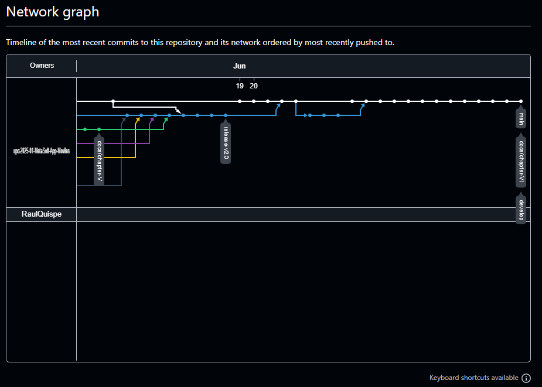
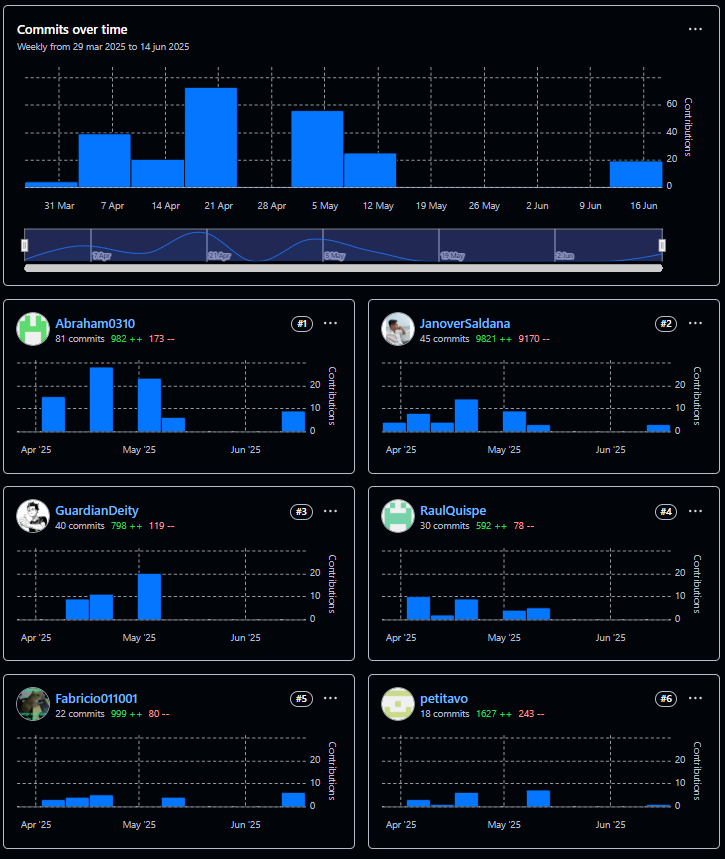
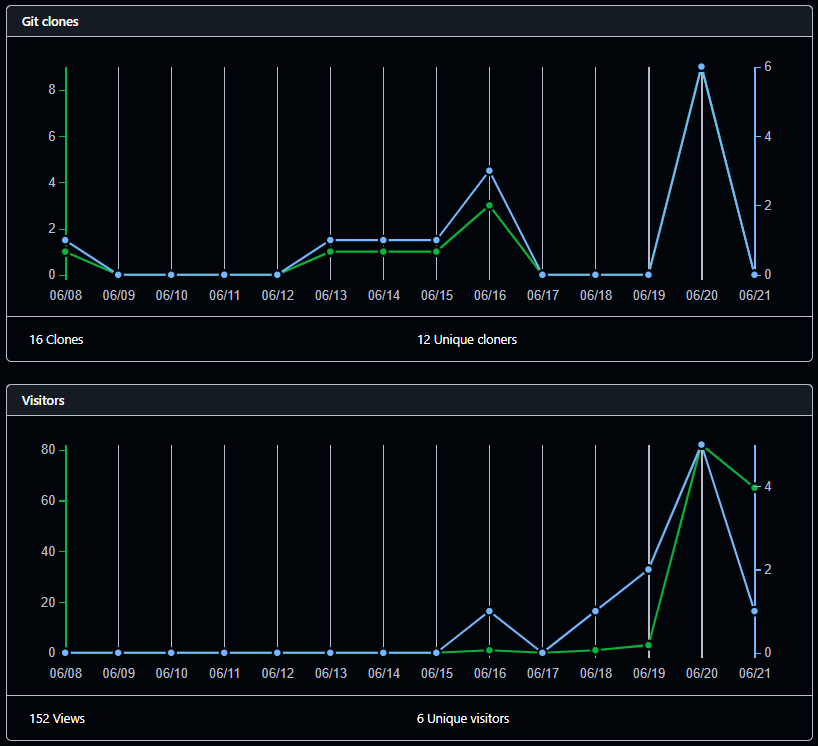

# Universidad Peruana De Ciencias Aplicadas
## 1ACC0238 - Aplicaciones para Dispositivos Móviles - Ingeniería de Software

 </img> 

# "Informe de Trabajo Final"
## Docente: Jorge Luis Mayta Guillermo
## Startup: MetaSoft
## Producto: ElixirControl

 

## Relación de integrantes:

* **Janover Gonzalo Saldaña Vela        U20201B510**
* **Gustavo Esau Huanca Navarro         U202215285**
* **Abraham Andres Estrada Cajamune     U202112164**
* **Raúl Ronaldo Quispe Erasmo          U20211B682**
* **Fernando Jesus Lizano Coll Cardenas U202214522**
* **Fabricio Apaza Morales              U201922146**

### 2025 - 01

---

## Registro de Versiones del Informe

<table>
<!-- =============================================================== -->
<thead>
    <tr>
        <th>Versión</th>
        <th>Fecha</th>
        <th>Responsable</th>
        <th>Descripción de modificación</th>
    </tr>
</thead>
<!-- =============================================================== -->
<tbody>
    <!-- ========================= FILA 01 ========================= -->
    <tr>
        <td>1.0</td>
        <td>2025-01-01</td>
        <td>
            Janover Gonzalo Saldaña Vela        
            Gustavo Esau Huanca Navarro            
            Abraham Andres Estrada Cajamune        
            Raúl Ronaldo Quispe Erasmo             
            Fernando Jesus Lizano Coll Cardenas     
            Fabricio Apaza Morales                 
        </td>
        <td> Presentable TB1 </td>
    </tr>
</table>

---

## Project Report Collaboration Insights

**URL del repositorio del reporte del proyecto:** https://github.com/upc-2025-01-MetaSoft-App-Moviles/upc-pre-202501-cc238-2510-MetaSoft-report

Github Collaboration Insights proporciona un cronograma que muestra las principales ramas y los procesos de fusión que han ocurrido. Todas las ramas se han generado siguiendo los principios de GitFlow, lo que garantiza una organización efectiva al utilizar un sistema de control de versiones.

* Janover Gonzalo Saldaña Vela        (JanoverSaldana)
* Gustavo Esau Huanca Navarro         (petitavo)
* Abraham Andres Estrada Cajamune     (Abraham0310)
* Raúl Ronaldo Quispe Erasmo          (R)
* Fernando Jesus Lizano Coll Cardenas (GuardianDeity)
* Fabricio Apaza Morales              (Fabricio011001)

El repositorio se estructuró de la siguiente manera para mejorar la colaboración y la organización del proyecto:

* main
* develop
* docs/chapter-I
* docs/chapter-II
* docs/chapter-III
* docs/chapter-IV
* docs/chapter-V
* docs/chapter-VI
* release-1.0

### Entregable TB1

A continuación, se presentan los gráficos de colaboración de los integrantes del equipo en el repositorio de nuestro primer sprint. Estos gráficos ofrecen una representación visual de la cantidad de contribuciones realizadas por cada miembro del equipo, junto con la fecha en que se llevaron a cabo. Además, se presenta información sobre la cantidad de líneas de código que se han modificado en cada uno de los commits.

**Gráficos de colaboración de los integrantes del equipo**

---

### Entregable TP

A continuación, se presentan los gráficos de colaboración de los integrantes del equipo en el repositorio de nuestro segundo sprint. Estos gráficos ofrecen una representación visual de la cantidad de contribuciones realizadas por cada miembro del equipo, junto con la fecha en que se llevaron a cabo. Además, se presenta información sobre la cantidad de líneas de código que se han modificado en cada uno de los commits.

**Gráficos de colaboración de los integrantes del equipo**

---

### Entregable TB2

A continuación, se presentan los gráficos de colaboración de los integrantes del equipo en el repositorio de nuestro tercer sprint. Estos gráficos ofrecen una representación visual de la cantidad de contribuciones realizadas por cada miembro del equipo, junto con la fecha en que se llevaron a cabo. Además, se presenta información sobre la cantidad de líneas de código que se han modificado en cada uno de los commits.

### Entregable Final

A continuación, se presentan los gráficos de colaboración de los integrantes del equipo en el repositorio de nuestro cuarto sprint. Estos gráficos ofrecen una representación visual de la cantidad de contribuciones realizadas por cada miembro del equipo, junto con la fecha en que se llevaron a cabo. Además, se presenta información sobre la cantidad de líneas de código que se han modificado en cada uno de los commits.

## Contenido

# [Capítulo I: Presentación]()
## [1.1. Startup Profile]()
### [1.1.1. Descripción de la Startup]()
### [1.1.2. Perfiles de integrantes del equipo]()
## [1.2. Solution Profile]()
### [1.2.1. Antecedentes y problemática]()
### [1.2.2. Lean UX Process]()
#### [1.2.2.1. Lean UX Problem Statements]()
#### [1.2.2.2. Lean UX Assumptions]()
#### [1.2.2.3. Lean UX Hypothesis Statements]()
#### [1.2.2.4. Lean UX Canvas]()
## [1.3. Segmentos objetivos]()
# [Capítulo II: Requirements Elicitation & Analysis]()
## [2.1. Competidores]()
### [2.1.1. Análisis competitivo]()
### [2.1.2. Estrategias y tácticas frente a competidores]()
## [2.2. Entrevistas]()
### [2.2.1. Diseño de entrevistas]()
### [2.2.2. Registro de entrevistas]()
### [2.2.3. Análisis de entrevistas]()
## [2.3. Needfinding]()
### [2.3.1. User Persons]()
### [2.3.2. User Task Matrix]()
### [2.3.3. User Journey Mapping]()
### [2.3.4. Empathy Mapping]()
### [2.3.5. As-is Scenario Mapping]()
## [2.4. Ubiquitous Language]()
# [Capítulo III: Requirements specification]()
## [3.1. To-Be Scenario Mapping.]()
## [3.2. User Stories.]()
## [3.3. Impact Mapping.]()
## [3.4. Product Backlog.]()
# [Capítulo IV: Solution Software Design]()
## [4.1. Strategic-Level Domain-Driven Design]()
### [4.1.1. EventStorming]()
#### [4.1.1.1. Candidate Context Discovery]()
#### [4.1.1.2. Domain Message Flows Modeling]()
#### [4.1.1.3. Bounded Context Canvases]()
### [4.1.2. Context Mapping]()
### [4.1.3. Software Architecture]()
#### [4.1.3.1. Software Architecture Context Level Diagrams]()
#### [4.1.3.2. Software Architecture Container Level Diagrams]()
#### [4.1.3.3. Software Architecture Deployment Diagrams]()
## [4.2. Tactical-Level Domain-Driven Design]()
### [4.2.1.  Bounded Context: <Bounded Context Name>]()
#### [4.2.1.1. Domain Layer]()
#### [4.2.1.2. Interface Layer]()
#### [4.2.1.3. Application Layer]()
#### [4.2.1.4. Infrastructure Layer]()
#### [4.2.1.5. Bounded Context Software Architecture Component Level Diagrams]()
#### [4.2.1.6. Bounded Context Software Architecture Code Level Diagrams]()
#### [4.2.1.6.1. Bounded Context Domain Layer Class Diagrams]()
#### [4.2.1.6.2. Bounded Context Database Design Diagram]()
# [Capítulo V: Solution UI/UX Design]()
## [5.1. Product design]()
### [5.1.1. Style Guidelines]()
#### [5.1.1.1. General Style Guidelines]()
### [5.1.2. Information Architecture]()
#### [5.1.2.1. Organization Systems]()
#### [5.1.2.2. Labelling Systems]()
#### [5.1.2.3. SEO Tags and Meta Tags]()
#### [5.1.2.4. Searching Systems]()
#### [5.1.2.5. Navigation Systems]()
### [5.1.3. Landing Page UI Design]()
#### [5.1.3.1. Landing Page Wireframe]()
#### [5.1.3.2. Landing Page Mock-up]()
### [5.1.4. Mobile Applications UX/UI Design]()
#### [5.1.4.1. Mobile Applications Wireframes]()
#### [5.1.4.2. Mobile Applications Wireflow Diagrams]()
#### [5.1.4.3. Mobile Applications Mock-ups]()
#### [5.1.4.4. Mobile Applications User Flow Diagrams]()
#### [5.1.4.5. Mobile Applications Prototyping]()
# [Capítulo VI: Product Implementation, Validation & Deployment]()
## [6.1. Software Configuration Management]()
### [6.1.1. Software Development Environment Configuration]()
### [6.1.2. Source Code Management]()
### [6.1.3. Source Code Style Guide & Conventions]()
### [6.1.4. Software Deployment Configuration]()
## [6.2. Landing Page & Mobile Application Implementation]()
### [6.2.1. Sprint 1]()
#### [6.2.1.1. Sprint Planning 1]()
#### [6.2.1.2. Sprint Backlog 1]()
#### [6.2.1.3. Development Evidence for Sprint Review]()
#### [6.2.1.4. Testing Suite Evidence for Sprint Review]()
#### [6.2.1.5. Execution Evidence for Sprint Review]()
#### [6.2.1.6. Services Documentation Evidence for Sprint Review]()
#### [6.2.1.7. Software Deployment Evidence for Sprint Review]()
#### [6.2.1.8. Team Collaboration Insights during Sprint]()
## [6.3. Validation Interviews]()
### [6.3.1. Diseño de Entrevistas]()
### [6.3.2. Registro de Entrevistas]()
### [6.3.3. Evaluaciones según heurísticas]()
## [6.4. Video About-the-Product]()
# [Conclusiones y recomendaciones]()
# [Video About-the-team]()
# [Bibliografía]()
# [Anexos]()

---

# Student Outcome

<table>
<!-- =============================================================== -->
<thead>
    <tr>
        <th>Criterio Específico</th>
        <th>Acciones Realizadas</th>
        <th>Conclusiones</th>
    </tr>
</thead>
<!-- =============================================================== -->
<tbody>
    <!-- ========================= FILA 01 ========================= -->
    <tr>
        <td>    
            Actualiza conceptos y conocimientos necesarios para su desarrollo profesional y en especial para su 
            proyecto en soluciones de software.
        </td>
        <!-- ============================================================ -->
        <!-- ============================================================ -->
        <!-- ============================================================ -->
        <td>
            <!-- ||||||||||||||||||||||||||||||||||||||||||||||||||||||| !-->
            <strong> ENTREGABLES </strong>   
            <!-- ||||||||||||||||||||||||||||||||||||||||||||||||||||||| !-->
            <!-- ==================== ESTUDIANTE 01 ==================== !-->
            <strong> Janover Gonzalo Saldaña Vela - TB1 </strong> 
            utilicé técnicas avanzadas como EventStorming y Context Mapping, lo que me permitió comprender profundamente el dominio del proyecto. A través de la creación de diagramas arquitectónicos a nivel de contexto, contenedor y despliegue, y al trabajar en Bounded Contexts y sus respectivas capas, actualicé mis conocimientos sobre cómo estructurar soluciones de software robustas y escalables, alineadas con las mejores prácticas del sector.   
            <strong> Janover Gonzalo Saldaña Vela - TP </strong> 
            Fui responsable de la estructuración del bounded context de "WineBatch", definiendo su modelo de dominio 
como agregado raíz y asegurando una separación clara de responsabilidades en cada capa de la arquitectura limpia. También desarrollé vistas en Jetpack Compose y coordiné la interacción entre frontend y backend mediante un enfoque orientado al dominio, lo cual requirió actualización constante de conocimientos y análisis de buenas prácticas de integración.   
            <strong> Janover Gonzalo Saldaña Vela - TB2 </strong> 
En este sprint profundicé en la integración de funcionalidades clave en la app móvil utilizando Jetpack Compose, reutilizando formularios para creación y edición de lotes de vino. Mejoré la navegación entre vistas y coordiné la interacción con el backend mediante patrones orientados al dominio. Además, estructuré y documenté historias de usuario detalladas para cubrir procesos como la visualización, filtrado, búsqueda y gestión de etapas e historial de producción, lo cual fortaleció mi capacidad de análisis funcional y técnico del sistema.  
            <strong> Janover Gonzalo Saldaña Vela - TF </strong> 
Durante el trabajo final, consolidé y apliqué conocimientos adquiridos previamente en arquitectura de software, desarrollo móvil y diseño UI/UX. Me enfoqué en mejorar componentes ya implementados, optimizar la navegación, y estructurar correctamente las interacciones entre las etapas del proceso de vinificación. Además, me actualicé en patrones de diseño multiplataforma y profundicé en las convenciones de Jetpack Compose y Flutter para asegurar una experiencia fluida, técnica y funcionalmente robusta.  
<!-- +++++++++++++++++++++++++++++++++++++++++++++++++++++++ !-->
            <!-- ==================== ESTUDIANTE 02 ==================== !-->
            <strong>  Apaza Morales, Fabricio - TB1 </strong> 
            Desarrollé el perfil inicial del startup, la problemática y el Lean UX Problem Statement, aplicando conceptos de lean startup y diseño centrado en el usuario. A su vez, algunas user stories  lo que me ayudó a mejorar en redacción de requisitos y en el uso de tecnologías para la plataforma.              
            <strong>  Apaza Morales, Fabricio - TP </strong> 
            Avancé con el bounded context de Production History, implementando su lógica principal tanto en el 
backend como en la aplicación móvil. También elaboré parte del ppt para comunicar el avance del proyecto y diseñé en Figma las interfaces relacionadas, asegurando consistencia visual y una experiencia de usuario clara.   
             <strong> Apaza Morales, Fabricio - TB2 </strong> 
TB2: En este sprint trabajé primero en la implementación de la app mobile en Kotlin, y luego avancé una versión inicial en Flutter. También hice modificaciones al backend del BC Production History, y ayudé a armar parte del PPT incluido con el reporte del Sprint 2. Con todo esto, estoy aplicando mis conocimientos para diseñar e implementar soluciones reales, alineándome con los resultados de aprendizaje del curso.  
            <!-- +++++++++++++++++++++++++++++++++++++++++++++++++++++++ !-->
            <!-- ==================== ESTUDIANTE 03 ==================== !-->
            <strong> Lizano Coll Cardenas, Fernando Jesus - TB1 </strong> 
            Durante el desarrollo del proyecto, he actualizado y reforzado conceptos esenciales relacionados con el análisis de segmentos objetivos, definición de assumptions y outcomes, así como otras características clave para la creación de soluciones de software. Esta actualización de conocimientos me ha permitido comprender mejor las necesidades de los usuarios y transformar esos requerimientos en elemento he logrado integrar buenas prácticas de gestión ágil, fortaleciendo así mi preparación profesional y aportando valor al desarrollo del proyecto.   
            <strong> Lizano Coll Cardenas, Fernando Jesus - TP </strong> 
            Durante el desarrollo del proyecto, actualicé y apliqué diversos conocimientos relacionados con diseño 
de interfaces, estructuración web y arquitectura de software. Me encargué de la elaboración de la estructura de la landing page, desarrollando tanto los wireframes como los mockups y su implementación en HTML. Además, participé activamente en la redacción del capítulo 5 del proyecto, lo cual me permitió profundizar en los aspectos técnicos y metodológicos de nuestra solución de software.   
            <!-- +++++++++++++++++++++++++++++++++++++++++++++++++++++++ !-->
            <!-- ==================== ESTUDIANTE 04 ==================== !-->
            <strong> Quispe Erasmo, Raúl Ronaldo - TB1 </strong> 
            Se llevó a cabo un análisis exhaustivo de todas las etapas del proyecto, con el propósito de identificar áreas críticas de mejora y resolver posibles inconvenientes. Este proceso permitió fortalecer los puntos clave del trabajo, asegurando una entrega final de alta calidad. Gracias a estas mejoras, el proyecto no solo fue más eficiente, sino que también incrementó sus posibilidades de obtener una excelente calificación al cumplir con los estándares de calidad esperados.   
            <strong> Quispe Erasmo, Raúl Ronaldo - TP </strong> 
            Yo me encargué de la parte de "Testimonios" en la landing page, armando la sección donde los usuarios 
pueden dejar sus opiniones y valoraciones. También trabajé en el backend, específicamente en el bounded context de "Planificación y Ejecución de Actividades Agrícolas", donde definí las entidades y lógica para poder crear, asignar y seguir actividades agrícolas. Además, hice los mockups de cómo se vería esta parte en la app móvil, con pantallas para ver las tareas, marcarlas como completadas, y ver el progreso. Por último, ayudé al grupo con la presentación en PowerPoint, organizando el contenido y dándole forma para explicar bien lo que hicimos.   
            <strong>  Raúl Ronaldo Quispe Erasmo -TB2 </strong> 
En este sprint trabajé primero en el backend, luego hice una versión más avanzada de la app en Kotlin. También realicé cambios en el backend de BC Planning-activities y desarrollé una versión básica de la app en Flutter. Con todo esto he ido actualizando los conocimientos que necesito para seguir mejorando como profesional y avanzar en el desarrollo de soluciones de software.  
            <!-- +++++++++++++++++++++++++++++++++++++++++++++++++++++++ !-->
            <!-- ==================== ESTUDIANTE 05 ==================== !-->
            <strong> Huanca Navarro, Gustavo Esau - TB1 </strong> 
            Durante el desarrollo del primer entregable, consolidé y apliqué conocimientos en diseño de bases de datos, modelado de procesos y estructuración de arquitecturas de software, enfocándome en garantizar una solución robusta y escalable para el proyecto. Esta experiencia me permitió fortalecer mis habilidades en diseño técnico y aplicar mejores prácticas de organización modular, contribuyendo de manera significativa a la calidad y sostenibilidad de la plataforma desarrollada.   
            <strong> Huanca Navarro, Gustavo Esau - TP </strong> 
            Durante el desarrollo del módulo Field Log Lookbook, identifiqué la necesidad de profundizar en 
conceptos relacionados con Domain-Driven Design (DDD), la gestión eficiente de estados en interfaces móviles y la aplicación de buenas prácticas en UI/UX. Esta experiencia reafirmó la importancia del aprendizaje continuo para mejorar mi desempeño profesional y desarrollar soluciones de software más sólidas y alineadas con los objetivos del proyecto.   
            <strong> Huanca Navarro, Gustavo Esau - TB2: </strong> 
En este sprint desarrollé el módulo de bitácora en la aplicación móvil utilizando Kotlin y Jetpack Compose. Implementé el formulario de registro, la visualización del historial y la integración con servicios externos para la carga de imágenes. Además, documenté evidencias de ejecución en el reporte. Esta experiencia me permitió actualizar mis conocimientos en desarrollo móvil, reforzar el uso de buenas prácticas y mejorar la organización del proyecto en Android Studio, aportando de manera efectiva al avance del proyecto.   
            <!-- +++++++++++++++++++++++++++++++++++++++++++++++++++++++ !-->
            <!-- ==================== ESTUDIANTE 06 ==================== !-->
            <strong> Estrada Cajamune, Abraham Andres - TB1 </strong> 
            Mediante un trabajo de investigación, recopilando, analizando las necesidades de los segmentos objetivos, me enfoqué en la realización del NeedFinding para estructurar requisitos clave. Además de lo User Stories para poder satisfacer las necesidades del usuario final, se enfocó en en endpoints RESTful para la gestión técnica del sistema.   
            <strong> Estrada Cajamune, Abraham Andres - TP </strong> 
            Fui encargado de la implementación de la seccion “Contact US” del Landing Page del proyecto, fabricando 
la seccion para que los usuarios puedan, en caso de duda, consulta, sugerencia y/o reclamo, puedan contactarse con alguno del equipo desarrollador. Tambien fui responsable de la creación e implementación tanto Mobile Application como Backend del bounded context  Gestión de Trabajadores de Campo, dicho desarrollo me ayudo a comprender más los flujos internos que pueda tener el proyecto.   
            Abraham Andres Estrada Cajamune - TB2: 
Durante este sprint, desarrollé las funcionalidades de CRUD con validaciones, agrupación visual por rol, filtros por fecha y alertas por vencimiento de contratos. También integré diálogos, navegación y manejo de estado usando buenas prácticas. Esta implementación me permitió actualizar mis conocimientos en desarrollo móvil moderno, diseño de interfaces dinámicas y arquitectura de navegación en Compose  
<!-- +++++++++++++++++++++++++++++++++++++++++++++++++++++++ !-->
        </td>
        <!-- ============================================================ -->
        <!-- ============================================================ -->
        <!-- ============================================================ -->
        <td>
            A lo largo del proceso, se actualizó y profundizó en conceptos clave relacionados con el desarrollo de software, especialmente en Domain-Driven Design (DDD), EventStorming, y la arquitectura de software. Estas metodologías y herramientas resultaron fundamentales para estructurar de manera efectiva el diseño de la solución, garantizando que los requisitos del negocio se alinearan adecuadamente con la arquitectura técnica. Este enfoque contribuyó significativamente a la creación de una solución robusta, escalable y bien fundamentada, mejorando así la calidad y efectividad del software desarrollado.  
            La constante actualización de conceptos técnicos y metodológicos me permitió afrontar con mayor 
solvencia los retos del proyecto, desarrollando una solución robusta, modular y mantenible. Además, afianzó mis 
bases en el desarrollo profesional de soluciones de software alineadas con las tendencias actuales de la industria.
   Como equipo, reconocemos que la actualización constante de conocimientos ha sido clave para el 
desarrollo exitoso de nuestro proyecto. Aplicamos conceptos avanzados como Domain-Driven Design, arquitectura limpia,
desarrollo móvil con Jetpack Compose y buenas prácticas de diseño UI/UX. Esta actualización nos permitió estructurar 
soluciones robustas, bien organizadas y alineadas con estándares profesionales. Coincidimos en que mantenernos 
técnicamente actualizados nos permite responder con mayor eficacia a los retos de proyectos reales.  
Durante el desarrollo del proyecto, la actualización de conceptos fue clave para abordar los desafíos técnicos con 
solvencia y claridad. La aplicación de prácticas modernas como DDD, arquitectura limpia y el uso de frameworks 
móviles actuales permitió construir una solución profesional y escalable. Esta mejora constante de conocimientos nos 
preparó no solo para completar con éxito cada sprint, sino también para enfrentar futuros proyectos con mayor 
capacidad de análisis y ejecución técnica.  
        </td>
    </tr>
    <!-- =========================================================== -->
    <!-- ========================= FILA 02 ========================= -->
    <!-- ============================================================ -->
    <tr>
        <!-- ============================================================ -->
        <td>    
            Reconoce la necesidad del aprendizaje permanente para el desempeño profesional y el desarrollo de 
            proyectos en soluciones de software.
        </td>
        <!-- ============================================================ -->
        <!-- ============================================================ -->
        <!-- ============================================================ -->
        <td>
            <!-- ||||||||||||||||||||||||||||||||||||||||||||||||||||||| !-->
            <strong> ENTREGABLES </strong>   
            <!-- ||||||||||||||||||||||||||||||||||||||||||||||||||||||| !-->
            <!-- ==================== ESTUDIANTE 01 ==================== !-->
            <strong> Janover Gonzalo Saldaña Vela - TB1 </strong> 
            Durante este proceso de diseño arquitectónico y la implementación de Domain-Driven Design táctico, reconozco lo crucial que es el aprendizaje continuo para mejorar mis habilidades y competencias en el desarrollo de soluciones de software. Al trabajar en diagramas de clases y diseño de bases de datos, me di cuenta de que la evolución constante del conocimiento en metodologías de diseño y arquitectura es esencial para mantenerme competitivo y aplicar las mejores prácticas en mis proyectos de software.   
            <strong> Janover Gonzalo Saldaña Vela - TP </strong> 
            El desarrollo de funcionalidades como el listado, creación y asignación de etapas en los lotes de vino implicó investigar constantemente sobre el ciclo completo del vino y su modelado técnico en software. Asimismo, adapté buenas prácticas para comunicarme de manera eficaz con APIs externas, enfocándome en una correcta separación de capas y un código desacoplado.
            <strong> Janover Gonzalo Saldaña Vela – TB2 </strong> 
Durante este sprint enfrenté desafíos al reutilizar formularios en Jetpack Compose y coordinar la navegación con la 
lógica de backend. Esto me llevó a explorar nuevas prácticas de manejo de estado y arquitectura móvil, lo que 
reforzó la importancia del aprendizaje continuo para mejorar mis habilidades y desarrollar soluciones más sólidas y 
profesionales.   
            <strong> Janover Gonzalo Saldaña Vela – TF </strong> 
Durante el desarrollo del trabajo final, reafirmé la importancia del aprendizaje constante al enfrentar nuevos retos 
técnicos, especialmente al coordinar y desarrollar componentes multiplataforma con Flutter y Jetpack Compose. 
Aprendí a optimizar formularios reutilizables, mejorar la navegación entre vistas y conectar correctamente con el 
backend, lo que exigió revisar documentación oficial, explorar nuevas bibliotecas y aplicar buenas prácticas de 
arquitectura móvil.  
            <!-- +++++++++++++++++++++++++++++++++++++++++++++++++++++++ !-->
            <!-- ==================== ESTUDIANTE 02 ==================== !-->
            <strong> Apaza Morales, Fabricio - TB1 </strong> 
            Me enfoqué en crear el perfil del startup, definir la problemática y trabajar en el Lean UX Problem Statement, lo que me permitió aplicar lo aprendido sobre modelos de negocio y diseño centrado en el usuario. Además, desarrollé seis user stories y dos técnicas, lo que me ayudó a mejorar mis habilidades en la creación de requisitos y en la implementación de soluciones tecnológicas.   
            <strong> Apaza Morales, Fabricio - TP </strong> 
            Desarrollé el bounded context de Production History, incorporando su lógica central en el backend y en la app móvil. Además, trabajé en la presentación en PowerPoint para mostrar el progreso del proyecto y diseñé las interfaces correspondientes en Figma, manteniendo una coherencia visual y una experiencia de usuario intuitiva.   
            <strong> Fabricio Josue Apaza Morales - TB2: </strong> 
            En este sprint trabajé primero en la implementación de la app mobile en Kotlin, y luego avancé una versión inicial 
            en Flutter. También hice modificaciones al backend del BC Production History, y ayudé a armar parte del PPT incluido 
            con el reporte del Sprint 2. Con todo esto, estoy aplicando mis conocimientos para diseñar e implementar soluciones 
            reales, alineándome con los resultados de aprendizaje del curso.   
<!-- +++++++++++++++++++++++++++++++++++++++++++++++++++++++ !-->
            <!-- ==================== ESTUDIANTE 03 ==================== !-->
            <strong> Lizano Coll Cardenas, Fernando Jesus - TB1 </strong> 
            A través de mi participación en el análisis de segmentos objetivos, la identificación de assumptions y outcomes, y el apoyo en la creación de user stories, he reafirmado la importancia del aprendizaje permanente para mantenerme actualizado en un entorno de constante cambio tecnológico. Este proceso ha fortalecido mi compromiso con la mejora continua, entendiendo que el aprendizaje constante es fundamental para un desempeño profesional sólido y sostenible.   
            <strong> Lizano Coll Cardenas, Fernando Jesus - TP </strong> 
            Reconozco la importancia del aprendizaje permanente para mantenerme actualizado en el desarrollo profesional y en la construcción de soluciones de software de calidad. En este sentido, reforcé mis conocimientos en desarrollo móvil con Kotlin al implementar las vistas correspondientes al módulo de gestión de suministros, dentro de su respectivo bounded context. Asimismo, trabajé en parte del backend para este módulo, lo cual me llevó a investigar e incorporar buenas prácticas actuales en lógica de negocio y diseño de servicios.              
            <!-- +++++++++++++++++++++++++++++++++++++++++++++++++++++++ !-->
            <!-- ==================== ESTUDIANTE 04 ==================== !-->
            <strong> Quispe Erasmo, Raúl Ronaldo - TB1 </strong> 
            Basándome en los conocimientos adquiridos sobre la metodología Agile, implementé diversas prácticas dentro del proyecto, con el objetivo de optimizar tanto el flujo de trabajo como el rendimiento del equipo. Esta aplicación de Agile no solo buscaba fortalecer la comprensión de los conceptos vistos en el curso, sino también fomentar la toma de decisiones efectivas y alcanzar acuerdos que beneficiaran el desarrollo del proyecto.   
            <strong> Quispe Erasmo, Raúl Ronaldo - TP </strong> 
            Desarrollé la sección de Testimonios en la landing page y participé en el backend del bounded context de Planificación y Ejecución de Actividades Agrícolas, definiendo su lógica principal. También diseñé los mockups móviles para esta funcionalidad y colaboré en la presentación del grupo. Durante el proyecto, entendí la importancia del aprendizaje continuo para mejorar mis aportes y adaptarme a nuevos desafíos técnicos.              
            <strong> Raúl Ronaldo Quispe Erasmo - TB2: </strong> 
En este sprint primero trabajé en el backend, luego avancé una versión más completa de la app en Kotlin. También 
hice ajustes en el backend de BC Planning-activities y creé una versión básica en Flutter. Con estas tareas he ido 
aplicando lo que sé y dándome cuenta de que siempre necesito seguir aprendiendo para poder mejorar en lo profesional 
y hacer mejores proyectos de software.   
            <!-- +++++++++++++++++++++++++++++++++++++++++++++++++++++++ !-->
            <!-- ==================== ESTUDIANTE 05 ==================== !-->
            <strong> Huanca Navarro, Gustavo Esau - TB1 </strong> 
            Durante el desarrollo del proyecto, fortalecí mi capacidad de aprendizaje continuo al profundizar en el diseño de bases de datos, estructuración de arquitecturas de software y aplicación de buenas prácticas de desarrollo. Este proceso me permitió comprender la importancia de mantenerme en constante actualización tecnológica para enfrentar los desafíos de la industria y aportar soluciones de mayor calidad y eficiencia en proyectos de software.   
            <strong> Huanca Navarro, Gustavo Esau - TP </strong> 
            Durante el desarrollo del bounded context de Field Log Lookbook, identifiqué la necesidad de profundizar 
en conceptos técnicos y metodológicos, como la estructuración de microservicios, manejo eficiente de estados en interfaces móviles, y buenas prácticas en UI/UX. Esta experiencia reforzó mi compromiso con el aprendizaje continuo como eje fundamental para mejorar mi desempeño profesional y aportar soluciones sólidas e innovadoras en el ámbito del desarrollo de software   
            <strong> Gustavo Esau Huanca Navarro - TB2: </strong> 
Durante este sprint trabajé en la funcionalidad de bitácora móvil con Kotlin y Jetpack Compose, abordando desafíos 
como el manejo de formularios, subida de imágenes y navegación estructurada. En el proceso, identifiqué nuevas 
herramientas y patrones que antes no dominaba, lo cual me motivó a seguir aprendiendo. Esta experiencia me demuestra 
que el aprendizaje continuo es esencial para adaptarme a nuevas tecnologías y desarrollar soluciones más completas y 
profesionales.  
            <!-- +++++++++++++++++++++++++++++++++++++++++++++++++++++++ !-->
            <!-- ==================== ESTUDIANTE 06 ==================== !-->
            <strong> Estrada Cajamune, Abraham Andres - TB1 </strong> 
            He fortalecido mi capacidad de aprendizaje continuo, la profundización en metodologías agiles, mejoras en flujos de trabajo colaborativo, y una mayor adquisición de conocimientos en modelado de procesos   
            <strong> Estrada Cajamune, Abraham Andres - TP </strong> 
            Comentar que dada la designación y ser el responsable de la creación e implementación tanto Mobile 
Application como Backend del bounded context  Gestión de Trabajadores de Campo, dicho desarrollo me ayudo a comprender más los flujos internos que pueda tener el proyecto, he fortalecido mis conocimientos en el ambito del Backend y mobile application   
            <strong> Abraham Andres Estrada Cajamune - TB2: </strong> 
Durante este sprint, desarrollé las funcionalidades de CRUD con validaciones, agrupación visual por rol, filtros por 
fecha y alertas por vencimiento de contratos. También integré diálogos, navegación y manejo de estado usando buenas prácticas. Esta implementación me permitió actualizar mis conocimientos en desarrollo móvil moderno, diseño de interfaces dinámicas y arquitectura de navegación en Compose   
         <strong>Abraham Andres Estrada Cajamune - TB2: </strong> 
En el proceso, enfrenté desafíos como la edición en formularios reactivos, resolución de conflictos en Git y diseño 
de interfaces escalables. Esta experiencia reafirmó la importancia del aprendizaje continuo para mantenerme 
actualizado y poder aportar soluciones eficientes y profesionales a proyectos reales de software.  
        <!-- +++++++++++++++++++++++++++++++++++++++++++++++++++++++ !-->
        </td>
        <!-- ============================================================ -->
        <!-- ============================================================ -->
        <!-- ============================================================ -->
        <td>
            Se reconoció la necesidad del aprendizaje continuo como una herramienta esencial para el desempeño 
profesional en ingeniería de software. La evolución constante de tecnologías y metodologías, como el Domain-Driven Design y los diagramas de arquitectura, subraya la importancia de mantenerse actualizado con las últimas tendencias y herramientas. Este compromiso con el aprendizaje permanente no solo es crucial para el desarrollo profesional, sino también para asegurar que los proyectos de software se mantengan competitivos, innovadores y alineados con las mejores prácticas del sector. Reconocer la necesidad de aprendizaje permanente ha sido clave para mantenerme actualizado frente a las
exigencias técnicas del proyecto. Este enfoque me permitió implementar soluciones con mayor calidad y eficiencia,
además de fortalecer mi perfil como futuro profesional del software comprometido con la mejora continua.   
            Reconocer la necesidad de aprendizaje permanente ha sido clave para mantenerme actualizado frente a las
            exigencias técnicas del proyecto. Este enfoque me permitió implementar soluciones con mayor calidad y eficiencia,
            además de fortalecer mi perfil como futuro profesional del software comprometido con la mejora continua.   
            A lo largo del proyecto, como equipo identificamos que el aprendizaje permanente no es solo una 
necesidad, sino una actitud clave para crecer profesionalmente. Cada desafío técnico fue una oportunidad para 
investigar, mejorar y aplicar nuevos enfoques. Esta mentalidad nos permitió adaptarnos a nuevas herramientas, 
resolver problemas de forma más eficiente y fortalecer nuestras habilidades. Estamos de acuerdo en que mantener esta 
disposición al aprendizaje continuo es fundamental para el desarrollo de soluciones innovadoras y sostenibles en 
ingeniería de software.   
Reconocer la necesidad del aprendizaje permanente fue fundamental para afrontar con éxito los desafíos técnicos y 
conceptuales del proyecto. Este enfoque me permitió mantener una actitud de mejora continua, adaptarme a nuevas 
tecnologías, y resolver problemas de manera más eficaz. Como equipo, coincidimos en que esta disposición al 
aprendizaje constante es esencial para el crecimiento profesional en ingeniería de software y para el desarrollo de 
soluciones innovadoras, sostenibles y de alta calidad.  
        </td>
    </tr>
</tbody>
</table>

---

# Objetivos SMART 

Fabricio Apaza Morales:

Participar en al menos dos hackatones o proyectos de código abierto durante el próximo año, contribuyendo activamente con código y completando ambos eventos dentro del plazo de 12 meses

Mejorar mis habilidades en desarrollo móvil aprendiendo a crear aplicaciones para Android o iOS en los próximos 6 meses, dedicando al menos 5 horas semanales a cursos prácticos y proyectos.

Raúl Ronaldo Quispe Erasmo:

Desarrollar al menos dos aplicaciones móviles básicas utilizando Flutter o React Native en los próximos 8 meses, dedicando un mínimo de 5 horas semanales a cursos y prácticas de programación.

- Mejorar mis habilidades en desarrollo web y bases de datos, completando un curso especializado en frontend, backend y SQL en un plazo de 6 meses, aplicando lo aprendido en un proyecto personal funcional.

Abraham Andres Estrada Cajamune:
Perfeccionar habilidades en UX Design, creando mejores prototipos funcionales y asistiendo a eventos especializados para mejorar la experiencia del usuario en aplicaciones web

Mejorar mis habilidades en desarrollo y programación frontend y backend profundizando en desarrollos de APIS y validaciones de datos para construir sistemas tanto escalables como eficientes para el usuario.

Janover Gonzalo Saldaña Vela:

Mejorar la habilidad de liderazgo de equipos de desarrollo de software participando como líder de equipo en al 
menos dos proyectos dentro de los próximos 12 meses. Dedicar al menos 10 horas mensuales a estudiar habilidades de gestión ágil, como Scrum o Kanban, a través de cursos en línea.

- **Medición:** Dirigir con éxito dos proyectos de equipo y obtener retroalimentación positiva en al menos el 85% de 
los aspectos relacionados con la gestión del equipo.

Crear y lanzar un portafolio profesional online en los próximos 4 meses, en el que se incluyan al menos tres 
proyectos completos que demuestren habilidades avanzadas en desarrollo web y UX/UI. El portafolio debe ser accesible en múltiples dispositivos y tener un mínimo de 50 visitas mensuales tras el lanzamiento.

- **Medición:** Contabilizar las visitas al portafolio mediante Google Analytics y obtener al menos un contacto laboral o 
de colaboración en los primeros 3 meses.

