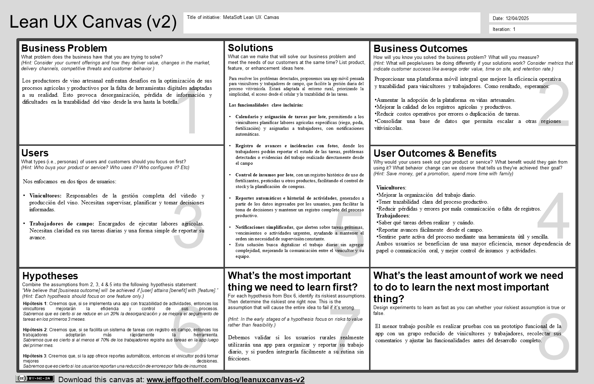

# Capítulo I: Presentación

## 1.1. Startup Profile

### 1.1.1. Descripción de la Startup
MetaSoft es una startup tecnológica fundada en el año 2025, integrada por estudiantes de la carrera de Ingeniería de Software. Nos especializamos en el desarrollo de soluciones digitales que integran tecnología avanzada con procesos tradicionales.

Nuestra propuesta nace de la necesidad real de los vinicultores y trabajadores rurales de contar con herramientas accesibles y potentes que les permitan gestionar sus actividades de forma ordenada, eficiente y en tiempo real. Con un enfoque centrado en el usuario, buscamos que la digitalización sea un aliado para los trabajadores del campo fomentando la autonomía de los productores, la eficiencia operativa y el fortalecimiento de una vitivinicultura más sostenible, rentable y moderna.

- Misión: Desarrollar soluciones tecnológicas centradas en el usuario que optimicen y digitalicen los procesos de gestión agrícola y vinícola artesanal, potenciando a los productores y trabajadores de campo con herramientas simples, efectivas y accesibles.

- Visión: Ser referentes en la transformación digital del sector vitivinícola artesanal, facilitando la integración entre tradición y tecnología, y contribuyendo a una agricultura más sostenible, organizada e inteligente.
### 1.1.2. Perfiles de integrantes del equipo

En esta sección se presentan los perfiles de los integrantes del equipo de trabajo, incluyendo una breve descripción 
de su formación académica, intereses y conocimientos técnicos. Esta información es relevante para entender la diversidad de habilidades y experiencias que aportan al desarrollo del proyecto.

<table>
<thead>
  <tr>
    <th> Integrantes </th>
    <th> Descripción </th>
    <th> Conocimientos </th>
  </tr>
</thead>
<tbody>
  <!-- ================================= INTEGRANTE 01 ================================= -->
  <!-- ================================================================================= -->
  <tr>
    <!-- ======================= Foto ======================= -->
    <td>
      
      Janover Gonzalo Saldaña Vela - U20201B510
    </td>
    <!-- ======================= Descripción ======================= -->
    <td>
      Estudio la carrera de Ingeniería de Software en la Universidad Peruana de Ciencias
      Aplicadas. Elegí la carrera por mi interés en crear nuevas tecnologías que sirvan de 
      apoyo dentro de las empresas, gobiernos, la educación y el entretenimiento. Tengo 
      como intereses viajar y conocer nuevos lugares, realizar deportes extremos y de aventura
    </td>
    <!-- ======================= Conocimientos ======================= -->
    <td>
      Nivel Intermedio en C++, Base de datos no relacionales. Experiencia en HTML, CSS, 
      JavaScript, Python, C# y conocimientos de metodologías ágiles. Poseo habilidades de 
      liderazgo de equipo que pueden ser de gran utilidad en entornos colaborativos.
    </td>
  </tr>
  <!-- ================================= INTEGRANTE 02 ================================= -->
  <!-- ================================================================================= -->
  <tr>
    <!-- ======================= Foto ======================= -->
    <td>
      
      Fabricio Apaza Morales - U201922146
    </td>
    <!-- ======================= Descripción ======================= -->
    <td>
      Soy estudiante de la carrera de Ingeniería de Software en la UPC. Soy una persona bastante apasionada en lo que es la tecnología, incluyendo el desarrollo web y analisis de datos. Mis intereses personales son tocar la guitarra y jugar al tenis.
    </td>
    <!-- ======================= Conocimientos ======================= -->
    <td>
      Tengo conocimientos en HTML, CSS, JavaScript, Python, C++, Power BI, SQL y conocimientos en metodologías ágiles. Me considero una persona bastante comprometida con el equipo, ya que trato de cumplir con las partes que se delegan para el desarrollo de un buen proyecto.
    </td>
  </tr>
  <!-- ================================= INTEGRANTE 03 ================================= -->
  <!-- ================================================================================= -->
  <tr>
    <!-- ======================= Foto ======================= -->
    <td></td>
    <!-- ======================= Descripción ======================= -->
    <td></td>
    <!-- ======================= Conocimientos ======================= -->
    <td></td>
  </tr>
  <!-- ================================= INTEGRANTE 04 ================================= -->
  <!-- ================================================================================= -->
  <tr>
    <!-- ======================= Foto ======================= -->
    <td></td>
    <!-- ======================= Descripción ======================= -->
    <td></td>
    <!-- ======================= Conocimientos ======================= -->
    <td></td>
  </tr>
  <!-- ================================= INTEGRANTE 05================================= -->
  <!-- ================================================================================= -->
  <tr>
    <!-- ======================= Foto ======================= -->
    <td></td>
    <!-- ======================= Descripción ======================= -->
    <td></td>
    <!-- ======================= Conocimientos ======================= -->
    <td></td>
  </tr>
  <!-- ================================= INTEGRANTE 06 ================================= -->
  <!-- ================================================================================= -->
  <tr>
    <!-- ======================= Foto ======================= -->
    <td></td>
    <!-- ======================= Descripción ======================= -->
    <td></td>
    <!-- ======================= Conocimientos ======================= -->
    <td></td>
  </tr>
</tbody>
</table>

## 1.2. Solution Profile
En esta sección se detallan los segmentos de descripición de nuestra solución de software, sus características de valor y las estrategias de monetización.

**Product Name:**

Elegimos el nombre ElixirLine porque conecta dos ideas poderosas: la tradición del “elixir” como bebida valiosa, cuidada y artesanal, y “line”, que simboliza organización, conexión y tecnología. Esta combinación representa la esencia de nuestra propuesta: una herramienta tecnológica que potencia y organiza el trabajo de quienes elaboran vino con pasión y esfuerzo.

**Descripción del Producto:**

ElixirLine es una aplicación móvil diseñada para vinicultores y trabajadores de campo que buscan llevar un mejor control de sus procesos sin complicaciones. A través de una plataforma intuitiva y adaptada al entorno rural, permite planificar, registrar y monitorear cada etapa del proceso productivo: desde el cultivo de la vid hasta el embotellado.

A diferencia de soluciones empresariales complejas, ElixirLine está pensada para ser práctica, fácil de usar y verdaderamente útil en el día a día.

**Monetización:**

Nuestro modelo de ingresos se basa en suscripciones con distintos niveles de servicio, pensados para ajustarse al tamaño y las necesidades operativas de cada cliente. Ofrecemos planes mensuales y anuales, con tarifas escalonadas que permiten mayor flexibilidad. También contemplamos la incorporación de módulos adicionales y servicios personalizados bajo la modalidad de pago por uso, brindando la posibilidad de ampliar funcionalidades según lo requiera cada usuario. Esta estrategia nos permite mantener ingresos constantes y fortalecer una relación a largo plazo con nuestros clientes, garantizando soporte técnico y actualizaciones permanentes del sistema

### 1.2.1. Antecedentes y problemática

**Antecedentes**

El proceso de producción en la industria vitivinícola es altamente estructurado y riguroso, ya que cada etapa desde el cultivo de la uva hasta la vinificación y distribución influye directamente en la calidad final del vino. Este nivel de exigencia requiere una gestión cuidadosa, en la que la planificación, la coordinación y el control de cada actividad son determinantes para lograr un producto competitivo y coherente con los estándares del mercado. En ese sentido, Mejía (2023) destaca que:

>En el sector vitivinícola, al igual que en muchas otras industrias, la gestión adecuada de la cadena de suministro es de vital importancia para garantizar la producción y distribución eficiente de vinos de alta calidad. Desde el cultivo de las uvas hasta el consumo final, cada etapa desempeña un papel crucial en el éxito de la industria” (p. 26).

A pesar de la importancia de este proceso estructurado, en muchos viñedos artesanales aún persiste el uso de métodos manuales e informales. Tareas como la poda, el riego, la cosecha o la aplicación de tratamientos suelen ejecutarse sin registros sistemáticos, confiando en cuadernos físicos o en la comunicación verbal entre trabajadores y productores. Esta falta de automatización y trazabilidad aumenta el riesgo de errores humanos, lo que puede afectar seriamente el desarrollo del cultivo y comprometer la calidad del producto final. En un entorno donde el control de cada variable es crítico, cualquier descoordinación puede alterar todo el proceso.

Frente a estos desafíos, la transformación digital se presenta como una herramienta clave. La incorporación de tecnologías digitales en los sistemas de gestión agrícola ha demostrado ser una estrategia eficaz para mejorar el control de operaciones, la eficiencia de los recursos y la toma de decisiones basada en datos. De hecho, Salgado, Cabezas y Alvear (2024) reportan que, tras la adopción de plataformas digitales, pequeños productores agrícolas lograron un incremento del 20% en su eficiencia operativa, particularmente en actividades como el manejo de inventarios y la logística interna.

Un ejemplo concreto de esta transición es el caso de Bodegas Trivento. Esta empresa ha implementado soluciones tecnológicas que le han permitido transformar profundamente su modelo de operación. Gracias a la digitalización, la bodega logró una trazabilidad más precisa, una mayor integración entre áreas técnicas, comerciales y logísticas, y una capacidad de adaptación más ágil frente a los cambios del entorno. Esta experiencia demuestra cómo la innovación puede influir en mejoras reales de gestión dentro del sector vitivinícola (Scavone, Sanabria & Vidal, 2023).

Por lo tanto, si bien existen avances importantes y casos exitosos de transformación digital, muchas bodegas y viñedos artesanales continúan operando bajo esquemas manuales. Esta realidad refleja una brecha tecnológica fuerte en el sector, pero también una oportunidad clara para impulsar soluciones accesibles y adaptadas que permitan modernizar la gestión productiva, mejorar la trazabilidad y facilitar la comunicación entre los vinicultores y trabajadores de campo.

**Problematicas**

**Técnicas de las 5W's y 2H's**

#### What?

- **¿Cuál es el problema?**

El problema central radica en la falta de una gestión ordenada y eficiente de las tareas agrícolas y del proceso de vinificación en viñedos artesanales. La mayoría de pequeños productores aún utilizan métodos manuales, como cuadernos, pizarras o la memoria, lo que provoca descoordinación, pérdida de información, falta de trazabilidad y errores que afectan el rendimiento, la calidad del producto y la organización general del trabajo.

- **¿Cuál es la relación con la persona en cuestión?**
 
Este problema afecta directamente a los vinicultores, quienes deben planificar y supervisar cada etapa del proceso desde el campo hasta la bodega. También impacta a los trabajadores de campo, que muchas veces no tienen claridad sobre las tareas asignadas, y a toda la operación, que se vuelve vulnerable a errores por falta de comunicación. Incluso los consumidores pueden verse afectados si la producción se retrasa o el producto final pierde calidad.

#### When?

- **¿Cuándo sucede el problema?**
 
El problema aparece a lo largo de todo el ciclo productivo, desde la poda y el riego, hasta la fermentación y el embotellado. Es más frecuente durante campañas de alta carga de trabajo, donde hay más tareas, menos tiempo, y más posibilidades de desorganización.

- **¿Cuándo utiliza el cliente el producto?**

El producto se usa todos los días en momentos clave: para planificar actividades, asignar tareas, registrar avances, controlar insumos, y tomar decisiones basadas en datos. El vinicultor puede usarlo antes de empezar el día, y el trabajador durante la ejecución de las labores en campo.

#### Where?

- **¿Dónde está el cliente cuando usa el producto?**

El usuario se encuentra en el viñedo, en la bodega o en algún punto de supervisión del proceso. ElixirLine está pensado para funcionar desde el celular, por lo que se adapta al entorno rural, sin necesidad de estar en una oficina. Puede usarse bajo el sol, en plena jornada agrícola, o al final del día para revisar los avances.

- **¿A dónde se dirige?**

El usuario busca mejorar su forma de trabajar, tener mayor control sobre lo que ocurre en su viñedo o bodega, evitar pérdidas por desorganización y llevar un registro claro que le permita crecer con confianza. Aspira a profesionalizar su producción sin dejar de ser artesanal.

- **¿Dónde surge el problema?**

Surge tanto en el campo como en la bodega. En el campo, la falta de planificación clara genera tareas mal ejecutadas o a destiempo. En la bodega, puede haber errores en la fermentación o embotellado por registros incompletos. También aparece en la gestión de insumos, donde no se sabe con certeza lo que se tiene o lo que se necesita.

#### Who?

- **¿Quiénes están involucrados?**
 
Los principales involucrados son los vinicultores artesanales, los trabajadores de campo, y en algunos casos, técnicos agrícolas que supervisan la producción. También están indirectamente implicados los clientes, distribuidores locales, y proveedores, quienes dependen de un proceso productivo organizado.

#### Why?

- **¿Cuál es la causa del problema?**

Porque no existen herramientas digitales accesibles y adaptadas a la realidad rural. La mayoría de soluciones tecnológicas son demasiado complejas, costosas o no funcionan bien fuera de entornos urbanos. Esto hace que los pequeños productores sigan dependiendo de métodos tradicionales que ya no son sostenibles frente a la demanda actual del mercado.

#### How?

- **¿En qué condiciones los clientes usan nuestros productos?**
 
Desde un celular o tablet, los usuarios pueden acceder a ElixirLine para ver el calendario de tareas, registrar avances, subir fotos de plagas o problemas, y monitorear el estado de cada lote. El vinicultor asigna tareas y analiza el avance; el trabajador ejecuta las acciones y reporta lo que ocurre.

- **¿Cómo prefieren los clientes acceder a nuestro producto?**

Los usuarios prefieren una herramienta móvil que funcione directamente desde sus celulares, sin necesidad de depender de computadoras o conexiones constantes a internet. Valoran especialmente una interfaz simple, visual y clara, que les permita acceder rápidamente a sus tareas, registrar lo que hacen y recibir notificaciones sin complicaciones. El acceso debe ser inmediato, intuitivo y sin requerir conocimientos técnicos avanzados, ideal para su uso en el campo durante las jornadas laborales.

- **¿Qué llevó al cliente a llegar a esta situación?**
 
La combinación de una alta carga de trabajo, métodos manuales obsoletos y la falta de soluciones accesibles ha hecho que los productores lleguen a un punto de descontrol, con registros dispersos, tareas duplicadas, y pérdidas evitables. Esta situación genera frustración y limita el crecimiento del negocio.

#### How much?

- **¿Cuántos problemas se dan en un día? ¿En una semana? ¿En un mes? ¿Cuánto dinero están implicando?**

El impacto varía, pero incluso en viñedos pequeños se pueden perder cientos de soles al mes por mala gestión de insumos, tareas mal ejecutadas o falta de seguimiento. En campañas grandes, esto puede traducirse en miles de soles perdidos por baja productividad, desperdicio o fallas en el proceso. Además, la falta de control reduce la capacidad de competir en mercados que exigen calidad, trazabilidad y orden.

### 1.2.2. Lean UX Process
En esta etapa damos inicio al enfoque Lean UX, una metodología que nos permitirá construir y afinar la visión del modelo de negocio que respaldará nuestra solución digital. Gracias a este enfoque, podremos centrar el diseño de nuestro producto en resolver necesidades concretas y generar valor real para los usuarios.

#### 1.2.2.1. Lean UX Problem Statements
A continuación, utilizamos la plantilla de Business Opportunity Statements (Gothelf, 2022) para enfocar nuestro equipo en la creación de una solución que responda eficazmente a las necesidades de los clientes, sin limitaciones que puedan afectar la creatividad y agilidad del desarrollo.

- La plantilla de Business Opportunity Statement:

El estado actual de **[domain]** se ha centrado principalmente en **[segments, pain points, etc.]**

Lo que los productos/servicios existentes no logran abordar es **[this gap].**

Nuestro producto/servicio abordará esta brecha mediante **[vision / strategy].**

Nuestro enfoque inicial será **[this segment].**

Sabremos que tenemos éxito cuando veamos **[these behaviors in our target audience].**

- ReStyle Lean UX Problem Statements:

El estado actual de **la gestión en viñedos artesanales** se ha centrado principalmente en **métodos tradicionales y desarticulados como el uso de cuadernos, pizarras y registros orales, lo cual dificulta la planificación, el seguimiento de tareas y la trazabilidad del proceso productivo desde el campo hasta la bodega.**

Lo que los productos/servicios existentes no logran abordar es **una herramienta accesible, intuitiva y realmente adaptada al entorno rural, que permita coordinar las tareas agrícolas, registrar avances en la vinificación y gestionar insumos, todo desde un dispositivo móvil y sin necesidad de conocimientos técnicos avanzados.**

Nuestro producto/servicio abordará esta brecha mediante **el desarrollo de una aplicación móvil "ElixirLine" que centraliza y simplifica la gestión de viñedos artesanales, facilitando la planificación de actividades agrícolas, el seguimiento de procesos por lote, la digitalización de bitácoras de campo y el control de insumos. Todo esto con una interfaz amigable, adaptable al ritmo del campo y diseñada pensando en usuarios con poca experiencia digital.**

Nuestro enfoque inicial será **el segmento de vinicultores artesanales y trabajadores de campo en zonas rurales de América Latina, que requieren soluciones prácticas, económicas y fáciles de implementar para organizar sus operaciones sin complicaciones.**

Sabremos que tenemos éxito cuando veamos **que nuestros usuarios adoptan la aplicación como herramienta diaria, logran mayor control sobre sus tareas, reducen errores y desperdicios, y sienten que ElixirLine les ayuda realmente a crecer, producir mejor y trabajar con más tranquilidad.**

#### 1.2.2.2. Lean UX Assumptions

**Users:**

- Vinicultores: Productores responsables de planificar, organizar y supervisar el ciclo completo de producción vitivinícola.

- Trabajadores de campo: Ejecutores directos de tareas agrícolas como poda, riego, fumigación y cosecha, bajo indicaciones del vinicultor.

- - -

**User Outcomes**

- **Vinicultores:**

  - Tener una visión clara y en tiempo real de todas las etapas del proceso productivo.

  - Poder planificar y asignar tareas fácilmente desde el celular.

  - Reducir pérdidas por desorganización y mejorar la trazabilidad.

  - Obtener reportes y registros digitales para tomar mejores decisiones.

- **Trabajadores de campo:**

  - Acceder a una lista clara de tareas diarias sin necesidad de esperar instrucciones presenciales.

  - Registrar sus avances de forma rápida y sencilla.

  - Recibir notificaciones cuando haya un cambio en sus labores o alertas urgentes.

  - Sentirse más valorados al tener una herramienta que los organiza y respalda.

- - -
**Business Assumptions:**

- Creemos que el mercado de la vitivinicultura artesanal en América Latina está subatendido tecnológicamente.

- Asumimos que hay una alta disposición a adoptar herramientas que simplifiquen la gestión del viñedo sin necesidad de conocimientos técnicos.

- Consideramos que un modelo basado en suscripciones escalables y módulos adicionales es rentable y sostenible en el tiempo.

**User Assumptions**

- **¿Quién utiliza nuestra plataforma?**

Nuestra plataforma está diseñada para ser utilizada principalmente por productores de vino artesanal (vinicultores) que supervisan el ciclo completo de producción, desde el manejo del viñedo hasta el embotellado, y por trabajadores rurales que ejecutan labores agrícolas en terreno, como la poda, el riego, la fertilización y el control de plagas. Ambos perfiles comparten la necesidad de herramientas prácticas que les permitan mejorar la organización, el control y la comunicación en sus labores diarias.

- **¿Cómo se integra en su rutina?**

El vinicultor inicia su jornada utilizando la aplicación en su celular para revisar el estado del viñedo, asignar tareas al equipo y consultar reportes de días anteriores. Durante la jornada, los trabajadores de campo acceden a la plataforma desde sus propios dispositivos o los proporcionados por el empleador para consultar las tareas asignadas, registrar avances, subir fotos de incidencias o cumplimientos, y marcar el estado de finalización. Al finalizar el día, el vinicultor puede revisar lo realizado y generar reportes automáticamente.

- **¿Qué desafíos resuelve?**

La plataforma resuelve varios desafíos comunes en la producción de vino artesanal: la falta de trazabilidad de actividades e insumos, la desorganización de tareas, la pérdida o dispersión de datos importantes (que a menudo quedan en papel o en la memoria), las dificultades de comunicación en campo debido a la desconexión tecnológica, y los errores frecuentes asociados a métodos manuales o poco sistemáticos de gestión.

- **¿Qué imagen queremos proyectar?**

Queremos que ElixirLine sea percibida como una tecnología que se adapta a las necesidades del mundo rural: accesible, cercana, confiable y fácil de usar. Una herramienta que no reemplaza la experiencia del vinicultor ni las prácticas tradicionales, sino que las potencia y las organiza, brindando un apoyo real que mejora la eficiencia sin complicar los procesos.

- **¿Propósito fundamental?**

Nuestro propósito es ofrecer una solución simple, intuitiva y poderosa para gestionar todos los aspectos agrícolas y productivos del vino artesanal desde el celular. Queremos transformar la forma en que se planifican, ejecutan y registran las tareas en los viñedos, facilitando la vida de quienes están en terreno y permitiendo una toma de decisiones más informada y eficiente.

- **¿Qué funcionalidades destacan?**

Una de las funcionalidades más destacadas de ElixirLine es su sistema de notificaciones y reportes simplificados, que permite tanto a vinicultores como a trabajadores de campo recibir alertas importantes en tiempo real, estar al tanto de cambios en las tareas asignadas y acceder a informes visuales y fáciles de interpretar sobre el avance de actividades, consumo de insumos y estado general del viñedo, todo desde una interfaz clara y accesible.

- - -

#### 1.2.2.3. Lean UX Hypothesis Statements

Para la elaboración de los Hypothesis Statements se utilizó el formato Lean UX: [Creemos que], [Esto logrará] y [Sabremos que]

- **Hipótesis 1:**

**Creemos que** si ofrecemos una plataforma que permita al vinicultor planificar, asignar y monitorear tareas desde el celular, entonces

**Esto logrará** mejorar la organización del proceso productivo y reducir errores por descoordinación.

**Sabremos que** estamos en lo cierto cuando observemos que al menos el 60% de los vinicultores usan la app al menos una vez al día durante la campaña productiva, y se reporta una disminución del 30% en tareas duplicadas o mal ejecutadas.

- **Hipótesis 2:**

**Creemos que** si el trabajador de campo puede acceder fácilmente a sus tareas diarias y registrar avances en la app, entonces

**Esto logrará** una mayor eficiencia en la ejecución de labores agrícolas.

**Sabremos que** estamos en lo cierto cuando el 70% de los trabajadores usen la app durante su jornada y el tiempo promedio de ejecución de tareas críticas se reduzca en al menos 20%.

- **Hipótesis 3:**

**Creemos que si** ofrecemos una interfaz intuitiva y adaptada al entorno rural (visual, clara y sin requerir internet constante), entonces 

**Esto logrará** una adopción más rápida entre usuarios con poca experiencia digital.

**Sabremos que** estamos en lo cierto cuando al menos el 80% de los usuarios nuevos puedan completar sus primeras tareas sin requerir asistencia o tutoriales extensos.

- **Hipótesis 4:**

**Creemos que si** integramos alertas y reportes visuales para el vinicultor, entonces 

**Esto logrará** una mejor toma de decisiones y control sobre el estado general del viñedo.

**Sabremos que** estamos en lo cierto cuando los vinicultores logren anticiparse a problemas recurrentes (plagas, falta de insumos) y reporten una mejora en su percepción del control operativo.

- **Hipótesis 5:**

**Creemos que** si ofrecemos planes de suscripción flexibles y módulos adicionales por uso (como reportes detallados o predicciones climáticas), entonces 

**Esto logrará** una monetización efectiva sin excluir a pequeños productores.

**Sabremos que** estamos en lo cierto cuando al menos el 30% de los usuarios activos adquieran módulos adicionales o se suscriban a un plan pago dentro de los primeros 6 meses de lanzamiento.

#### 1.2.2.4. Lean UX Canvas

  

 <em> Fuente: Elaboración propia </em> 

## 1.3. Segmentos objetivos

**1. Vinicultores:** 

Productores de vino a pequeña y mediana escala, ubicados principalmente en regiones rurales con tradición vitivinícola, como los valles costeros o zonas de sierra baja. Son responsables del ciclo completo de producción: desde el cultivo de la vid hasta el embotellado.

<table>
  <thead>
    <tr>
      <th>Característica</th>
      <th>Detalle</th>
    </tr>
  </thead>
  <tbody>
    <tr>
      <td>Edad promedio</td>
      <td>Entre 35 y 60 años</td>
    </tr>
    <tr>
      <td>Formación</td>
      <td>Experiencia práctica en agricultura, con conocimientos técnicos básicos o intermedios</td>
    </tr>
    <tr>
      <td>Acceso a tecnología</td>
      <td>En transición hacia herramientas digitales; uso frecuente de cuadernos o Excel</td>
    </tr>
    <tr>
      <td>Necesidades clave</td>
      <td>Organización de tareas, trazabilidad del proceso, acceso móvil incluso sin conexión</td>
    </tr>
  </tbody>
</table>

**2. Trabajadores de campo:**

Encargados de ejecutar tareas agrícolas como riego, poda, fertilización, cosecha y control de plagas. Viven en zonas rurales donde la cobertura de red puede ser limitada, y trabajan bajo instrucciones directas del vinicultor.

<table>
  <thead>
    <tr>
      <th>Característica</th>
      <th>Detalle</th>
    </tr>
  </thead>
  <tbody>
    <tr>
      <td>Edad promedio</td>
      <td>Entre 20 y 55 años</td>
    </tr>
    <tr>
      <td>Formación</td>
      <td>Educación básica o técnica</td>
    </tr>
    <tr>
      <td>Acceso a tecnología</td>
      <td>Celulares Android de gama media o baja; familiarizados con apps simples como WhatsApp</td>
    </tr>
    <tr>
      <td>Necesidades clave</td>
      <td>Recibir tareas claras, registrar avances fácilmente (idealmente con fotos), y usar una app sencilla y directa</td>
    </tr>
  </tbody>
</table>

- **Ejemplo contextual:** 

En zonas agrícolas del sur andino o la costa central, donde la producción artesanal de vino es una actividad importante, se observa una alta dependencia del trabajo manual, baja digitalización y una creciente apertura a herramientas móviles que faciliten la coordinación y documentación del trabajo diario.