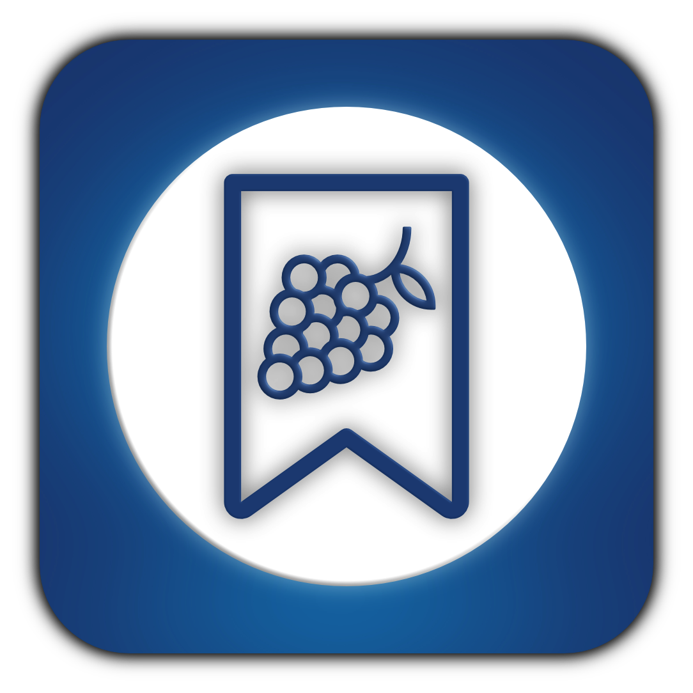
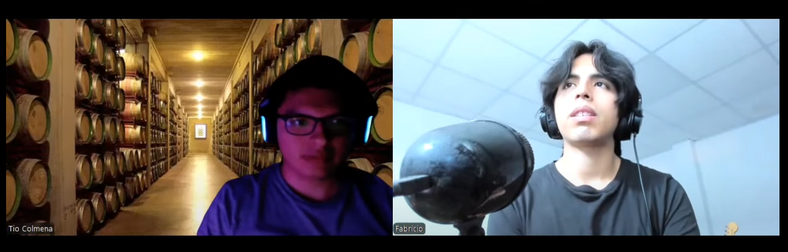
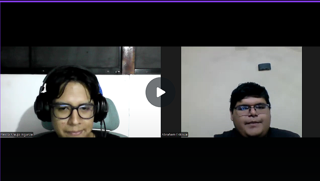
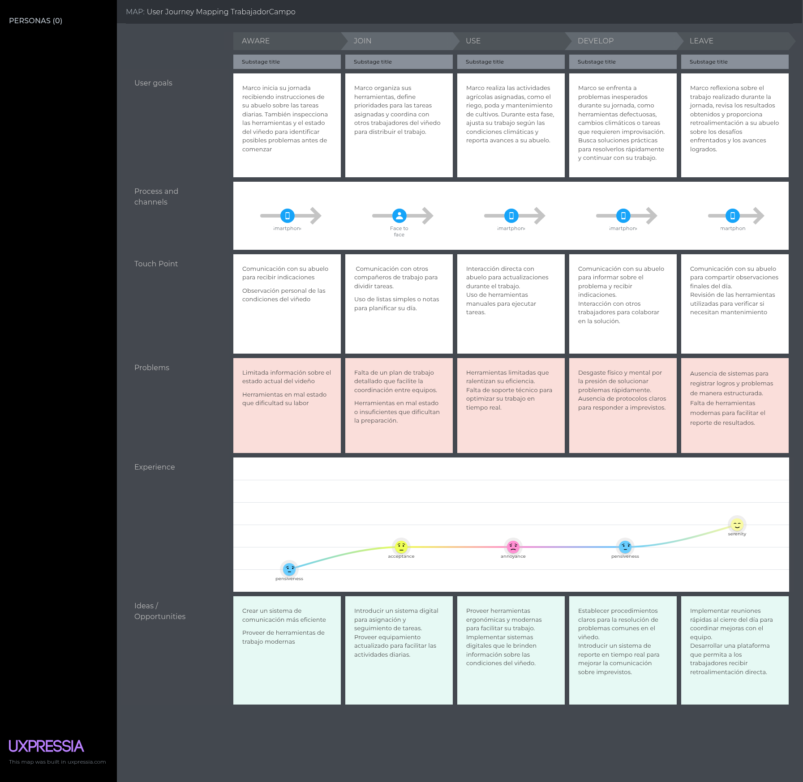
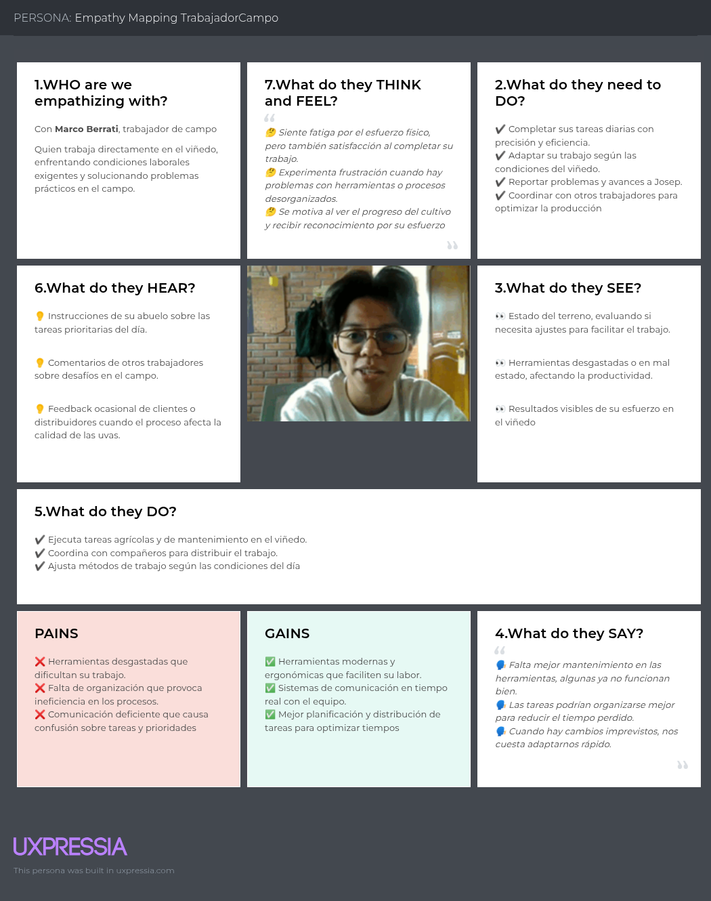
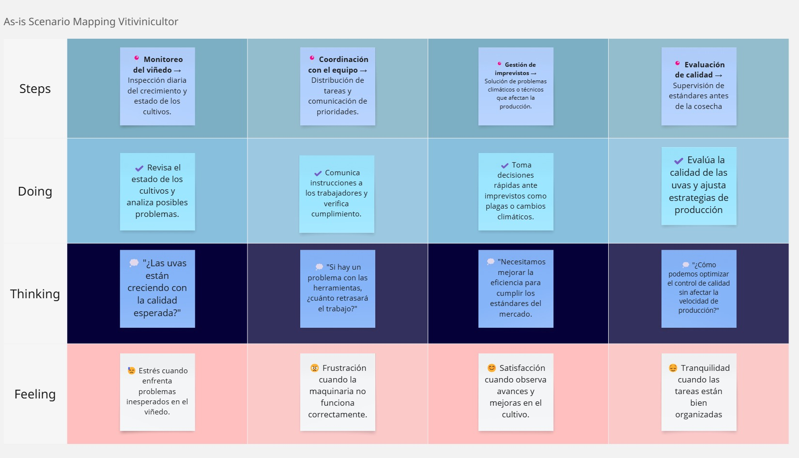

# Capítulo II: Requirements Elicitation & Analysis

## 2.1. Competidores

En esta etapa, el equipo llevará a cabo un análisis sobre los posibles competidores dentro del mercado.

### 2.1.1. Análisis competitivo

En esta sección, el equipo llevará a cabo un análisis competitivo de los tres principales competidores identificados, con el fin de determinar e implementar estrategias adecuadas en relación con ellos.

<table>  
    <thead>
        <tr>
            <th colspan="6">Competitive Analysis Landscape</th>
        </tr>
        <tr>
            <th colspan="2">Competitive Analysis Landscape</th>
            <td colspan="5" style="text-align: justify">Este análisis tiene como finalidad identificar y comprender de forma más profunda las fortalezas, debilidades y estrategias de los principales competidores. A partir de ello, se podrán detectar oportunidades y amenazas en el mercado para definir acciones estratégicas que otorguen una ventaja competitiva.</td>
        </tr>
    </thead>
    <tbody style="text-align: center">
        <tr>
            <th colspan="2"></th>
            <th>  </th>
            <th></th>
            <th></th>
            <th></th>
        </tr>
        <tr>
            <th rowspan="2"> <strong> Perfil </strong> </th>
            <td> Overview</td>
            <td>ElixirLine es una plataforma completa enfocada en la gestión del proceso productivo de vinos y pisco. Integra herramientas para administrar inventarios, pedidos y el proceso de vinificación, con el objetivo de optimizar la eficiencia y mejorar la toma de decisiones.</td>
            <td>Vinotec es un software integral de gestión para bodegas y productores de vino. Su propósito es mejorar la eficiencia del proceso productivo y de ventas, facilitando el control de producción.</td>
            <td>WineManager brinda soluciones específicas para el sector vitivinícola, con funciones de control de inventario, seguimiento de pedidos y análisis de ventas, enfocándose en integrar información para respaldar decisiones estratégicas.</td>
            <td>VinTrace está orientado a la gestión de viñedos y seguimiento de la producción de vinos. Dispone de herramientas para planificación agrícola, registro de actividades y documentación de cosechas, priorizando el cumplimiento normativo y la calidad.</td>
        </tr>
        <tr>
            <td>Ventaja competitiva ¿Que valor ofrece a los clientes?</td>
            <td>Brinda una solución completa que cubre desde la gestión de inventario hasta el control de pedidos, ajustándose a las necesidades particulares de productores y distribuidores de vinos y pisco.</td>
            <td>Se enfoca en mejorar los procesos de producción y ventas, aunque no incluye funciones especializadas para el pisco.</td>  
            <td>Su principal fortaleza es la integración de datos, permitiendo decisiones fundamentadas a partir de análisis detallados.</td>  
            <td>Aunque se enfoca en el pisco, su alcance limitado puede no ser adecuado para productores de vino.</td>  
        </tr>
        <tr>
            <th rowspan="2"> <strong> Perfil de Marketing </strong> </th>
            <td> Mercado objetivo</td>
            <td>Productores y distribuidores de vinos y pisco que buscan herramientas adaptadas para gestionar eficientemente sus procesos productivos.</td>  
            <td>Bodegas y productores de vino que requieren mejorar la gestión de ventas y producción.</td>  
            <td>Empresas del sector vitivinícola que necesitan soluciones integradas para la toma de decisiones.</td>  
            <td>Productores de vino que demandan herramientas específicas para el manejo de viñedos y trazabilidad.</td>
        </tr>
        <tr>
            <td>Estrategias de Marketing</td>
            <td>Se promueve como una herramienta versátil e integral para la producción de vinos y pisco, destacando su facilidad de uso y capacidad de adaptación.</td>  
            <td>Orienta su estrategia en la mejora de procesos y gestión de ventas a través de su plataforma.</td>  
            <td>Hace uso del marketing de contenidos y análisis de datos para consolidarse como una solución integrada líder.</td>  
            <td>Se especializa en la gestión de viñedos, destacando su experiencia en el rubro y capacidad para garantizar calidad.</td>  
        </tr>
        <tr>
            <th rowspan="3"> <strong> Perfil del producto </strong> </th>
            <td> Producto & servicios</td>
            <td>Incluye control de inventarios, seguimiento de pedidos y funciones para vinificación y manejo de viñedos.</td>  
            <td>Ofrece herramientas para ventas y producción, aunque tiene menor enfoque en el proceso de vinificación.</td>  
            <td>Brinda soluciones integradas, aunque podría no contar con funciones específicas para el pisco.</td>  
            <td>Está especializado en la administración de viñedos, con funciones para planificación agrícola y control de calidad.</td>  
        </tr>
        <tr>
            <td>precio y costos</td>
            <td>Dispone de tres planes de suscripción (Básico, Intermedio, Avanzado), ajustados a distintos tamaños de empresas.</td>  
            <td>Funciona bajo un modelo de suscripción, con precios que varían según las funciones requeridas.</td>  
            <td>Establece sus precios en función del número de usuarios y características, priorizando la personalización.</td>  
            <td>Opera con una suscripción de costo fijo, aunque limitado a funcionalidades para gestión de viñedos.</td>  
        </tr>
        <tr>
            <td>Canales de distribución (Web y/o movil)</td>
            <td>Está disponible en plataformas web y móviles, lo que facilita el acceso desde distintos dispositivos.</td>  
            <td>Opera principalmente vía web, con funciones móviles limitadas.</td>  
            <td>Cuenta con una plataforma web sólida, pero presenta restricciones en su versión móvil.</td>  
            <td>Enfocado en la versión web, con una interfaz amigable para el usuario.</td> 
        </tr>
        <tr>
            <th rowspan="4"> <strong> Análisis SWOT </strong> </th>
            <td>Fortalezas</td>
            <td>Plataforma completa y adaptable, interfaz sencilla, y orientación hacia la eficiencia operativa.</td>  
            <td>Capacidad para optimizar procesos y amplia experiencia en el sector.</td>  
            <td>Integración de datos que respalda la toma de decisiones.</td>  
            <td>Especialización en manejo de viñedos y trazabilidad.</td> 
        </tr>
        <tr>
            <td>Debilidades</td>
            <td>Debe ganar confianza en un entorno altamente competitivo y depende de la infraestructura tecnológica.</td>  
            <td>Carece de funciones adaptadas para productores de pisco.</td>  
            <td>Podría resultar muy técnico para ciertos usuarios.</td>  
            <td>Su enfoque limitado podría no atraer a los productores de vino.</td> 
        </tr>
        <tr>
            <td>Oportunidades</td>
            <td>Incremento en la demanda de soluciones tecnológicas para la industria de vinos y pisco, con potencial de expansión internacional.</td>  
            <td>Crecimiento del sector vitivinícola y necesidad de eficientizar procesos.</td>  
            <td>Posibilidad de ampliar su oferta de servicios.</td>  
            <td>Mayor interés en herramientas para control de calidad y manejo de viñedos.</td> 
        </tr>
        <tr>
            <td>Amenazas</td>
            <td>Ingreso de nuevas plataformas al mercado y cambios regulatorios del sector.</td>  
            <td>Aumento de competidores con tecnologías emergentes.</td>  
            <td>La evolución acelerada del sector puede dejar atrás a soluciones no actualizadas.</td>  
            <td>Modificaciones en las preferencias del consumidor y mayor competencia en gestión de viñedos.</td> 
        </tr>
    </tbody>
</table>

### 2.1.2. Estrategias y tácticas frente a competidores

Después de haber comparado nuestra propuesta con las soluciones actuales en el mercado, el equipo definirá las estrategias y técnicas que deberán implementarse para destacar frente a la competencia.

<table>
    <thead>
        <tr>
            <th colspan="3"> Matriz CAME para el desarrollo de estrategias en base al análisis FODA </th>
        </tr>
    </thead>
    <tbody>
        <tr>
            <th rowspan="2"> Análisis FODA cruzado</th>
            <th> Oportunidades </th>
            <th> Amenazas </th>
        </tr>
        <tr>
            <td>
                1. El aumento del interés en sistemas de gestión para la industria vitivinícola representa una oportunidad clave para ElixirLine. 
                2. Existen posibilidades de crecimiento geográfico hacia nuevas regiones y países. 
                3. La evolución tecnológica constante permite mejorar la plataforma y brindar una mejor experiencia al usuario. 
                4. Las colaboraciones con actores del sector podrían fortalecer la propuesta de valor. 
                5. Se puede consolidar la imagen de ElixirLine como líder en gestión de vinos y pisco mediante acciones de marketing. 
                6. Vincularse con instituciones académicas permitiría impulsar programas de capacitación y certificación.
            </td>
            <td>
                1. La entrada de nuevas plataformas con mejor tecnología puede representar una fuerte competencia. 
                2. Cambios en normativas del rubro podrían afectar la operatividad del software. 
                3. Existen riesgos asociados a la seguridad digital que podrían afectar la confianza de los usuarios. 
                4. Los competidores podrían ofrecer precios más bajos y captar a los usuarios más sensibles al costo. 
                5. La falta de integración fluida con otros sistemas puede ser una barrera para potenciales usuarios.
            </td>
        </tr>
        <tr>
            <th>Fortalezas</th>
            <th>Estrategia (FO) E. Ofensivas</th>
            <th>Estrategia (FA) E. Defensivas</th>
        </tr>
        <tr>
            <td>
                1. Comunicación directa entre cliente y empresa, lo que mejora la relación y genera confianza. 
                2. Transparencia total en el avance del proceso productivo. 
                3. Especialización en un sector específico, lo que permite mayor eficacia. 
                4. Ahorro de tiempo y esfuerzo para el cliente gracias a la automatización.
            </td>
            <td>
                1. Lanzar campañas que destaquen cómo ElixirLine responde a la demanda creciente del mercado. 
                2. Analizar nuevas regiones con potencial y adaptar la solución a cada contexto. 
                3. Invertir en desarrollo tecnológico continuo para garantizar una experiencia superior. 
                4. Formar alianzas con empresas del rubro para ofrecer soluciones más integradas. 
                5. Promocionar ElixirLine como referente en el sector a través de acciones de marca. 
                6. Colaborar con universidades para posicionarse como herramienta educativa y profesional.
            </td>
            <td>
                1. Innovar constantemente para mantener la ventaja tecnológica. 
                2. Reforzar los sistemas de seguridad para generar confianza. 
                3. Estar atentos a cambios normativos para adaptar el sistema a tiempo. 
                4. Analizar precios del mercado para seguir siendo competitivos. 
                5. Crear herramientas de integración que faciliten la adopción del sistema. 
                6. Estimular la innovación interna para continuar liderando el sector.
            </td>
        </tr>
        <tr>
            <th>Debilidad (D)</th>
            <th>Estrategia(DO) de Reorientación</th>
            <th>Estrategia(DA) de Supervivencia</th>
        </tr>
        <tr>
            <td>
                1. Dificultad para generar confianza en nuevos usuarios. 
                2. Falta de consistencia en la calidad del servicio. 
                3. Baja presencia de marca en el mercado. 
                4. Dependencia alta de herramientas tecnológicas.
            </td>
            <td>
                1. Mostrar casos exitosos para construir credibilidad ante nuevos usuarios. 
                2. Aplicar mejoras continuas basadas en la retroalimentación del usuario. 
                3. Implementar una estrategia digital que incremente el alcance de la marca. 
                4. Capacitar constantemente al equipo para responder a los cambios tecnológicos.
            </td>
            <td>
                1. Ampliar el portafolio de servicios para reducir vulnerabilidades. 
                2. Tener estrategias listas para enfrentar nuevas amenazas del entorno competitivo. 
                3. Mantener un diálogo constante con los usuarios para fortalecer la relación. 
                4. Asegurar que el equipo esté siempre actualizado frente a las nuevas herramientas. 
                5. Contar con opciones alternativas ante cualquier interrupción técnica o de proveedores. 
                6. Establecer mecanismos efectivos para recibir sugerencias o reclamos y mejorar el servicio.
            </td>
        </tr>
    </tbody>
</table>

## 2.2. Entrevistas

En la parte de aqui, el equipo llevará a cabo entrevistas con los segmentos objetivos previamente definidos, con el propósito de comprender mejor sus necesidades y establecer una mayor empatía con ellos.

### 2.2.1. Diseño de entrevistas

<strong>Preguntas para Productores de Vinos y Piscos Artesanales:</strong>

<ul>
    <li><strong>Introducción (30 segundos):</strong>
        <ul>
            <li>Saludo e introducción breve de tu parte.</li>
            <li>Explicación del propósito de la entrevista.</li>
            <li>Mención de la confidencialidad y duración estimada.</li>
        </ul>
    </li>
     
    <li><strong>Aspectos Demográficos (1 minuto):</strong>
        <ul>
            <li>¿Cuál es tu nombre y el nombre de tu empresa?</li>
            <li>¿Qué función específica cumples en la producción de vinos/piscos?</li>
            <li>¿Dónde se encuentra tu lugar de producción o empresa?</li>
            <li>¿Cuánto tiempo llevas en la industria vitivinícola o pisquera?</li>
        </ul>
    </li>
     
    <li><strong>Información sobre el negocio (1 minuto):</strong>
        <ul>
            <li>¿Qué tipo de vinos o piscos produces?</li>
            <li>¿Qué parte del proceso de producción te resulta más complicada?</li>
        </ul>
    </li>
     
    <li><strong>Desafíos y Necesidades (1 minuto):</strong>
        <ul>
            <li>¿Cuál consideras que es el principal reto al que te enfrentas actualmente?</li>
            <li>¿Qué tipo de recursos o ayudas crees que podrían ayudarte a superar esos retos?</li>
        </ul>
    </li>
     
    <li><strong>Uso de tecnología (1 minuto):</strong>
        <ul>
            <li>¿Qué herramientas tecnológicas estás utilizando actualmente en tu proceso?</li>
            <li>¿Te interesaría implementar nuevas soluciones tecnológicas? ¿Qué funcionalidades te parecerían útiles?</li>
        </ul>
    </li>
     
    <li><strong>Cierre (30 segundos):</strong>
        <ul>
            <li>Gracias por tu tiempo y participación.</li>
            <li>¿Estarías dispuesto(a) a que te contactemos nuevamente para futuras pruebas o consultas?</li>
        </ul>
    </li>
</ul>

 

<strong>Preguntas principales para Trabajadores de Campo:</strong>

<ul>
    <li><strong>Introducción (30 segundos):</strong>
        <ul>
            <li>Saludo y breve presentación personal.</li>
            <li>Explicación del propósito de la entrevista.</li>
            <li>Asegurar la confidencialidad de las respuestas y mencionar la duración estimada de la entrevista.</li>
        </ul>
    </li>
     
    <li><strong>Aspectos demográficos (1 minuto):</strong>
        <ul>
            <li>¿Cuál es tu nombre completo y en qué empresa o viñedo trabajas?</li>
            <li>¿Qué rol desempeñas dentro del trabajo de campo?</li>
            <li>¿En qué lugar está ubicado el campo o viñedo donde trabajas?</li>
            <li>¿Cuánto tiempo llevas trabajando en labores agrícolas o vitivinícolas</li>
        </ul>
    </li>
     
    <li><strong>Información general sobre el trabajo (1 minuto):</strong>
        <ul>
            <li>¿Qué tipo de tareas realizas habitualmente en tu jornada?</li>
            <li>¿Cuál de estas tareas consideras la más difícil o pesada?</li>
        </ul>
    </li>
     
    <li><strong>Desafíos y necesidades (1 minuto):</strong>
        <ul>
            <li>¿Con qué tipo de dificultades te sueles encontrar al hacer tu trabajo en el campo?</li>
            <li>¿Qué apoyos o herramientas crees que podrían facilitarte el trabajo diario?</li>
        </ul>
    </li>
     
    <li><strong>Uso de tecnología (1 minuto):</strong>
        <ul>
            <li>¿Utilizas actualmente algún celular, tablet o sistema digital como parte de tu trabajo?</li>
            <li>¿Te interesaría usar una herramienta digital que te ayude a recibir tareas y reportar problemas?</li>
            <li>¿Qué características o funciones te gustaría que tenga?</li>
        </ul>
    </li>
     
    <li><strong>Cierre (30 segundos):</strong>
        <ul>
            <li>Agradecimiento por su tiempo y colaboración.</li>
            <li>¿Estarías dispuesto a participar en futuras entrevistas o pruebas relacionadas al proyecto?</li>
        </ul>
    </li>
</ul>

### 2.2.2. Registro de entrevistas

### Segmento objetivo trabajador de campo

<table>
        <thead>
            <tr>
                <th>Entrevistado 1</th>
                <th>David Crisanto</th>
            </tr>
            <tr>
                <th>Entrevistador</th>
                <th>Gustavo Huanca Navarro</th>
            </tr>
        </thead>
        <tbody>
            <tr>
                <td>Edad</td>
                <td>28 años</td>
            </tr>
            <tr>
                <td>Distrito</td>
                <td>Santiago - Ica</td>
            </tr>
            <tr>
                <td>
                    
                </td>
                <td>
                <strong>Resumen:</strong> 
                El entrevistado trabaja desde hace más de 3 años en una vinicultora llamada Don Luis, en el distrito de Santiago, Ica. Desempeña principalmente labores agrícolas como el mantenimiento de riego, cosecha y apoyo en la fermentación, las cuales varían según la temporada. Destaca que las tareas más exigentes son el control de riego y la cosecha, especialmente en días calurosos, debido a la exposición al sol, la carga física y el uso de pesticidas. Considera que una aplicación que ayude a organizar tareas según temporada, controlar turnos, registrar condiciones de trabajo y mejorar la seguridad sería de gran utilidad para trabajadores como él.
                </td>
            </tr>
            <tr>
                <td>Tiempo que empieza</td>
                <td>0:00 minutos</td>
            </tr>
            <tr>
                <td>Tiempo de la entrevista</td>
                <td>8:37 minutos</td>
            </tr>
            <tr>
                <td>URL de la entrevista</td>
                <td><a href="https://upcedupe-my.sharepoint.com/personal/u202120569_upc_edu_pe/_layouts/15/stream.aspx?id=%2Fpersonal%2Fu202120569%5Fupc%5Fedu%5Fpe%2FDocuments%2F2025%2D04%2D23%2017%2D28%2D17%2Emkv&nav=eyJyZWZlcnJhbEluZm8iOnsicmVmZXJyYWxBcHAiOiJTdHJlYW1XZWJBcHAiLCJyZWZlcnJhbFZpZXciOiJTaGFyZURpYWxvZy1MaW5rIiwicmVmZXJyYWxBcHBQbGF0Zm9ybSI6IldlYiIsInJlZmVycmFsTW9kZSI6InZpZXcifX0&ga=1&referrer=StreamWebApp%2EWeb&referrerScenario=AddressBarCopied%2Eview%2E7accd9b3%2D76da%2D4241%2Da2dd%2De00f6f41b562">Ver entrevista</a></td>
            </tr>
        </tbody>
</table>

<table>
        <thead>
            <tr>
                <th>Entrevistado 2</th>
                <th>Francisco Palomino Hurtado</th>
            </tr>
            <tr>
                <th>Entrevistador</th>
                <th>Raúl Ronaldo Quispe Erasmo</th>
            </tr>
        </thead>
        <tbody>
            <tr>
                <td>Edad</td>
                <td>25 años</td>
            </tr>
            <tr>
                <td>Distrito</td>
                <td>Surco - Ica</td>
            </tr>
            <tr>
                <td>
                    
                </td>
                <td>
                <strong>Resumen:</strong> 
                El entrevistado, de 25 años, trabaja como ayudante en un viñedo en Ica, cerca de Pueblo Nuevo. Realiza tareas variadas como limpieza, riego, poda, aplicación de fertilizantes y cosecha, según la temporada y necesidad del campo. Lleva casi un año en labores agrícolas, principalmente en épocas donde no tiene clases. Considera que la cosecha es la parte más pesada del trabajo, especialmente por el esfuerzo físico y el calor intenso. Entre las dificultades que enfrenta están la falta de sombra, agua cercana y una organización clara de las tareas. Sugiere que contar con guantes, sombreros y una mejor comunicación con supervisores mejoraría su día a día. Aunque actualmente solo usa su celular personal para lo básico, le interesaría tener una aplicación móvil que muestre tareas, clima, mapas del campo y permita reportar problemas, siempre que sea ligera y funcione con poca señal.
                </td>
            </tr>
            <tr>
                <td>Tiempo que empieza</td>
                <td>8:38 minutos</td>
            </tr>
            <tr>
                <td>Tiempo de la entrevista</td>
                <td>4:13 minutos</td>
            </tr>
            <tr>
                <td>URL de la entrevista</td>
                <td><a href="">Ver entrevista</a></td>
            </tr>
        </tbody>
</table>

<table>
        <thead>
            <tr>
                <th>Entrevistado 3</th>
                <th>Marco Berrati Riega</th>
            </tr>
            <tr>
                <th>Entrevistador</th>
                <th>Fernando Jesus Lizano Coll Cardenas</th>
            </tr>
        </thead>
        <tbody>
            <tr>
                <td>Edad</td>
                <td>21 años</td>
            </tr>
            <tr>
                <td>Distrito</td>
                <td>Chorrillos - Ica</td>
            </tr>
            <tr>
                <td>
                    
                </td>
                <td>
                <strong>Resumen:</strong> 
                Marco es un joven trabajador de medio tiempo que apoya a su abuelo en un viñedo familiar ubicado en Ica. Lleva cinco años participando en labores vitivinícolas, especialmente durante la temporada de vendimia. Sus tareas principales incluyen la cosecha, selección de racimos, riego y mantenimiento básico del terreno.

Entre los principales desafíos que enfrenta menciona las condiciones climáticas extremas y la falta de comunicación clara sobre las tareas diarias. No utiliza herramientas digitales en su trabajo actual, pero expresó interés en una aplicación simple que le permita recibir tareas, marcar actividades realizadas y reportar problemas, idealmente con funcionamiento sin conexión.

Marco mostró disposición a participar en futuras entrevistas o pruebas relacionadas con el desarrollo de soluciones digitales para el campo. </td>
</tr>
<tr>
<td>Tiempo que empieza</td>
<td>0:00 minutos</td>
</tr>
<tr>
<td>Tiempo de la entrevista</td>
<td>04:11 minutos</td>
</tr>
<tr>
<td>URL de la entrevista</td>
<td><a href="https://upcedupe-my.sharepoint.com/:v:/g/personal/u202214522_upc_edu_pe/EfWW02X_qUpLs88s7rDnQJYBKFbtIxanutwsiCak42pzNg?e=teS17x">Ver entrevista</a></td>
</tr>
</tbody>
</table>

### Segmento objetivo vinicultor

<table>
        <thead>
            <tr>
                <th>Entrevistado 4</th>
                <th>Daniel Shibamukuro</th>
            </tr>
            <tr>
                <th>Entrevistador</th>
                <th>Fabricio Apaza Morales</th>
            </tr>
        </thead>
        <tbody>
            <tr>
                <td>Edad</td>
                <td>28 años</td>
            </tr>
            <tr>
                <td>Distrito</td>
                <td>Ocucaje - Ica</td>
            </tr>
            <tr>
                <td>
                    
                </td>
                <td>
                <strong>Resumen:</strong> 
                Daniel Shimabukuro es parte del viñedo familiar Las Ruinas del Sol, ubicado en Ocucaje, cerca de Ica. Con más de 25 años en la producción artesanal de vino tinto borgoña y pisco de uva quebranta, comenta que uno de los mayores retos que enfrentan es organizar bien las tareas del día a día, ya que muchas veces todo se lleva de forma informal, entre cuadernos y memoria. También mencionó problemas como el cobro de cupos a sus trabajadores y la falta de herramientas para tener control del proceso. Aunque actualmente usan Telegram para comunicarse, siente que necesitan algo más práctico. Le interesaría una app sencilla desde el celular que les ayude a registrar tareas, controlar insumos y tener todo en orden, siempre que sea fácil de usar y útil para el trabajo en el campo.
                </td>
            </tr>
            <tr>
                <td>Tiempo que empieza</td>
                <td>0:00 minutos</td>
            </tr>
            <tr>
                <td>Tiempo de la entrevista</td>
                <td>7:29 minutos</td>
            </tr>
            <tr>
                <td>URL de la entrevista</td>
                <td><a href="">Ver entrevista</a></td>
            </tr>
        </tbody>
</table>

<table>
        <thead>
            <tr>
                <th>Entrevistado 5</th>
                <th>Renzo José Araujo Ingunza</th>
            </tr>
            <tr>
                <th>Entrevistador</th>
                <th>Abraham Andres Estrada Cajamune</th>
            </tr>
        </thead>
        <tbody>
            <tr>
                <td>Edad</td>
                <td>21 años</td>
            </tr>
            <tr>
                <td>Distrito</td>
                <td>Surco - Ica</td>
            </tr>
            <tr>
                <td>
                    
                </td>
                <td>
                <strong>Resumen:</strong> 
                El entrevistado, de 25 años, un productor artesanal de vinos y piscos, con 12 años de experiencia y ubicado en Ica, Perú, se encarga de la destilación y control de calidad. Produce pisco quebranta y vino borgoña, enfrentando desafíos en la etapa de fermentación por el control de temperatura. Su principal reto es el control de calidad, y considera que el apoyo en esa area sería clave. Actualmente utiliza herramientas básicas como balanzas digitales, termómetros y Excel, pero está interesado en implementar nuevas tecnologías, especialmente para control de inventario y trazabilidad. Está dispuesto a participar en futuras consultas.
                </td>
            </tr>
            <tr>
                <td>Tiempo que empieza</td>
                <td>0:00 minutos</td>
            </tr>
            <tr>
                <td>Tiempo de la entrevista</td>
                <td>4:14 minutos</td>
            </tr>
            <tr>
                <td>URL de la entrevista</td>
                <td><a href="">Ver entrevista</a></td>
            </tr>
        </tbody>
</table>
<!-- JANOVER ENTREVISTA 6 COLOCAR AQUI
<table>
        <thead>
            <tr>
                <th>Entrevistado 6</th>
                <th>Renzo José Araujo Ingunza</th>
            </tr>
            <tr>
                <th>Entrevistador</th>
                <th>Abraham Andres Estrada Cajamune</th>
            </tr>
        </thead>
        <tbody>
            <tr>
                <td>Edad</td>
                <td>21 años</td>
            </tr>
            <tr>
                <td>Distrito</td>
                <td>Surco - Ica</td>
            </tr>
            <tr>
                <td>
                    
                </td>
                <td>
                <strong>Resumen:</strong> 
                El entrevistado, de 25 años, un productor artesanal de vinos y piscos, con 12 años de experiencia y ubicado en Ica, Perú, se encarga de la destilación y control de calidad. Produce pisco quebranta y vino borgoña, enfrentando desafíos en la etapa de fermentación por el control de temperatura. Su principal reto es el control de calidad, y considera que el apoyo en esa area sería clave. Actualmente utiliza herramientas básicas como balanzas digitales, termómetros y Excel, pero está interesado en implementar nuevas tecnologías, especialmente para control de inventario y trazabilidad. Está dispuesto a participar en futuras consultas.
                </td>
            </tr>
            <tr>
                <td>Tiempo que empieza</td>
                <td>0:00 minutos</td>
            </tr>
            <tr>
                <td>Tiempo de la entrevista</td>
                <td>4:14 minutos</td>
            </tr>
            <tr>
                <td>URL de la entrevista</td>
                <td><a href="">Ver entrevista</a></td>
            </tr>
        </tbody>
</table>
-->

### 2.2.3. Análisis de entrevistas

**Segmento 1: Trabajadores del Campo**
- Características Objetivas:
  1. Edad promedio:
     - La edad promedio de los trabajadores del campo entrevistados es de 24.6 años.
     - La mayoría de los entrevistados se encuentra en un rango de 21 a 28 años.
     
  2. Distrito: Las entrevistas provienen de distritos de Ica: Santiago, Surco, Ocucaje, Chorrillos, lo que sugiere que el segmento está ubicado en áreas rurales relacionadas con la viticultura.
  3. Experiencia: Los trabajadores tienen experiencia en labores agrícolas de entre 1 y 5 años. La duración promedio de la experiencia laboral en la viticultura es de 3.5 años.
  4. Tareas realizadas: Las principales tareas incluyen cosecha, riego, mantenimiento de terreno, poda, y control de insumos. El 80% de los trabajadores menciona que realizan tareas físicamente exigentes, como la cosecha y el mantenimiento de riego.

- **Características Subjetivas:**
  1. Condiciones de trabajo: Las condiciones de trabajo se mencionan como difíciles, especialmente por las condiciones climáticas extremas, como el calor intenso y la exposición al sol. 75% de los entrevistados menciona que la falta de sombra y agua cerca son problemas recurrentes.
  2. Interés en la tecnología: La mayoría de los trabajadores expresaron interés en el uso de una aplicación móvil que les permita gestionar tareas y condiciones de trabajo. 60% de los entrevistados indicó que le gustaría una herramienta que les ayude a organizar las tareas diarias, gestionar turnos y registrar problemas.
  3. Preferencias tecnológicas: Los entrevistados expresaron la necesidad de que la aplicación sea sencilla, ligera y funcione sin conexión a internet. 80% de los trabajadores mencionan que necesitan una solución práctica, con poca señal de red en sus ubicaciones.
  4. Seguridad: El tema de la seguridad es relevante. 70% de los entrevistados mencionaron la importancia de mejorar la seguridad en las actividades diarias, especialmente para tareas como la cosecha y el manejo de insumos.

**Segmento 2: Vinicultores**
- Características Objetivas:
    1. Edad promedio:
        - La edad promedio de los vinicultores entrevistados es de 27.2 años.

    2. Ubicación: Todos los vinicultores están ubicados en Ica, específicamente en áreas rurales de Ocucaje y Surco.
    3. Experiencia: La mayoría de los vinicultores entrevistados tiene entre 5 y 12 años de experiencia en la producción artesanal de vino y pisco.
    4. Tareas realizadas: Las tareas se centran en la producción de vino y pisco, incluyendo labores como fermentación, destilación, control de calidad, y organización de insumos. 100% de los entrevistados menciona que el control de calidad es un desafío.

- **Características Subjetivas:**
  1. Desafíos en el proceso de producción: Los vinicultores destacan que uno de los mayores desafíos es la organización de tareas y el control de insumos. 80% de los entrevistados mencionan que actualmente usan herramientas básicas (cuadernos, Telegram) para gestionar el proceso, pero necesitan algo más estructurado.
  2. Interés en la tecnología: Los vinicultores están interesados en implementar tecnologías para controlar inventarios, mejorar la trazabilidad y gestionar mejor los insumos. 60% de los entrevistados mencionan que les gustaría utilizar una aplicación móvil para gestionar las actividades y mejorar el control de calidad.
  3. Necesidades adicionales: El control de temperatura en la fermentación es otro desafío mencionado por el 40% de los vinicultores, lo que resalta la necesidad de una solución que permita monitorear condiciones en tiempo real.

El análisis de las entrevistas resalta varias necesidades comunes entre los dos segmentos, como la organización de tareas y la necesidad de herramientas digitales. Sin embargo, hay diferencias clave en las prioridades: los trabajadores del campo buscan una herramienta sencilla para tareas diarias y seguridad, mientras que los vinicultores están más enfocados en mejorar el control de calidad, trazabilidad e inventarios.

Esta información será útil para desarrollar los arquetipos y las funcionalidades clave de ElixirLine, alineando las necesidades de ambos grupos con el diseño de la aplicación.

## 2.3. Needfinding

### 2.3.1. User Persons

    

        En esta sección se presentan las fichas de User Persona elaboradas a partir del análisis detallado de entrevistas realizadas a los segmentos objetivos y de la investigación de la competencia. Estos artefactos            son fundamentales para comprender las necesidades, motivaciones y frustraciones de los usuarios, permitiendo establecer una mayor empatía y diseñar soluciones que respondan a sus realidades.
    
    
    
 
        La relación entre los artefactos presentados radica en su complementariedad: las entrevistas proporcionaron información clave directamente de los usuarios, mientras que el análisis de la competencia permitió             identificar estándares y buenas prácticas en la industria. A partir de estos insumos, se construyeron los User Persona, los cuales sintetizan las características más relevantes de cada segmento, como sus                 objetivos, tareas principales, contextos demográficos y desafíos.
    

    
 
        Este enfoque integral garantiza que los User Persona representen de manera precisa a los usuarios y sirvan como guías fundamentales en la toma de decisiones para el desarrollo del producto.
    

#### a) User Person Vitivinicultor

    

#### b) User Person Trabajador de Campo

    

    
    

### 2.3.2. User Task Matrix

    

        En esta sección se presentan los segmentos objetivos identificados: el vitivinicultor artesanal (representado por Josep Grau) y el trabajador de campo (representado por Luis Gómez). Cada uno desempeña un rol clave en la producción de vinos en el Valle del              Colca, Perú. A través del user person, se destacan las responsabilidades específicas de cada segmento e importancia en el cumplimiento de sus objetivos. Esto permite identificar similitudes, diferencias y áreas de enfoque entre los dos perfiles.
    
    

<b>
    Vitivinicultor:
</b>

<table border="1" style="border-collapse: collapse; width: 100%; text-align: center;">
    <thead>
        <tr>
            <th>Tareas</th>
            <th>Frecuencia</th>
            <th>Importancia</th>
        </tr>
    </thead>
    <tbody>
        <tr>
            <td>Supervisar la calidad del viñedo</td>
            <td>Semanal</td>
            <td>Alta</td>
        </tr>
        <tr>
            <td>Aplicar técnicas de cultivo</td>
            <td>Mensual</td>
            <td>Media</td>
        </tr>
        <tr>
            <td>Gestionar la cosecha de uvas</td>
            <td>Estacional</td>
            <td>Alta</td>
        </tr>
        <tr>
            <td>Mantener herramientas agrícolas</td>
            <td>Semanal</td>
            <td>Media</td>
        </tr>
        <tr>
            <td>Coordinar equipo de trabajo</td>
            <td>Diaria</td>
            <td>Alta</td>
        </tr>
    </tbody>
</table>

<b>
    Trabajador de Campo
</b>

    <table border="1" style="border-collapse: collapse; width: 100%; text-align: center;">
    <thead>
        <tr>
            <th>Tareas</th>
            <th>Frecuencia</th>
            <th>Importancia</th>
        </tr>
    </thead>
    <tbody>
        <tr>
            <td>Supervisar la calidad del viñedo</td>
            <td>Diaria</td>
            <td>Alta</td>
        </tr>
        <tr>
            <td>Aplicar técnicas de cultivo</td>
            <td>Diaria</td>
            <td>Alta</td>
        </tr>
        <tr>
            <td>Gestionar la cosecha de uvas</td>
            <td>Estacional</td>
            <td>Alta</td>
        </tr>
        <tr>
            <td>Mantener herramientas agrícolas</td>
            <td>Mensual</td>
            <td>Media</td>
        </tr>
        <tr>
            <td>Coordinar equipo de trabajo</td>
            <td>Diaria</td>
            <td>Media</td>
        </tr>
    </tbody>
</table>

    
<strong>Explicación del User Task Matrix</strong>

    

        El análisis del <strong>User Task Matrix</strong> revela diferencias y similitudes clave entre las tareas de los segmentos objetivo. 
        A continuación, se destacan los puntos más importantes:
    

    <ol>
        <li>
            <strong>Tareas con mayor frecuencia e importancia:</strong>
            <ul>
                <li>
                    <strong>Supervisar la calidad del viñedo:</strong> Es altamente relevante para ambos segmentos, aunque su frecuencia varía.
                    El vitivinicultor (Josep Grau) lo realiza semanalmente, mientras que el trabajador de campo (Luis Gómez) lo hace diariamente debido a su rol operativo.
                </li>
                <li>
                    <strong>Gestionar la cosecha de uvas:</strong> Tiene una importancia alta para ambos, pero se lleva a cabo de manera estacional, 
                    lo que refleja la naturaleza del ciclo agrícola.
                </li>
            </ul>
        </li>
        <li>
            <strong>Principales diferencias:</strong>
            <ul>
                <li>
                    <strong>Aplicar técnicas de cultivo:</strong> Es una tarea mensual para Josep Grau, pero diaria para Luis Gómez, mostrando su rol 
                    más activo en las actividades diarias del campo.
                </li>
                <li>
                    <strong>Coordinar equipo de trabajo:</strong> Es una responsabilidad diaria y de alta importancia para Josep, quien lidera y organiza,
                    mientras que para Luis tiene una importancia moderada, ya que su enfoque principal está en las actividades operativas.
                </li>
            </ul>
        </li>
        <li>
            <strong>Similitudes:</strong>
            <ul>
                <li>
                    Ambos segmentos coinciden en la relevancia de tareas esenciales como <strong>supervisar calidad</strong> y 
                    <strong>gestionar la cosecha</strong>, reflejando un enfoque compartido en la calidad del producto final.
                </li>
            </ul>
        </li>
    </ol>
    

        Este análisis permite priorizar las necesidades de cada segmento y definir áreas donde las soluciones pueden tener un impacto positivo, 
        como la optimización de la supervisión y la gestión de equipos.
    

### 2.3.3. User Journey Mapping

    

        Durante esta sección, se desarrolla los <strong>User Journey Maps</strong> de los perfiles clave involucrados en el proceso vitivinícola: 
        <strong>Josep Grau</strong>, el vitivinicultor, y <strong>Luis Gómez</strong>, el trabajador de campo. Estos journeys ilustran la experiencia 
        actual (<em>As-Is</em>) de cada persona en su respectivo rol, antes de la implementación de cualquier solución tecnológica o mejora en los procesos. 
    

    
 
        Cada User Journey Map detalla las fases principales que atraviesan ambos perfiles, destacando sus puntos de contacto, puntos de dolor, 
        oportunidades de mejora y las emociones que experimentan a lo largo de sus actividades diarias. Además, los journeys están estrechamente vinculados 
        con las fichas de <strong>User Persona</strong> previamente elaboradas, asegurando que las experiencias reflejadas sean representativas y alineadas 
        con las características y objetivos de cada segmento. 
    
        
    

        Este análisis busca comprender los desafíos y oportunidades presentes en las actividades actuales 
        para sentar las bases de una futura optimización de procesos, orientada a mejorar la productividad y satisfacción de todos los involucrados.
    

#### a) User Journey Mapping Vitivinicultor

    

#### b) User Journet Mapping Trabajador de Campo

    

### 2.3.4. Empathy Mapping
### Proceso de elaboración de Empathy Mapping
<section>
        

            El <strong>Empathy Mapping</strong> es una técnica utilizada para profundizar en la perspectiva del usuario y entender sus pensamientos, emociones y 
            comportamientos dentro de su entorno. Para desarrollar los Empathy Maps de <strong>Josep Grau</strong> y <strong>Luis Gómez</strong>, el equipo siguió un 
            proceso estructurado que permitió capturar observaciones relevantes sobre cada perfil.
        

        <h3> Pasos de elaboración:</h3>
        <ul>
            <li><strong>Preparación:</strong> Se identificaron los User Personas clave y se colocaron al centro de sus respectivos mapas en la herramienta indicada.</li>
            <li><strong>Observación y análisis:</strong> Se recopilaron percepciones de los miembros del equipo basadas en interacciones previas, estudios de campo y entrevistas.</li>
            <li><strong>Segmentación de información:</strong> Las respuestas fueron organizadas en los cuadrantes del Empathy Map:</li>
            <ul>
                <li><strong>Qué piensa y siente:</strong> emociones internas y preocupaciones.</li>
                <li><strong>Qué escucha:</strong> comentarios, expectativas externas e influencia del entorno.</li>
                <li><strong>Qué ve:</strong> situaciones y aspectos visibles en su realidad laboral.</li>
                <li><strong>Qué dice y hace:</strong> expresión verbal y acciones concretas.</li>
            </ul>
            <li><strong>Identificación de Pains y Gains:</strong> Se analizaron los puntos de dolor (dificultades y preocupaciones) y oportunidades (soluciones y mejoras potenciales).</li>
            <li><strong>Integración con el User Journey Mapping:</strong> Se aseguraron conexiones entre los Empathy Maps y los User Journeys, garantizando coherencia en la representación.</li>
        </ul>
        

            Este proceso permitió construir una visión clara y completa de la experiencia actual de cada User Persona, facilitando la identificación de oportunidades 
            de mejora en sus interacciones y procesos.
        

    </section>
    
#### Segmento objetivo Vitivinicultores: Empathy Mapping

    

    
 #### Segmento objetivo Trabajador de Campo: Empathy Mapping
 

    

### Identificación de Pains y Gains

### Josep Grau (Vitivinicultor)

####     Pains (Desafíos y preocupaciones)

<ul>
            <li><strong>Condiciones climáticas impredecibles:</strong> Cambios bruscos pueden afectar la producción y generar pérdidas económicas.</li>
            <li><strong>Gestión manual del viñedo:</strong> Sin herramientas tecnológicas adecuadas, toma mucho tiempo evaluar la calidad del cultivo.</li>
            <li><strong>Falta de comunicación rápida con el equipo:</strong> La toma de decisiones se ralentiza ante problemas urgentes en el campo.</li>
            <li><strong>Dificultad para monitorear la maquinaria:</strong> Equipos necesitan mantenimiento frecuente y no hay un sistema automatizado que lo gestione.</li>
            <li><strong>Presión por cumplir estándares de calidad:</strong> Los clientes y distribuidores esperan altos niveles de producción y calidad en cada cosecha.</li>
        </ul>

#### Gains (Soluciones y oportunidades de mejora)

<ul>
            <li><strong>Implementación de sensores y sistemas de monitoreo:</strong> Permitirían evaluar el estado del viñedo en tiempo real.</li>
            <li><strong>Digitalización del proceso de gestión:</strong> Una plataforma centralizada ayudaría a optimizar la planificación y seguimiento de tareas.</li>
            <li><strong>Mejor comunicación interna:</strong> Herramientas como radios de comunicación o aplicaciones colaborativas reducirían los tiempos de respuesta.</li>
            <li><strong>Automatización del mantenimiento de maquinaria:</strong> Registro digital y alertas sobre revisiones programadas mejorarían la eficiencia.</li>
            <li><strong>Optimización de procesos agrícolas:</strong> Implementar técnicas modernas de cultivo para maximizar la producción y adaptarse mejor a cambios climáticos.</li>
        </ul>

###  Luis Gómez (Trabajador de Campo)

#### Pains (Desafíos y preocupaciones)
<ul>
            <li><strong>Herramientas en mal estado:</strong> Algunas están desgastadas, lo que dificulta su trabajo y genera mayor esfuerzo físico.</li>
            <li><strong>Falta de organización en tareas diarias:</strong> En ocasiones, las prioridades no están claras, lo que reduce la eficiencia del equipo.</li>
            <li><strong>Condiciones del terreno irregulares:</strong> Dependiendo del clima, el suelo puede estar demasiado seco o demasiado húmedo, afectando la jornada laboral.</li>
            <li><strong>Retrasos en la entrega de insumos:</strong> Sin materiales a tiempo, ciertas tareas quedan incompletas, afectando el progreso del cultivo.</li>
            <li><strong>Fatiga y desgaste físico:</strong> El trabajo es exigente y requiere mucho esfuerzo, lo que afecta su rendimiento a largo plazo.</li>
        </ul>

#### Gains (Soluciones y oportunidades de mejora)
<ul>
            <li><strong>Renovación y mantenimiento frecuente de herramientas:</strong> Equipos más eficientes reducirían el desgaste físico y mejorarían su desempeño.</li>
            <li><strong>Planificación optimizada de tareas:</strong> Un sistema que asigne tareas de manera clara mejoraría la productividad.</li>
            <li><strong>Adaptación de técnicas agrícolas:</strong> Métodos específicos para optimizar el uso del terreno según las condiciones climáticas.</li>
            <li><strong>Optimización en la logística de insumos:</strong> Coordinar entregas con un sistema digital reduciría retrasos en el abastecimiento.</li>
            <li><strong>Capacitación sobre ergonomía y técnicas de trabajo:</strong> Mejorar la seguridad laboral y reducir riesgos de fatiga excesiva.</li>
        </ul>

#### Preguntas adicionales

#### ¿Qué dice?
<ul>
            <li><strong>Josep Grau:</strong> Expresa preocupación por la gestión del viñedo, la optimización de herramientas y el cumplimiento de estándares de calidad.</li>
            <li><strong>Luis Gómez:</strong> Menciona problemas con herramientas, falta de organización en tareas y la necesidad de mejorar la logística en el campo.</li>
        </ul>

#### ¿Qué puede convencerlo de que somos la alternativa correcta?
<ul>
            <li> Una solución tecnológica que responda directamente a sus necesidades y desafíos.</li>
            <li> Evidencia de mejoras tangibles en eficiencia y productividad dentro del viñedo.</li>
            <li> Comunicación clara sobre los beneficios del sistema y cómo facilitará su trabajo.</li>
            <li> Testimonios o pruebas piloto que demuestren la efectividad de la propuesta.</li>
        </ul>

#### Conclusión

            La construcción de los <strong>Empathy Maps</strong> permitió comprender de manera profunda las emociones, pensamientos y necesidades de 
            <strong>Josep Grau</strong> y <strong>Luis Gómez</strong> en su contexto de trabajo. Con esta representación visual, logramos identificar los 
            desafíos (<strong>Pains</strong>) y oportunidades de mejora (<strong>Gains</strong>) que afectan su desempeño diario.
        

            Gracias a este análisis, el equipo puede proponer soluciones específicas para mejorar la experiencia de ambos usuarios, optimizando herramientas, 
            procesos y la comunicación dentro del entorno laboral. Esta información será fundamental para la siguiente fase del proyecto, donde se diseñarán estrategias 
            de mejora con base en los hallazgos obtenidos.
        

### 2.3.5. As-is Scenario Mapping
### Proceso de realización de As-is Scenario Mapping

            El <strong>As-Is Scenario Mapping</strong> es una técnica que permite visualizar de manera estructurada la experiencia actual de los usuarios en su entorno, 
            sin implementar cambios o mejoras. En este análisis, se desarrollaron dos mapas de escenario para <strong>Josep Grau</strong> (Vitivinicultor) y <strong>Luis Gómez</strong> 
            (Trabajador de Campo), capturando sus interacciones, desafíos y emociones en cada fase del proceso.
        

### Pasos de elaboración:
<ul>
            <li><strong>Preparación:</strong> Se definieron los User Personas y se establecieron los elementos clave que se analizarían en cada escenario.</li>
            <li><strong>Lluvia de ideas individual:</strong> Cada miembro del equipo recopiló observaciones sobre la experiencia actual del usuario, basándose en estudios previos y entrevistas.</li>
            <li><strong>Revisión e identificación de fases:</strong> Se organizaron las <strong>fases</strong> principales como columnas en la herramienta indicada, reflejando el flujo de trabajo real de cada User Persona.</li>
            <li><strong>Nombramiento de fases:</strong> Cada etapa del proceso fue nombrada con base en las tareas y responsabilidades del usuario dentro del viñedo.</li>
            <li><strong>Identificación y etiquetado de áreas clave:</strong>
                <ul>
                    <li> Áreas <strong>positivas</strong>, donde el usuario encuentra fluidez y eficiencia en su trabajo.</li>
                    <li> Áreas <strong>negativas</strong>, donde se presentan dificultades o problemas recurrentes.</li>
                    <li> Áreas <strong>blank</strong>, que requieren mayor exploración para comprender su impacto y posibles mejoras.</li>
                </ul>
            </li>
            <li><strong>Digitalización en la herramienta indicada:</strong> Se trasladó el contenido al formato visual del <strong>Scenario Mapping</strong>, organizando las filas clave: <strong>Phases, Doing, Thinking, Feeling.</strong></li>
        </ul>

            Este proceso permitió capturar la experiencia actual de los User Personas en su contexto de trabajo, facilitando la identificación de puntos críticos y oportunidades de optimización.
        

        
#### Segmento objetivo Vitivinicultores: As-is Scenario Map

    

#### Áreas Clave en el Proceso</h2>

#### Positivas
<ul>
            <li><strong>Buena organización de la inspección del viñedo:</strong> Se mantiene un control eficiente del crecimiento y salud de las uvas.</li>
            <li><strong>Equipo comprometido con la producción:</strong> Los trabajadores colaboran activamente para cumplir los objetivos del viñedo.</li>
        </ul>

#### Negativas
<ul>
            <li> <strong>Problemas técnicos recurrentes con maquinaria y herramientas:</strong> Fallas en el equipamiento afectan la productividad y generan retrasos.</li>
            <li> <strong>Desafíos climáticos que afectan la cosecha:</strong> Variaciones inesperadas en el clima pueden reducir la calidad y cantidad de producción.</li>
        </ul>

#### Blank Areas
<ul>
            <li><strong>Necesidad de explorar tecnologías que optimicen la gestión del viñedo:</strong> Implementación de sensores o plataformas digitales para monitoreo en tiempo real.</li>
            <li><strong>Posibles estrategias para mejorar la comunicación interna del equipo:</strong> Evaluar herramientas de gestión colaborativa para agilizar la toma de decisiones.</li>
        </ul>
    
 #### Segmento objetivo Trabajador de Campo: As-is Scenario Map
 

    

#### Áreas Clave en el Proceso

#### Positivas
<ul>
            <li><strong>Experiencia y habilidad en tareas agrícolas:</strong> Conocimiento profundo de los procesos de cultivo y mantenimiento.</li>
            <li><strong>Compromiso con la producción:</strong> Enfoque proactivo en el trabajo diario y dedicación al viñedo.</li>
        </ul>

#### Negativas
<ul>
            <li><strong>Herramientas desgastadas que dificultan su labor:</strong> Algunas herramientas están en mal estado, reduciendo eficiencia.</li>
            <li><strong>Falta de coordinación efectiva en algunas tareas:</strong> Problemas de comunicación afectan la planificación y ejecución.</li>
        </ul>

#### Blank Areas
<ul>
            <li><strong>Identificación de oportunidades para mejorar la gestión de herramientas:</strong> Posibles soluciones tecnológicas y estrategias de mantenimiento.</li>
            <li><strong>Posibles estrategias para aumentar la organización y eficiencia operativa:</strong> Evaluación de métodos para optimizar la distribución del trabajo.</li>
        </ul>

        Accede al tablero de Miro haciendo clic en el siguiente enlace:  
        <a href="https://miro.com/app/board/uXjVI-De6M8=/?share_link_id=929113183371" target="_blank">Ir al As-is Scenario Map</a>
    

#### Conclusión

            El <strong>As-Is Scenario Mapping</strong> permitió capturar de manera estructurada el <strong>estado actual</strong> del flujo de trabajo para 
            <strong>Josep Grau</strong> (Vitivinicultor) y <strong>Luis Gómez</strong> (Trabajador de Campo). A través del análisis de <strong>Phases, Doing, Thinking y Feeling</strong>, 
            identificamos las áreas críticas que afectan su rendimiento diario, así como oportunidades de mejora dentro del entorno laboral.
        

            Gracias a este proceso, se lograron determinar:
        

<ul>
            <li><strong>Factores positivos</strong> que favorecen la eficiencia y el desempeño de cada User Persona.</li>
            <li><strong>Desafíos clave</strong> que generan obstáculos en sus tareas diarias y requieren intervención.</li>
            <li><strong>Blank areas</strong> que necesitan mayor exploración para diseñar soluciones informadas.</li>
        </ul>

            Este mapa de escenario proporciona un <strong>punto de partida esencial</strong> para la siguiente fase del proyecto, donde se trabajará en la 
            <strong>optimización de procesos, herramientas y metodologías</strong> para mejorar la experiencia del usuario.
        

## 2.4. Ubiquitous Language

#### Glosario del Lenguaje Ubicuo – ElixirLine

_**Ámbito: Gestión de Viñedos y Vinificación Artesanal**_

1. **Vinegrower (Vinicultor)**
      
    Persona encargada de supervisar y tomar decisiones sobre todo el ciclo productivo del vino, desde el cuidado del 
   viñedo hasta el embotellado.  

2. **Field Worker (Trabajador de Campo)**
     
    Persona que realiza labores agrícolas en el viñedo bajo instrucciones del vinicultor, como poda, riego, 
   fertilización y control de plagas.  

3. **Plot (Parcela)**

    Unidad geográfica específica dentro del viñedo donde se ejecutan actividades agrícolas.  

4. **Production Lot (Lote de Producción)**
      
    Conjunto de uvas cosechadas y procesadas como una unidad única durante la vinificación.  

5. **Campaign (Campaña)**
      
    Ciclo anual de producción de vino que abarca desde la preparación del viñedo hasta el producto final.  

6. **Agricultural Activity (Actividad Agrícola)**
      
    Acción específica realizada en el campo, como podar, fertilizar, regar o cosechar, programada según las 
   necesidades del viñedo.  

7. **Fermentation (Fermentación)**
      
    Fase del proceso de vinificación en la que los azúcares presentes en el mosto se transforman en alcohol mediante 
   levaduras.  

8. **Clarification (Clarificación)**
      
    Etapa en la que se eliminan impurezas del vino para mejorar su estabilidad y aspecto visual, utilizando métodos 
   como el filtrado o la decantación.  

9. **Pressing (Prensado)**

    Proceso mediante el cual se extrae el jugo de las uvas después de la fermentación o antes de ella, dependiendo 
   del tipo de vino.  

10. **Aging (Añejamiento)**
       
    Periodo durante el cual el vino se guarda en recipientes especiales para desarrollar su sabor y complejidad.  

11. **Bottling (Embotellado)**
       
    Fase final del proceso productivo, en la cual el vino es envasado para su conservación y distribución.  

12. **Supply (Insumo)**
       
    Material utilizado en el proceso agrícola o enológico, como fertilizantes, productos para el control de plagas, 
    levaduras o barricas.  

13. **Task (Tarea)**
       
    Actividad asignada a una persona para ser realizada en una fecha y lugar específicos, generalmente asociada a 
    una parcela o lote.  

14. **Field Report (Bitácora de Campo)**
       
    Registro de actividades, condiciones del terreno, observaciones y problemas encontrados durante el trabajo en el 
    viñedo.  

15. **Productivity Dashboard (Panel de Control Productivo)**
       
    Vista que muestra información resumida del estado de los lotes, tareas en curso, alertas y métricas clave del 
    proceso.  

16. **Deviation Alert (Alerta de Desviación)**
       
    Notificación generada cuando se detectan valores anómalos en los parámetros del proceso o retrasos en actividades.  

17. **Stock Control (Control de Inventario)**
       
    Monitoreo de la cantidad disponible de insumos agrícolas o enológicos, con alertas para reabastecimiento cuando 
    los niveles son bajos.  

18. **Technical Parameter (Parámetro Técnico)**
       
    Medición específica que describe el estado del vino o del mosto en una etapa determinada, como el nivel de 
    azúcar (°Brix), pH o temperatura.  

