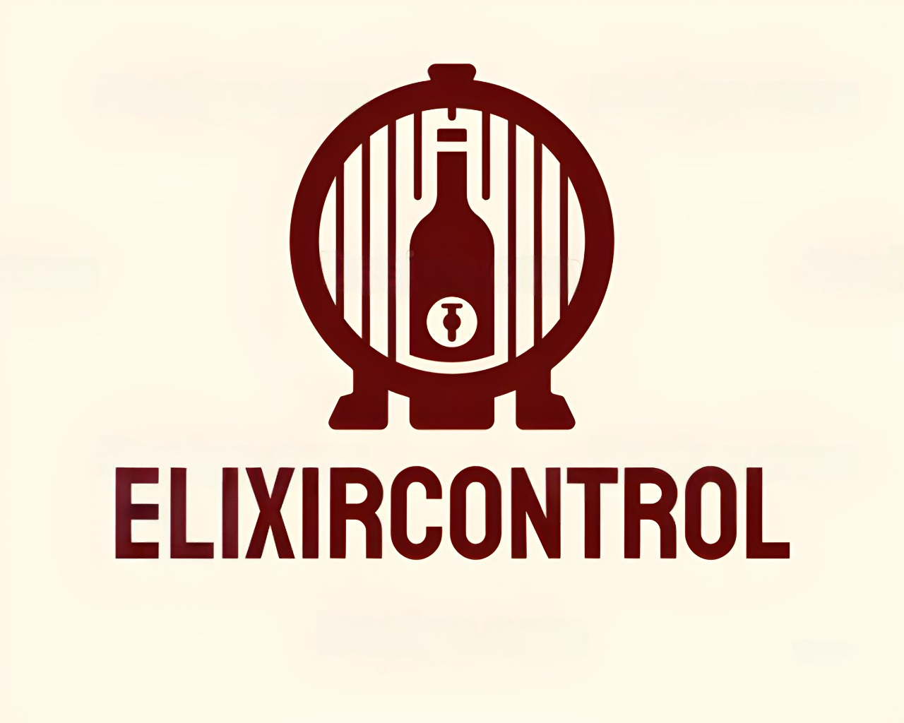

# Capítulo II: Requirements Elicitation & Analysis

## 2.1. Competidores

En esta etapa, el equipo llevará a cabo un análisis sobre los posibles competidores dentro del mercado.

### 2.1.1. Análisis competitivo

En esta sección, el equipo llevará a cabo un análisis competitivo de los tres principales competidores identificados, con el fin de determinar e implementar estrategias adecuadas en relación con ellos.

<table>  
    <thead>
        <tr>
            <th colspan="6">Competitive Analysis Landscape</th>
        </tr>
        <tr>
            <th colspan="2">Competitive Analysis Landscape</th>
            <td colspan="5" style="text-align: justify">Este análisis tiene como finalidad identificar y comprender de forma más profunda las fortalezas, debilidades y estrategias de los principales competidores. A partir de ello, se podrán detectar oportunidades y amenazas en el mercado para definir acciones estratégicas que otorguen una ventaja competitiva.</td>
        </tr>
    </thead>
    <tbody style="text-align: center">
        <tr>
            <th colspan="2"></th>
            <th>  </th>
            <th></th>
            <th></th>
            <th></th>
        </tr>
        <tr>
            <th rowspan="2"> <strong> Perfil </strong> </th>
            <td> Overview</td>
            <td>ElixirControl es una plataforma completa enfocada en la gestión del proceso productivo de vinos y pisco. Integra herramientas para administrar inventarios, pedidos, clientes y el proceso de vinificación, con el objetivo de optimizar la eficiencia y mejorar la toma de decisiones.</td>
            <td>Vinotec es un software integral de gestión para bodegas y productores de vino. Su propósito es mejorar la eficiencia del proceso productivo y de ventas, facilitando el control de producción y la administración de clientes.</td>
            <td>WineManager brinda soluciones específicas para el sector vitivinícola, con funciones de control de inventario, seguimiento de pedidos y análisis de ventas, enfocándose en integrar información para respaldar decisiones estratégicas.</td>
            <td>VinTrace está orientado a la gestión de viñedos y seguimiento de la producción de vinos. Dispone de herramientas para planificación agrícola, registro de actividades y documentación de cosechas, priorizando el cumplimiento normativo y la calidad.</td>
        </tr>
        <tr>
            <td>Ventaja competitiva ¿Que valor ofrece a los clientes?</td>
            <td>Brinda una solución completa que cubre desde la gestión de inventario hasta el control de pedidos y cartera de clientes, ajustándose a las necesidades particulares de productores y distribuidores de vinos y pisco.</td>
            <td>Se enfoca en mejorar los procesos de producción y ventas, aunque no incluye funciones especializadas para el pisco.</td>  
            <td>Su principal fortaleza es la integración de datos, permitiendo decisiones fundamentadas a partir de análisis detallados.</td>  
            <td>Aunque se enfoca en el pisco, su alcance limitado puede no ser adecuado para productores de vino.</td>  
        </tr>
        <tr>
            <th rowspan="2"> <strong> Perfil de Marketing </strong> </th>
            <td> Mercado objetivo</td>
            <td>Productores y distribuidores de vinos y pisco que buscan herramientas adaptadas para gestionar eficientemente sus procesos productivos.</td>  
            <td>Bodegas y productores de vino que requieren mejorar la gestión de ventas y producción.</td>  
            <td>Empresas del sector vitivinícola que necesitan soluciones integradas para la toma de decisiones.</td>  
            <td>Productores de vino que demandan herramientas específicas para el manejo de viñedos y trazabilidad.</td>
        </tr>
        <tr>
            <td>Estrategias de Marketing</td>
            <td>Se promueve como una herramienta versátil e integral para la producción de vinos y pisco, destacando su facilidad de uso y capacidad de adaptación.</td>  
            <td>Orienta su estrategia en la mejora de procesos y gestión de ventas a través de su plataforma.</td>  
            <td>Hace uso del marketing de contenidos y análisis de datos para consolidarse como una solución integrada líder.</td>  
            <td>Se especializa en la gestión de viñedos, destacando su experiencia en el rubro y capacidad para garantizar calidad.</td>  
        </tr>
        <tr>
            <th rowspan="3"> <strong> Perfil del producto </strong> </th>
            <td> Producto & servicios</td>
            <td>Incluye control de inventarios, gestión de clientes, seguimiento de pedidos y funciones para vinificación y manejo de viñedos.</td>  
            <td>Ofrece herramientas para ventas y producción, aunque tiene menor enfoque en el proceso de vinificación.</td>  
            <td>Brinda soluciones integradas, aunque podría no contar con funciones específicas para el pisco.</td>  
            <td>Está especializado en la administración de viñedos, con funciones para planificación agrícola y control de calidad.</td>  
        </tr>
        <tr>
            <td>precio y costos</td>
            <td>Dispone de tres planes de suscripción (Básico, Intermedio, Avanzado), ajustados a distintos tamaños de empresas.</td>  
            <td>Funciona bajo un modelo de suscripción, con precios que varían según las funciones requeridas.</td>  
            <td>Establece sus precios en función del número de usuarios y características, priorizando la personalización.</td>  
            <td>Opera con una suscripción de costo fijo, aunque limitado a funcionalidades para gestión de viñedos.</td>  
        </tr>
        <tr>
            <td>Canales de distribución (Web y/o movil)</td>
            <td>Está disponible en plataformas web y móviles, lo que facilita el acceso desde distintos dispositivos.</td>  
            <td>Opera principalmente vía web, con funciones móviles limitadas.</td>  
            <td>Cuenta con una plataforma web sólida, pero presenta restricciones en su versión móvil.</td>  
            <td>Enfocado en la versión web, con una interfaz amigable para el usuario.</td> 
        </tr>
        <tr>
            <th rowspan="4"> <strong> Análisis SWOT </strong> </th>
            <td>Fortalezas</td>
            <td>Plataforma completa y adaptable, interfaz sencilla, y orientación hacia la eficiencia operativa.</td>  
            <td>Capacidad para optimizar procesos y amplia experiencia en el sector.</td>  
            <td>Integración de datos que respalda la toma de decisiones.</td>  
            <td>Especialización en manejo de viñedos y trazabilidad.</td> 
        </tr>
        <tr>
            <td>Debilidades</td>
            <td>Debe ganar confianza en un entorno altamente competitivo y depende de la infraestructura tecnológica.</td>  
            <td>Carece de funciones adaptadas para productores de pisco.</td>  
            <td>Podría resultar muy técnico para ciertos usuarios.</td>  
            <td>Su enfoque limitado podría no atraer a los productores de vino.</td> 
        </tr>
        <tr>
            <td>Oportunidades</td>
            <td>Incremento en la demanda de soluciones tecnológicas para la industria de vinos y pisco, con potencial de expansión internacional.</td>  
            <td>Crecimiento del sector vitivinícola y necesidad de eficientizar procesos.</td>  
            <td>Posibilidad de ampliar su oferta de servicios.</td>  
            <td>Mayor interés en herramientas para control de calidad y manejo de viñedos.</td> 
        </tr>
        <tr>
            <td>Amenazas</td>
            <td>Ingreso de nuevas plataformas al mercado y cambios regulatorios del sector.</td>  
            <td>Aumento de competidores con tecnologías emergentes.</td>  
            <td>La evolución acelerada del sector puede dejar atrás a soluciones no actualizadas.</td>  
            <td>Modificaciones en las preferencias del consumidor y mayor competencia en gestión de viñedos.</td> 
        </tr>
    </tbody>
</table>

### 2.1.2. Estrategias y tácticas frente a competidores

Después de haber comparado nuestra propuesta con las soluciones actuales en el mercado, el equipo definirá las estrategias y técnicas que deberán implementarse para destacar frente a la competencia.

<table>
    <thead>
        <tr>
            <th colspan="3"> Matriz CAME para el desarrollo de estrategias en base al análisis FODA </th>
        </tr>
    </thead>
    <tbody>
        <tr>
            <th rowspan="2"> Análisis FODA cruzado</th>
            <th> Oportunidades </th>
            <th> Amenazas </th>
        </tr>
        <tr>
            <td>
                1. El aumento del interés en sistemas de gestión para la industria vitivinícola representa una oportunidad clave para ElixirControl. 
                2. Existen posibilidades de crecimiento geográfico hacia nuevas regiones y países. 
                3. La evolución tecnológica constante permite mejorar la plataforma y brindar una mejor experiencia al usuario. 
                4. Las colaboraciones con actores del sector podrían fortalecer la propuesta de valor. 
                5. Se puede consolidar la imagen de ElixirControl como líder en gestión de vinos y pisco mediante acciones de marketing. 
                6. Vincularse con instituciones académicas permitiría impulsar programas de capacitación y certificación.
            </td>
            <td>
                1. La entrada de nuevas plataformas con mejor tecnología puede representar una fuerte competencia. 
                2. Cambios en normativas del rubro podrían afectar la operatividad del software. 
                3. Existen riesgos asociados a la seguridad digital que podrían afectar la confianza de los usuarios. 
                4. Los competidores podrían ofrecer precios más bajos y captar a los clientes más sensibles al costo. 
                5. La falta de integración fluida con otros sistemas puede ser una barrera para potenciales clientes.
            </td>
        </tr>
        <tr>
            <th>Fortalezas</th>
            <th>Estrategia (FO) E. Ofensivas</th>
            <th>Estrategia (FA) E. Defensivas</th>
        </tr>
        <tr>
            <td>
                1. Comunicación directa entre cliente y empresa, lo que mejora la relación y genera confianza. 
                2. Transparencia total en el avance del proceso productivo. 
                3. Especialización en un sector específico, lo que permite mayor eficacia. 
                4. Ahorro de tiempo y esfuerzo para el cliente gracias a la automatización.
            </td>
            <td>
                1. Lanzar campañas que destaquen cómo ElixirControl responde a la demanda creciente del mercado. 
                2. Analizar nuevas regiones con potencial y adaptar la solución a cada contexto. 
                3. Invertir en desarrollo tecnológico continuo para garantizar una experiencia superior. 
                4. Formar alianzas con empresas del rubro para ofrecer soluciones más integradas. 
                5. Promocionar ElixirControl como referente en el sector a través de acciones de marca. 
                6. Colaborar con universidades para posicionarse como herramienta educativa y profesional.
            </td>
            <td>
                1. Innovar constantemente para mantener la ventaja tecnológica. 
                2. Reforzar los sistemas de seguridad para generar confianza. 
                3. Estar atentos a cambios normativos para adaptar el sistema a tiempo. 
                4. Analizar precios del mercado para seguir siendo competitivos. 
                5. Crear herramientas de integración que faciliten la adopción del sistema. 
                6. Estimular la innovación interna para continuar liderando el sector.
            </td>
        </tr>
        <tr>
            <th>Debilidad (D)</th>
            <th>Estrategia(DO) de Reorientación</th>
            <th>Estrategia(DA) de Supervivencia</th>
        </tr>
        <tr>
            <td>
                1. Dificultad para generar confianza en nuevos clientes. 
                2. Falta de consistencia en la calidad del servicio. 
                3. Baja presencia de marca en el mercado. 
                4. Dependencia alta de herramientas tecnológicas.
            </td>
            <td>
                1. Mostrar casos exitosos para construir credibilidad ante nuevos clientes. 
                2. Aplicar mejoras continuas basadas en la retroalimentación del usuario. 
                3. Implementar una estrategia digital que incremente el alcance de la marca. 
                4. Capacitar constantemente al equipo para responder a los cambios tecnológicos.
            </td>
            <td>
                1. Ampliar el portafolio de servicios para reducir vulnerabilidades. 
                2. Tener estrategias listas para enfrentar nuevas amenazas del entorno competitivo. 
                3. Mantener un diálogo constante con los usuarios para fortalecer la relación. 
                4. Asegurar que el equipo esté siempre actualizado frente a las nuevas herramientas. 
                5. Contar con opciones alternativas ante cualquier interrupción técnica o de proveedores. 
                6. Establecer mecanismos efectivos para recibir sugerencias o reclamos y mejorar el servicio.
            </td>
        </tr>
    </tbody>
</table>

## 2.2. Entrevistas

### 2.2.1. Diseño de entrevistas

### 2.2.2. Registro de entrevistas

### 2.2.3. Análisis de entrevistas

## 2.3. Needfinding

### 2.3.1. User Persons

### 2.3.2. User Task Matrix

### 2.3.3. User Journey Mapping

### 2.3.4. Empathy Mapping

### 2.3.5. As-is Scenario Mapping

## 2.4. Ubiquitous Language