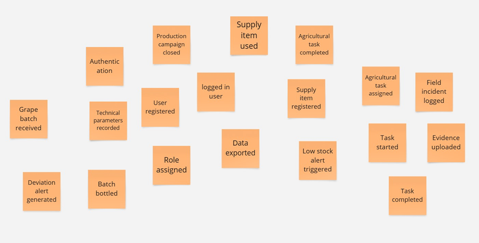
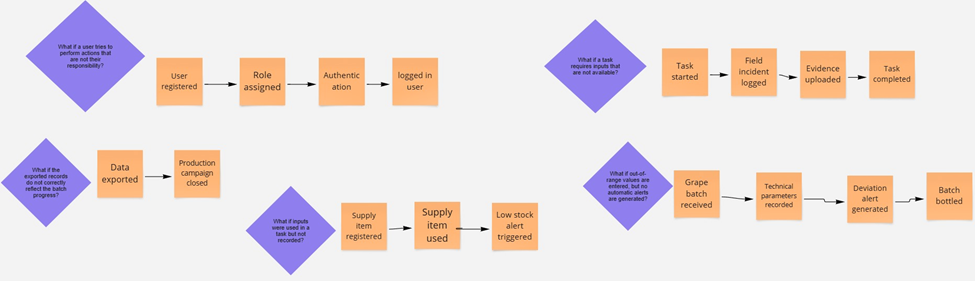
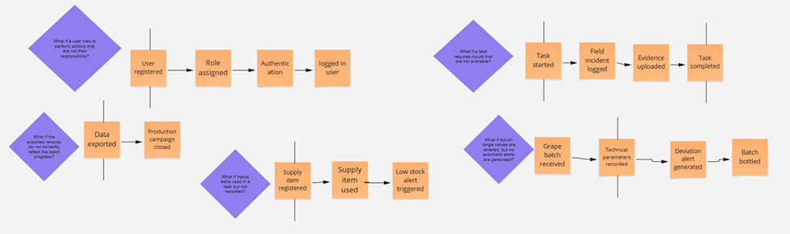
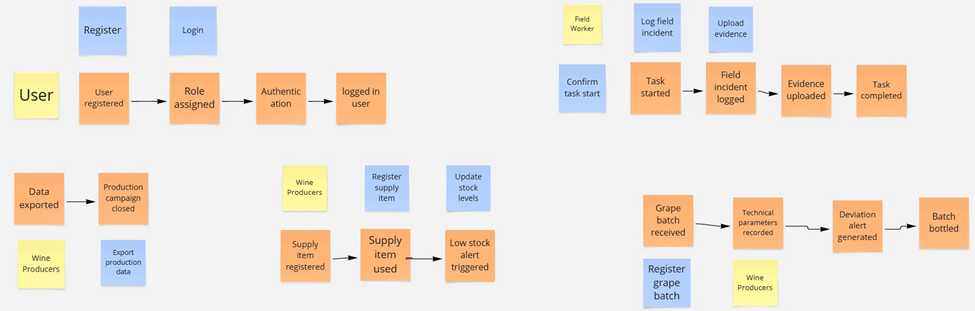
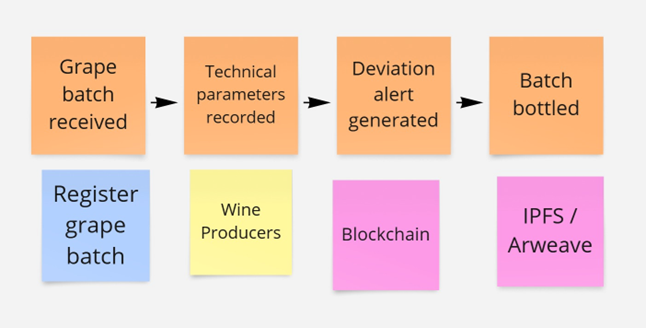
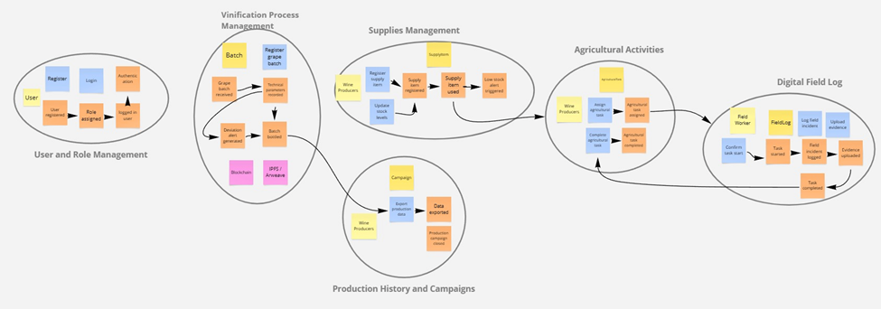
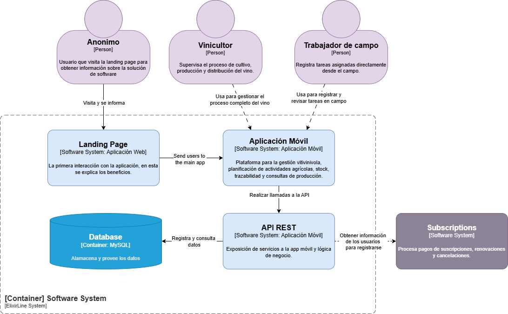
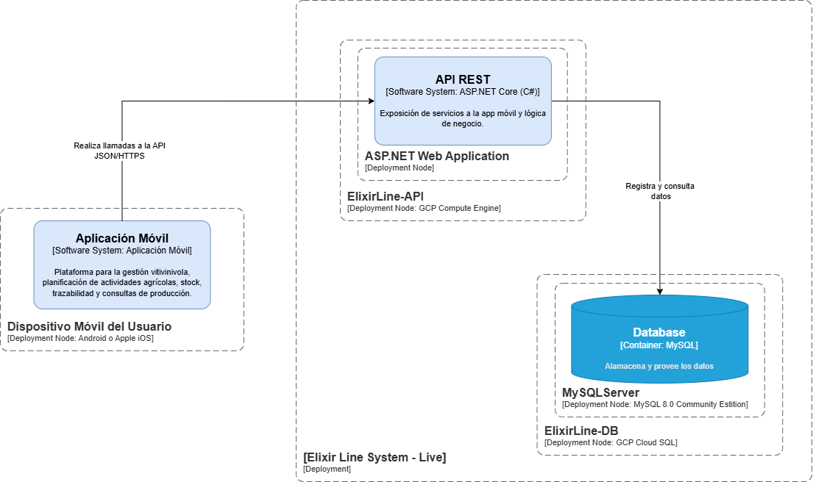

# Capítulo IV: Solution Software Design

---

## 4.1. Strategic-Level Domain-Driven Design

### 4.1.1. EventStorming

Para el desarrollo de esta sección, se adoptó la técnica de Event Storming, un método colaborativo que facilita la 
exploración profunda del dominio de una aplicación. A través de diversas sesiones de trabajo, y con el apoyo de 
la herramienta Miro, fue posible construir el flujo general y detallar los pasos clave del proceso. En una primera 
fase, se recopilaron diferentes perspectivas sobre los eventos relevantes del dominio, los cuales fueron organizados 
según criterios como su frecuencia y relevancia, entre otros.

**Step 1: Unstructured Exploration**

En esta fase, se definieron los eventos principales que reflejan las acciones más relevantes dentro del sistema.

--- 

**Step 2: Timelines**

Luego, se dispusieron los eventos en una línea de tiempo con el objetivo de visualizar el flujo 
de interacciones y la secuencia entre ellos. Esta disposición cronológica ayuda a identificar 
dependencias y momentos clave, lo que contribuye a un diseño más claro y coherente del sistema.

--- 

**Step 3: Paint Points**

En el tercer paso, identificamos "Pain Points" o cuellos de botella en el flujo de eventos.

--- 

**Step 4: Pivotal Points**

Identificamos los "Pivotal Points",  Estos puntos son esenciales para el flujo del sistema, y su correcta implementación asegura un funcionamiento fluido.

--- 

**Step 5: EventStorming-Commands**

Finalmente, se definieron los comandos que pueden ser ejecutados por los distintos roles dentro del sistema. Cada rol cuenta con permisos específicos, lo que garantiza que los usuarios tengan acceso únicamente a las funciones que les corresponden según su perfil

#### 4.1.1.1. Candidate Context Discovery

**Step 6: Policies**

En esta etapa, se definieron políticas específicas para regular la interacción entre los distintos componentes del sistema. Estas directrices permiten mantener la coherencia del funcionamiento general y contribuyen a reducir posibles riesgos operativos.

**Step 7: Read Models**

Se definieron modelos de lectura que representan el estado actual del sistema. Estos modelos permiten acceder a información actualizada en todo momento, lo cual facilita la consulta de datos relevantes y apoya una mejor toma de decisiones por parte de los usuarios.

**Step 8: External-Systems**

Se identificaron sistemas externos que interactúan con la aplicación, los cuales son esenciales para la ejecución de ciertas funciones. Para manejar estas interacciones, se implementaron mecanismos que permiten gestionar adecuadamente las dependencias y asegurar una integración eficiente.

**Step 9: Aggregates**

Se definieron agregados que agrupan de forma lógica entidades relacionadas, lo cual ayuda a mantener la coherencia interna y promueve el modularidad del sistema.

**Step 10: Bounded Context**

Finalmente, se definieron los Bounded Contexts, cada uno con responsabilidades claras y bien delimitadas. Esto permite una mejor organización del sistema, facilita el mantenimiento y asegura una alineación más efectiva con los objetivos del negocio.

#### 4.1.1.2. Domain Message Flows Modeling

En esta sección se presenta el modelado de los flujos de mensajes dentro del dominio, utilizando
la técnica de EventStorming. Esta metodología permitió identificar los eventos clave y 
comprender sus interacciones. Con base en estos eventos, se elaboraron diagramas que ilustran 
cómo se comunican los distintos componentes del sistema para cumplir con los objetivos del 
negocio. A continuación, se muestran los diagramas de flujo de mensajes correspondientes a los
contextos previamente definidos.

**Step 11: Domain Message Flows Modeling**

#### 4.1.1.3. Bounded Context Canvases

### 4.1.2. Context Mapping

### 4.1.3. Software Architecture

En esta sección, se presenta la arquitectura de software del sistema, que incluye tanto la arquitectura de alto nivel como la de bajo nivel. La arquitectura de alto nivel proporciona una visión general de los componentes principales y sus interacciones, mientras que la arquitectura de bajo nivel detalla la implementación específica de cada componente.

#### 4.1.3.1. Software Architecture Context Level Diagrams

El diagrama de nivel de contexto de ElixirLine muestra las interacciones clave entre el sistema principal, sistema externo y sus usuarios principales:

* Vinicultor: Responsables de gestionar el ciclo completo de producción
* Trabajador de campo: Encargados de ejecutar tareas agrícolas bajo la dirección del vinicultor

#### 4.1.3.2. Software Architecture Container Level Diagrams

Este diagrama detalla la arquitectura de los contenedores de ElixirLine, mostrando los componentes principales del sistema:

* Landing Page: Sitio web donde los vinicultores pueden informarse sobre la aplicación y registrarse.
* Mobile App: Aplicación móvil destinada a los trabajadores de campo para recibir y reportar tareas agrícolas asignadas por el vinicultor.
* Backend: Servicio REST que gestiona y procesa la información de los datos.
* Database: Base de datos donde se almacena la información relacionada con las actividades de producción del viñedo, vinicultores y trabajadores de campo.

#### 4.1.3.3. Software Architecture Deployment Diagrams

Nuestro servidor backend y de base de datos se desplegará utilizando la nube de Google Cloud Platform (GCP).

## 4.2. Tactical-Level Domain-Driven Design

### 4.2.1.  Bounded Context: <Bounded Context Name>

#### 4.2.1.1. Domain Layer

#### 4.2.1.2. Interface Layer

#### 4.2.1.3. Application Layer

#### 4.2.1.4. Infrastructure Layer

#### 4.2.1.5. Bounded Context Software Architecture Component Level Diagrams

#### 4.2.1.6. Bounded Context Software Architecture Code Level Diagrams

#### 4.2.1.6.1. Bounded Context Domain Layer Class Diagrams

#### 4.2.1.6.2. Bounded Context Database Design Diagram