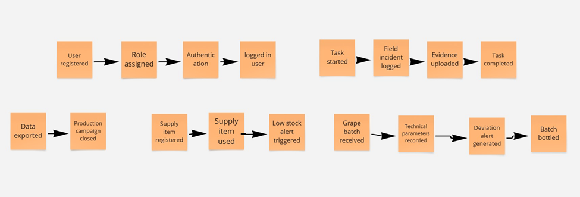
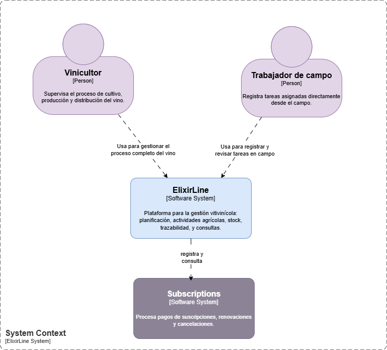
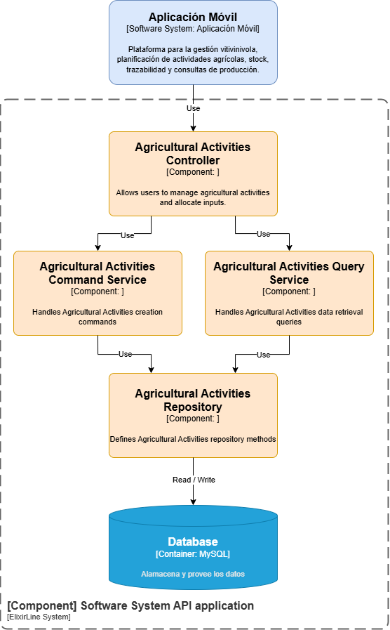

# Capítulo IV: Solution Software Design

---

## 4.1. Strategic-Level Domain-Driven Design

### 4.1.1. EventStorming

Para el desarrollo de esta sección, se adoptó la técnica de Event Storming, un método colaborativo que facilita la 
exploración profunda del dominio de una aplicación. A través de diversas sesiones de trabajo, y con el apoyo de 
la herramienta Miro, fue posible construir el flujo general y detallar los pasos clave del proceso. En una primera 
fase, se recopilaron diferentes perspectivas sobre los eventos relevantes del dominio, los cuales fueron organizados 
según criterios como su frecuencia y relevancia, entre otros.

**Step 1: Unstructured Exploration**

En esta fase, se definieron los eventos principales que reflejan las acciones más relevantes dentro del sistema.

--- 

**Step 2: Timelines**

Luego, se dispusieron los eventos en una línea de tiempo con el objetivo de visualizar el flujo 
de interacciones y la secuencia entre ellos. Esta disposición cronológica ayuda a identificar 
dependencias y momentos clave, lo que contribuye a un diseño más claro y coherente del sistema.

--- 

**Step 3: Paint Points**

En el tercer paso, identificamos "Pain Points" o cuellos de botella en el flujo de eventos.

--- 

**Step 4: Pivotal Points**

Identificamos los "Pivotal Points",  Estos puntos son esenciales para el flujo del sistema, y su correcta implementación asegura un funcionamiento fluido.

--- 

**Step 5: EventStorming-Commands**

Finalmente, se definieron los comandos que pueden ser ejecutados por los distintos roles dentro del sistema. Cada rol cuenta con permisos específicos, lo que garantiza que los usuarios tengan acceso únicamente a las funciones que les corresponden según su perfil

#### 4.1.1.1. Candidate Context Discovery

**Step 6: Policies**

En esta etapa, se definieron políticas específicas para regular la interacción entre los distintos componentes del sistema. Estas directrices permiten mantener la coherencia del funcionamiento general y contribuyen a reducir posibles riesgos operativos.

**Step 7: Read Models**

Se definieron modelos de lectura que representan el estado actual del sistema. Estos modelos permiten acceder a información actualizada en todo momento, lo cual facilita la consulta de datos relevantes y apoya una mejor toma de decisiones por parte de los usuarios.

**Step 8: External-Systems**

Se identificaron sistemas externos que interactúan con la aplicación, los cuales son esenciales para la ejecución de ciertas funciones. Para manejar estas interacciones, se implementaron mecanismos que permiten gestionar adecuadamente las dependencias y asegurar una integración eficiente.

**Step 9: Aggregates**

Se definieron agregados que agrupan de forma lógica entidades relacionadas, lo cual ayuda a mantener la coherencia interna y promueve el modularidad del sistema.

**Step 10: Bounded Context**

Finalmente, se definieron los Bounded Contexts, cada uno con responsabilidades claras y bien delimitadas. Esto permite una mejor organización del sistema, facilita el mantenimiento y asegura una alineación más efectiva con los objetivos del negocio.

#### 4.1.1.2. Domain Message Flows Modeling

En esta sección se presenta el modelado de los flujos de mensajes dentro del dominio, utilizando
la técnica de EventStorming. Esta metodología permitió identificar los eventos clave y 
comprender sus interacciones. Con base en estos eventos, se elaboraron diagramas que ilustran 
cómo se comunican los distintos componentes del sistema para cumplir con los objetivos del 
negocio. A continuación, se muestran los diagramas de flujo de mensajes correspondientes a los
contextos previamente definidos.

**Step 11: Domain Message Flows Modeling**

#### 4.1.1.3. Bounded Context Canvases

Para lograr una mejor organización del dominio y una comunicación clara entre equipos, 
se desarrollaron Bounded Context Canvases que delimitan responsabilidades, definen 
modelos clave y establecen interacciones entre contextos. Esta sección presenta los 
canvases elaborados, los cuales sirvieron como guía para estructurar y alinear el 
diseño del sistema.

**Bounded Context Canvas: Vinification Process Management**

**Bounded Context Canvas: Supply Management**

**Bounded Context Canvas: Agricultural Activities**

**Bounded Context Canvas: Digital Field Log**

**Bounded Context Canvas: Production History and Campaigns**

**Bounded Context Canvas: Identity and Access Management - IAM**

### 4.1.2. Context Mapping

En esta sección, se presenta el mapeo de contextos, que permite visualizar las interacciones 
y dependencias entre los diferentes contextos delimitados en la fase anterior. 
Este mapeo es fundamental para comprender cómo se relacionan los distintos componentes 
del sistema y cómo fluyen los datos entre ellos.

### 4.1.3. Software Architecture

En esta sección, se presenta la arquitectura de software del sistema, que incluye tanto la arquitectura de alto nivel como la de bajo nivel. La arquitectura de alto nivel proporciona una visión general de los componentes principales y sus interacciones, mientras que la arquitectura de bajo nivel detalla la implementación específica de cada componente.

#### 4.1.3.1. Software Architecture Context Level Diagrams

El diagrama de nivel de contexto de ElixirLine muestra las interacciones clave entre el sistema principal, sistema externo y sus usuarios principales:

* Vinicultor: Responsables de gestionar el ciclo completo de producción
* Trabajador de campo: Encargados de ejecutar tareas agrícolas bajo la dirección del vinicultor

#### 4.1.3.2. Software Architecture Container Level Diagrams

Este diagrama detalla la arquitectura de los contenedores de ElixirLine, mostrando los componentes principales del sistema:

* Landing Page: Sitio web donde los vinicultores pueden informarse sobre la aplicación y registrarse.
* Mobile App: Aplicación móvil destinada a los trabajadores de campo para recibir y reportar tareas agrícolas asignadas por el vinicultor.
* Backend: Servicio REST que gestiona y procesa la información de los datos.
* Database: Base de datos donde se almacena la información relacionada con las actividades de producción del viñedo, vinicultores y trabajadores de campo.

#### 4.1.3.3. Software Architecture Deployment Diagrams

Nuestro servidor backend y de base de datos se desplegará utilizando la nube de Google Cloud Platform (GCP).

## 4.2. Tactical-Level Domain-Driven Design

### 4.2.1.  Bounded Context: "Bounded Context Name"

En esta sección, nuestro equipo presenta las clases identificadas detalladas a manera de
diccionario, explicando para cada una su nombre, propósito y la documentación de
atributos y métodos considerados, junto con las relaciones entre ellas.

---

### **Bounded Context Name: "Vinification Process Management"**

<table>
<thead>
    <tr>
        <th>Class Name: WineBatch</th>
    </tr>
</thead>
<tbody>
    <tr>
        <td>
            Propósito:  
            Representa un conjunto de uvas procesadas de manera conjunta a lo largo de las etapas de vinificación.
        </td>
    </tr>
    <tr>
        <td>
            <strong> Atributos: </strong>  
            batchId: UUID – Identificador único del lote.  
            grapeVariety: String – Tipo de uva utilizada (e.g., Tempranillo, Malbec).  
            receptionDate: Date – Fecha de ingreso del lote al sistema.  
            currentStage: Enum (Recepción, Fermentación, Clarificación, etc.) – Etapa actual del proceso.  
            technicalParameters: Parámetros Técnicos – Parámetros técnicos asociados.  
            stages: List[VinificationStage] – Historial completo de las etapas por las que ha pasado el lote.  
        </td>
    </tr>
    <tr>
        <td>
            <strong> Métodos: </strong> 
            advanceStage(): Cambia la etapa del lote y actualiza el historial. 
            addParameters(params: TechnicalParameters): Asocia parámetros a una etapa. 
            completeBatch(): Marca el lote como completado para el histórico. 
        </td>
    </tr>
</tbody>
</table>

<table>
<thead>
    <tr>
        <th>Class Name: VinificationStage</th>
    </tr>
</thead>
<tbody>
    <tr>
        <td>
            Propósito:  
            Representa una etapa específica dentro del proceso de vinificación.
        </td>
    </tr>
    <tr>
        <td>
            <strong> Atributos: </strong>  
            stageType: Enum (Recepción, Fermentación, Clarificación, etc.)  
            startDate: Date   
            endDate: Date?  
            status: Enum (Pendiente, En curso, Finalizada, Incidencia)  
            notes: String?  
        </td>
    </tr>
    <tr>
        <td>
            <strong> Métodos: </strong>  
            start(): Cambia estado a "En curso".   
            complete(): Establece fecha de fin y cambia estado.  
            reportIncident(comentario: String): Registra desviación con comentario.  
        </td>
    </tr>
</tbody>
</table>

<table>
<thead>
    <tr>
        <th>Class Name: TechnicalParameters</th>
    </tr>
</thead>
<tbody>
    <tr>
        <td>
            Propósito:  
            Representa los parámetros técnicos asociados a una etapa de vinificación.
        </td>
    </tr>
    <tr>
        <td>
            <strong> Atributos: </strong>  
            brix: Double – Grado Brix (azúcares). 
            ph: Double – Nivel de acidez. 
            temperature: Double – Medición en °C. 
            measurementDate: Date 
        </td>
    </tr>
    <tr>
        <td>
            <strong> Métodos: </strong>  
            validarRango(): Verifica si los valores están dentro de límites aceptables.
        </td>
    </tr>
</tbody>
</table>

<table>
<thead>
    <tr>
        <th>Class Name: ProcessAlert</th>
    </tr>
</thead>
<tbody>
    <tr>
        <td>
            Propósito:  
            Representa una alerta generada por el sistema en caso de desviaciones o problemas en el proceso.
        </td>
    </tr>
    <tr>
        <td>
            <strong> Atributos: </strong>  
            alertId: UUID   
            alertType: Enum (Desviación técnica, Retraso, Parámetro fuera de rango)   
            description: String   
            date: Date   
            associatedBatch: WineBatch   
        </td>
    </tr>
    <tr>
        <td>
            <strong> Métodos: </strong>  
            enviarNotificacion(): Dispara un evento para ser visualizado o registrado.   
            esCritica(): Devuelve true si la alerta compromete la calidad del lote.   
        </td>
    </tr>
</tbody>
</table>

<table>
<thead>
    <tr>
        <th>Class Name: ProcessLog</th>
    </tr>
</thead>
<tbody>
    <tr>
        <td>
            Propósito:  
            Consolidación de toda la información generada durante el ciclo de vida del lote, para consulta o exportación.        </td>
    </tr>
    <tr>
        <td>
            <strong> Atributos: </strong>  
            lote: LoteDeVino   
            parametrosHistoricos: List[ParametrosTecnicos>   
            etapas: List[EtapaVinificacion>   
            alertas: List[AlertaProceso]   
        </td>
    </tr>
    <tr>
        <td>
            <strong> Métodos: </strong>  
            exportarFormato(tipo: String): Genera archivo en PDF/Excel.  
            resumenLote(): Devuelve resumen estructurado del ciclo de vida del lote.   
        </td>
    </tr>
</tbody>
</table>

**Relaciones Clave**

1. [ ] WineBatch tiene una lista de VinificationStage
2. [ ] Cada VinificationStage puede contener un conjunto de TechnicalParameters
3. [ ] WineBatch puede generar múltiples ProcessAlert
4. [ ] ProcessLog actúa como agregador de toda la información del lote

---

### **Bounded Context Name: "Supply Management"**

<table>
<thead>
    <tr>
        <th>Class Name: SupplyItem</th>
    </tr>
</thead>
<tbody>
    <tr>
        <td>
            Propósito:  
            Representa un insumo o material utilizado en el proceso de vinificación.
        </td>
    </tr>
    <tr>
        <td>
            <strong> Atributos: </strong>  
            supplyId: UUID – Identificador único del insumo. 
            name: String – Nombre del insumo (ej. fertilizante, levadura, solución de limpieza). 
            category: String – Tipo de insumo (ej. agrícola, procesamiento, limpieza). 
            quantityAvailable: Double – Cantidad disponible actualmente. 
            unit: String – Unidad de medida (ej. kg, L, unidades). 
            minimumStockLevel: Double – Nivel mínimo de stock para disparar una alerta. 
            lastUpdated: Date – Fecha de última actualización del inventario. 
        </td>
    </tr>
    <tr>
        <td>
            <strong> Métodos: </strong>  
            decreaseQuantity(amount: Double): Disminuye la cantidad disponible del insumo en la cantidad especificada.  
            increaseQuantity(amount: Double): Incrementa la cantidad disponible del insumo en la cantidad especificada.  
            isBelowMinimum(): Verifica si la cantidad disponible está por debajo del nivel mínimo permitido.  
        </td>
    </tr>
</tbody>
</table>
 

<table>
<thead>
    <tr>
        <th>Class Name: SupplyMovement</th>
    </tr>
</thead>
<tbody>
    <tr>
        <td>
            Propósito:  
            Representa un movimiento de insumo, ya sea entrada o salida del inventario.
        </td>
    </tr>
    <tr>
        <td>
            <strong> Atributos: </strong>  
            movementId: UUID – Identificador único del movimiento de insumo.  
            supplyItem: SupplyItem – Referencia al insumo afectado por el movimiento.  
            movementType: Enum (Inbound, Outbound, Adjustment) – Tipo de movimiento: entrada, salida o ajuste.   
            quantity: Double – Cantidad involucrada en el movimiento.  
            movementDate: Date – Fecha en que se realizó el movimiento.  
            associatedTaskOrBatchId: UUID? – ID opcional de la tarea o lote asociado al movimiento. 
        </td>
    </tr>
    <tr>
        <td>
            <strong> Métodos: </strong>  
            registerMovement(): Registra el movimiento y actualiza el stock correspondiente.
        </td>
    </tr>
</tbody>
</table>

<table>
<thead>
    <tr>
        <th>Class Name: StockAlert</th>
    </tr>
</thead>
<tbody>
    <tr>
        <td>
            Propósito:  
            Representa una alerta generada por el sistema cuando un insumo está por debajo del nivel mínimo de stock.
        </td>
    </tr>
    <tr>
        <td>
            <strong> Atributos: </strong>  
            alertId: UUID – Identificador único de la alerta.   
            supplyItem: SupplyItem – Insumo asociado a la alerta.   
            alertType: Enum (StockBelowMinimum) – Tipo de alerta generada.   
            description: String – Descripción breve del motivo de la alerta.
        </td>
    </tr>
    <tr>
        <td>
            <strong> Métodos: </strong>  
            triggerNotification(): Envía una notificación sobre la alerta de bajo stock.
        </td>
    </tr>
</tbody>
</table>

<table>
<thead>
    <tr>
        <th>Class Name: SupplyAssignment</th>
    </tr>
</thead>
<tbody>
    <tr>
        <td>
            Propósito:  
            Representa la asignación de insumos a tareas o lotes específicos dentro del proceso de vinificación.
        </td>
    </tr>
    <tr>
        <td>
            <strong> Atributos: </strong>  
            assignmentId: UUID – Identificador único de la asignación.   
            supplyItem: SupplyItem – Insumo asignado.   
            assignedTo: UUID – Identificador de la tarea o lote al que se asigna el insumo.   
            assignedQuantity: Double – Cantidad de insumo asignada.   
            assignmentDate: Date – Fecha de la asignación.
        </td>
    </tr>
    <tr>
        <td>
            <strong> Métodos: </strong>  
            confirmAssignment(): Confirma la asignación del insumo a la tarea o lote correspondiente.   
        </td>
    </tr>
</tbody>
</table>

**Relaciones Clave**

1. [ ] SupplyItem es referenciado por SupplyMovement, SupplyAssignment y StockAlert.
2. [ ] SupplyMovement modifica la cantidad de SupplyItem.
3. [ ] SupplyAssignment asocia insumos a tareas o lotes de vinificación.
4. [ ] StockAlert se dispara cuando SupplyItem.isBelowMinimum() es true.

---

### **Bounded Context Name: "Agricultural Activities"**

<table>
<thead>
    <tr>
        <th>Class Name: AgriculturalTask</th>
    </tr>
</thead>
<tbody>
    <tr>
        <td>
            Propósito:  
            Representa una tarea agrícola específica que debe ser ejecutada por un trabajador de campo.
        </td>
    </tr>
    <tr>
        <td>
            <strong> Atributos: </strong>  
            taskId: UUID – Identificador único de la tarea.  
            title: String – Título breve de la tarea (ej. "Poda de invierno").  
            description: String – Descripción detallada de la actividad a realizar.  
            parcelId: UUID – Identificador del lote o parcela donde se realizará la tarea.  
            assignedTo: UUID – Identificador del trabajador asignado.  
            scheduledDate: Date – Fecha programada para ejecutar la tarea.  
            status: Enum (Scheduled, InProgress, Completed, Cancelled) – Estado actual de la tarea.  
        </td>
    </tr>
    <tr>
        <td>
            <strong> Métodos: </strong>  
            startTask(): Cambia el estado de la tarea a "InProgress".  
            completeTask(): Marca la tarea como completada.  
            cancelTask(reason: String): Cancela la tarea con una justificación.  
        </td>
    </tr>
</tbody>
</table>

<table>
<thead>
    <tr>
        <th>Class Name: TaskExecutionReport</th>
    </tr>
</thead>
<tbody>
    <tr>
        <td>
            Propósito:  
            Almacena información sobre la ejecución real de una tarea agrícola.
        </td>
    </tr>
    <tr>
        <td>
            <strong> Atributos: </strong>  
            reportId: UUID – Identificador único del reporte.   
            taskId: UUID – Tarea agrícola a la que pertenece el reporte.   
            executorId: UUID – Usuario que ejecutó la tarea.   
            executionDate: Date – Fecha real de ejecución.   
            observations: String – Comentarios o notas del ejecutor.   
            evidencePhotos: List[String> – URLs de fotos o evidencia visual adjunta.   
        </td>
    </tr>
    <tr>
        <td>
            <strong> Métodos: </strong>  
            attachEvidence(photoUrl: String): Agrega una foto como evidencia al reporte.  
            updateObservations(text: String): Modifica las observaciones del reporte.  
        </td>
    </tr>
</tbody>
</table>

<table>
<thead>
    <tr>
        <th>Class Name: TaskNotification</th>
    </tr>
</thead>
<tbody>
    <tr>
        <td>
            Propósito:  
            Representa una notificación enviada a un usuario sobre una tarea agrícola.
        </td>
    </tr>
    <tr>
        <td>
            <strong> Atributos: </strong>   
            notificationId: UUID – Identificador único de la notificación.   
            recipientId: UUID – Usuario que recibirá la notificación.   
            taskId: UUID – Tarea asociada a la notificación.   
            message: String – Mensaje a mostrar.   
            sentDate: Date – Fecha de envío.   
            readStatus: Boolean – Indica si el usuario ya leyó la notificación.
        </td>
    </tr>
    <tr>
        <td>
            <strong> Métodos: </strong>  
            markAsRead(): Cambia el estado de la notificación a "Leída".   
        </td>
    </tr>
</tbody>
</table>

<table>
<thead>
    <tr>
        <th>Class Name: Parcel</th>
    </tr>
</thead>
<tbody>
    <tr>
        <td>
            Propósito:  
            Representa una parcela o lote específico donde se realizan actividades agrícolas.
        </td>
    </tr>
    <tr>
        <td>
            <strong> Atributos: </strong>   
            parcelId: UUID – Identificador único de la parcela.   
            name: String – Nombre o referencia de la parcela.   
            area: Double – Tamaño de la parcela en hectáreas.   
            cropType: String – Tipo de cultivo actual.   
            location: String – Descripción o coordenadas geográficas.   
        </td>
    </tr>
    <tr>
        <td>
            <strong> Métodos: </strong>  
            updateCropType(newCrop: String): Actualiza el tipo de cultivo de la parcela.
        </td>
    </tr>
</tbody>
</table>

**Relaciones Clave**

1. [ ] AgriculturalTask se relaciona con Parcel mediante parcelId.
2. [ ] TaskExecutionReport está vinculado a AgriculturalTask.
3. [ ] TaskNotification está asociada a AgriculturalTask y a un usuario.
4. [ ] Parcel agrupa tareas por ubicación geográfica.

---

### **Bounded Context Name: "Digital Field Log"**

<table>
<thead>
    <tr>
        <th>Class Name: FieldLogEntry</th>
    </tr>
</thead>
<tbody>
    <tr>
        <td>
            Propósito:  
            Representa un registro digital de observaciones o eventos en campo.
        </td>
    </tr>
    <tr>
        <td>
            <strong> Atributos: </strong>  
            entryId: UUID – Identificador único del registro.  
            authorId: UUID – Identificador del trabajador que creó la entrada.  
            parcelId: UUID – Parcela o lote asociado al registro.  
            entryType: Enum (Incident, Observation, CompletedTask) – Tipo de entrada registrada.  
            description: String – Descripción del evento, incidencia o actividad observada.  
            timestamp: DateTime – Fecha y hora del registro.  
        </td>
    </tr>
    <tr>
        <td>
            <strong> Métodos: </strong>  
            updateDescription(newText: String): Permite modificar la descripción.  
            reclassifyEntry(newType: Enum): Cambia el tipo de entrada.  
        </td>
    </tr>
</tbody>
</table>

<table>
<thead>
    <tr>
        <th>Class Name: PhotoEvidence</th>
    </tr>
</thead>
<tbody>
    <tr>
        <td>
            Propósito:  
            Representa una foto o evidencia visual asociada a un registro de campo.
        </td>
    </tr>
    <tr>
        <td>
            <strong> Atributos: </strong>  
            photoId: UUID – Identificador único de la foto.  
            entryId: UUID – Identificador del registro al que está asociada la foto.  
            photoUrl: String – URL donde se almacena la imagen.  
            description: String? – Descripción opcional de la foto.  
        </td>
    </tr>
    <tr>
        <td>
            <strong> Métodos: </strong>  
            updateDescription(text: String): Modifica la descripción de la imagen. 
            removePhoto(): Elimina la evidencia visual del sistema  
        </td>
    </tr>
</tbody>
</table>

<table>
<thead>
    <tr>
        <th>Class Name: TaskCompletionRecord</th>
    </tr>
</thead>
<tbody>
    <tr>
        <td>
            Propósito:  
            Representa el registro de la finalización de una tarea agrícola.
        </td>
    </tr>
    <tr>
        <td>
            <strong> Atributos: </strong>  
            recordId: UUID – Identificador único del registro.   
            taskId: UUID – Tarea asociada al registro.  
            workerId: UUID – Usuario que completó la tarea.  
            completedAt: DateTime – Fecha y hora de finalización.   
            comments: String – Comentarios adicionales sobre la ejecución.  
        </td>
    </tr>
    <tr>
        <td>
            <strong> Métodos: </strong>  
            editComments(text: String): Permite actualizar los comentarios del registro.
        </td>
    </tr>
</tbody>
</table>

<table>
<thead>
    <tr>
        <th>Class Name: FieldUser</th>
    </tr>
</thead>
<tbody>
    <tr>
        <td>
            Propósito:  
            Representa a los trabajadores de campo que interactúan con el sistema.
        </td>
    </tr>
    <tr>
        <td>
            <strong> Atributos: </strong>  
            userId: UUID – Identificador único del trabajador.  
            name: String – Nombre completo.  
            role: Enum (FieldWorker, Supervisor) – Rol del usuario.  
            assignedParcels: List[UUID> – Lista de parcelas asignadas al usuario.   
        </td>
    </tr>
    <tr>
        <td>
            <strong> Métodos: </strong>  
            assignParcel(parcelId: UUID): Asigna una nueva parcela al trabajador.   
            changeRole(newRole: Enum): Cambia el rol del usuario.   
        </td>
    </tr>
</tbody>
</table>

**Relaciones Clave**

1. [ ] FieldLogEntry se relaciona con Parcel y con FieldUser.
2. [ ] PhotoEvidence está vinculada a una FieldLogEntry.
3. [ ] TaskCompletionRecord complementa una tarea agrícola ejecutada y puede generar una entrada en FieldLogEntry.
4. [ ] FieldUser crea entradas y reportes de ejecución.

---

### **Bounded Context Name: "Production History and Campaigns"**

<table>
<thead>
    <tr>
        <th>Class Name: ProductionRecord</th>
    </tr>
</thead>
<tbody>
    <tr>
        <td>
            Propósito:  
            Representa un registro de producción asociado a un lote específico.
        </td>
    </tr>
    <tr>
        <td>
            <strong> Atributos: </strong>  
            recordId: UUID – Identificador único del registro de producción.  
            batchId: UUID – Identificador del lote asociado.   
            startDate: DateTime – Fecha de inicio del registro productivo.  
            endDate: DateTime – Fecha de finalización del registro.  
            volumeProduced: Float – Volumen producido en litros.  
            qualityMetrics: Map[String, Float> – Indicadores de calidad asociados (pH, °Brix, acidez, etc.).  
        </td>
    </tr>
    <tr>
        <td>
            <strong> Métodos: </strong>  
            updateVolumeProduced(volume: Float): Permite actualizar el volumen registrado.
            addQualityMetric(metricName: String, value: Float): Agrega un nuevo indicador de calidad.
            closeRecord(): Marca el registro como cerrado/finalizado
        </td>
    </tr>
</tbody>
</table>

<table>
<thead>
    <tr>
        <th>Class Name: BatchHistory</th>
    </tr>
</thead>
<tbody>
    <tr>
        <td>
            Propósito:  
            Representa el historial de producción de un lote específico.
        </td>
    </tr>
    <tr>
        <td>
            <strong> Atributos: </strong>  
            historyId: UUID – Identificador único del historial.   
            batchId: UUID – Lote asociado al historial.   
            productionRecords: List[ProductionRecord> – Lista de registros de producción asociados.   
            totalProduced: Double – Total producido en litros.   
        </td>
    </tr>
    <tr>
        <td>
            <strong> Métodos: </strong>  
            addProductionRecord(record: ProductionRecord): Agrega un nuevo registro al historial.  
            calculateTotalProduced(): Calcula el total producido a partir de los registros.  
        </td>
    </tr>
</tbody>
</table>

**Relaciones Clave**

1. [ ] ProductionRecord está vinculado a un Batch.
2. [ ] BatchHistory agrega múltiples ProductionRecord para un mismo lote.

---

### 4.2.1.1. Domain Layer

Esta capa define el núcleo del dominio del proceso de vinificación, incluyendo entidades, objetos de valor, agregados, servicios y contratos de repositorios.

### **Bounded Context: Vinification Process Management**

### **Entities:**

**WineBatch**

* Propósito: Representa un lote específico de producción de vino.
* Atributos: batchId, grapeType, harvestDate, assignedStages, currentStage, status.
* Métodos: assignStage(), advanceStage(), reportDeviation().

**VinificationStage**

* Propósito: Describe una etapa particular en el proceso de vinificación (fermentación, prensado, etc.).
* Atributos: stageId, name, description, startDate, endDate, parameters, status.
* Métodos: start(), updateParameters(), complete(), notifyDeviation().

**ProcessDeviation**

* Propósito: Captura una desviación técnica o problema detectado durante una etapa.
* Atributos: deviationId, description, detectedAt, severity, responsibleUser.
* Métodos: record(), resolve().

### **Value Objects:**

**ProcessParameters**

* Propósito: Representa parámetros técnicos como °Brix, pH y temperatura para control de calidad.
* Atributos: brixLevel, pHLevel, temperature.

**VinificationStatus**

* Propósito: Indica el estado actual de un lote o etapa.
* Valores: Pending, InProgress, Completed, DeviationReported.

### **Aggregates:**

**VinificationAggregate**

* Propósito: Coordina la consistencia de un VinificationBatch y sus VinificationStages.

### **Repositories (Interfaces):**

**IVinificationBatchRepository**

* Propósito: Proporciona acceso para persistencia y recuperación de lotes de vinificación.

---

### **Bounded Context: Supply Management**

### **Entities:**

**_SupplyItem_**

* Propósito: Representa un insumo utilizado en el proceso agrícola o de vinificación.
* Atributos: itemId, name, quantityAvailable, unit, threshold.
* Métodos: consume(), replenish(), isBelowThreshold().

**_SupplyUsage_**

* Propósito: Registro de consumo de insumos asociados a una tarea o lote.
* Atributos: usageId, supplyItemId, quantityUsed, usedAt, taskId.
* Métodos: recordUsage().

### **Value Objects:**

**_SupplyUnit_**

* Propósito: Unidad de medida del insumo (litros, kilogramos, etc.).

### **Aggregates:**

**_SupplyAggregate_**

* Propósito: Gestiona consistencia entre SupplyItem y su historial de SupplyUsage.

### **Repositories (Interfaces):**

**_ISupplyRepository_**

* Propósito: Proporciona persistencia para insumos y sus consumos.

---

### **Bounded Context: Agricultural Activities**

### **Entities:**

**AgriculturalTask**

* Propósito: Representa una tarea agrícola asignada a una parcela o lote.
* Atributos: taskId, description, assignedPlot, scheduledDate, status, responsibleWorker.
* Métodos: startTask(), completeTask(), reportIssue().

**Plot**

* Propósito: Área de cultivo donde se realizan tareas agrícolas.
* Atributos: plotId, location, cropType.

### **Value Objects:**

**TaskStatus**

* Propósito: Representa el estado de una tarea agrícola (Scheduled, InProgress, Completed, IssueReported).

### **Aggregates:**

**AgriculturalActivityAggregate**

* Propósito: Mantiene la consistencia de una tarea y su impacto en el lote agrícola.

### **Repositories (Interfaces):**

**IAgriculturalTaskRepository**

* Propósito: Persistencia y gestión de las tareas agrícolas.

---

### **Bounded Context: Digital Field Log**

### **Entities:**

**FieldLogEntry**

* Propósito: Registra una observación de campo, incluyendo incidencias, condiciones o resultados de tareas.
* Atributos: logId, observerUserId, observedAt, description, photoUrls, relatedTaskId.
* Métodos: addObservation(), attachPhotos().

**FieldIssue**

* Propósito: Representa un problema detectado como plaga, enfermedad o anomalía.
* Atributos: issueId, description, severity, reportedAt.

### **Value Objects:**

**IssueSeverity**

* Propósito: Nivel de severidad de una incidencia (Low, Medium, High, Critical).

### **Aggregates:**

**FieldLogAggregate**

* Propósito: Agrupa registros y problemas relacionados a un lote o parcela específica.

### **Repositories (Interfaces):**

**IFieldLogRepository**

* Propósito: Persistencia y consulta de registros de campo.

---

### **Bounded Context: Production History**

### **Entities:**

**ProductionRecord**

* Propósito: Captura los datos históricos de una campaña de producción.
* Atributos: recordId, campaignYear, totalVolumeProduced, batchesProduced, keyObservations.
* Métodos: addBatchSummary(), generateSummaryReport().

### **Value Objects**

**CampaignYear**

* Propósito: Representa el año de una campaña de producción específica.

### **Aggregates:**

**ProductionHistoryAggregate**

* Propósito: Consolida los registros de campañas y producción para análisis histórico.

### **Repositories (Interfaces):**

IProductionHistoryRepository

Propósito: Persistencia y recuperación de datos históricos de producción.

### 4.2.1.2. Interface Layer

Esta capa expone los endpoints necesarios para la interacción de usuarios y otros contextos.

### **Bounded Context: Vinification Process Management**

### **Controllers:**

**VinificationBatchController**

_**Propósito:**_ Gestiona las solicitudes de creación, avance y monitoreo de lotes de vinificación.

_**Responsabilidades:**_

1. [x] Crear nuevos VinificationBatch.
2. [x] Iniciar y actualizar etapas de proceso (VinificationStage).
3. [x] Reportar desviaciones (ProcessDeviation).

**VinificationStageController**

_**Propósito:**_ Controla la interacción de usuarios con etapas específicas de vinificación.

_**Responsabilidades:**_

1. [x] Iniciar una etapa.
2. [x] Registrar parámetros técnicos.
3. [x] Completar etapa.

### **Consumers:**

**SupplyAvailabilityConsumer**

**_Propósito:_** Escucha eventos de confirmación de disponibilidad de insumos provenientes de Supply Management.

**CampaignClosureConsumer**

**_Propósito:_** Escucha notificaciones de cierre de campañas desde Production History para registrar datos finales de 
vinificación.

---

### **Bounded Context: Supply Management**

### **Controllers:**

**SupplyItemController**

**_Propósito:_** Gestiona la creación, actualización y consulta de insumos.

**_Responsabilidades:_**

1. [x] Registrar nuevos insumos.
2. [x] Actualizar stock de insumos.
3. [x] Consultar disponibilidad de materiales.

**SupplyUsageController**

**_Propósito:_** Permite registrar y consultar consumos de insumos.

**_Responsabilidades:_**

1. [x] Registrar consumo por tarea o lote.
2. [x] Visualizar historial de uso.

### **Consumers:**

**TaskSupplyRequestConsumer**

**_Propósito:_** Consume solicitudes de insumos desde Agricultural Activities o Vinification Process Management.

---

### **Bounded Context: Agricultural Activities**

### **Controllers:**

**AgriculturalTaskController**

**_Propósito:_** Gestiona las actividades agrícolas planificadas y en ejecución.

**_Responsabilidades:_**

1. [x] Programar nuevas tareas agrícolas.
2. [x] Iniciar/Completar tareas.
3. [x] Reportar incidencias de campo.

**PlotController**

**_Propósito:_** Administra las parcelas donde se ejecutan actividades agrícolas.

**_Responsabilidades:_**

1. [x] Crear y consultar parcelas.

### **Consumers:**

**SupplyConfirmationConsumer**

**_Propósito:_** Recibe confirmaciones de disponibilidad de insumos desde Supply Management.

---

### **Bounded Context: Digital Field Log**

### **Controllers:**

**FieldLogController**

**_Propósito:_** Permite la creación y consulta de registros de campo.

**_Responsabilidades:_**

1. [x] Registrar observaciones del campo.
2. [x] Adjuntar fotografías o evidencia.
3. [x] Consultar registros históricos por parcela o tarea.

### **Consumers:**

**TaskCompletionConsumer**

**_Propósito:_** Escucha eventos de finalización de tareas de Agricultural Activities para generar registros automáticos en el campo.

--- 

### **Bounded Context: Production History and Campaigns**

### **Controllers:**

**ProductionRecordController**

**_Propósito:_** Gestiona los registros históricos de campañas de producción.

**_Responsabilidades:_**

1. [x] Registrar campañas concluidas.
2. [x] Consultar historial de producción.
3. [x] Generar reportes consolidados.

### **Consumers:**

**CampaignEndEventConsumer**

**_Propósito:_** Escucha eventos de cierre de campaña emitidos por Vinification Process Management y Agricultural Activities.

### 4.2.1.3. Application Layer

Se maneja el flujo del negocio mediante comandos y eventos.

### **Bounded Context: Vinification Process Management**

### **Command Handlers:**

**CreateVinificationBatchCommandHandler**

* Maneja la creación de nuevos lotes de vinificación.

**StartVinificationStageCommandHandler**

* Gestiona el inicio de una nueva etapa del proceso de vinificación.

**UpdateStageParametersCommandHandler**

* Permite actualizar los parámetros técnicos (°Brix, pH, temperatura) de una etapa.

**ReportDeviationCommandHandler**

* Permite reportar desviaciones o incidencias detectadas durante la vinificación.

### **Event Handlers:**

**SupplyConfirmedEventHandler**

* Responde a eventos de confirmación de insumos para iniciar etapas.

**CampaignClosedEventHandler**

* Registra los datos de producción finalizados cuando una campaña cierra.

---

### **Bounded Context: Supply Management**

### **Command Handlers:**

**RegisterSupplyItemCommandHandler**

* Maneja la creación de nuevos registros de insumos.

**UpdateSupplyStockCommandHandler**

* Administra las actualizaciones de stock de los insumos.

**RecordSupplyUsageCommandHandler**

* Permite registrar el consumo de un insumo asociado a una tarea o lote.

### **Event Handlers:**

**TaskSupplyRequestEventHandler**

* Atiende solicitudes de materiales desde otros contextos como Agricultural Activities o Vinification.

---

### **Bounded Context: Agricultural Activities**

### **Command Handlers:**

**ScheduleAgriculturalTaskCommandHandler**

* Maneja la programación de nuevas tareas agrícolas.

**StartTaskCommandHandler**

* Inicia la ejecución de una tarea agrícola.

**CompleteTaskCommandHandler**

* Marca la finalización de una tarea agrícola.

**ReportFieldIncidentCommandHandler**

* Gestiona la notificación de incidencias detectadas en campo.

### **Event Handlers:**

**SupplyConfirmationReceivedHandler**

* Administra la respuesta ante confirmaciones de insumos para tareas agrícolas.

---

### **Bounded Context: Digital Field Log**

### **Command Handlers**

**CreateFieldLogEntryCommandHandler**

* Permite registrar una nueva observación en el cuaderno de campo.

**AttachEvidenceCommandHandler**

* Adjunta archivos multimedia (fotos, notas) a los registros de campo.

### **Event Handlers:**

**TaskCompletedEventHandler**

* Genera entradas automáticas de registro de campo al recibir notificaciones de tareas finalizadas.

--- 

### **Bounded Context: Production History and Campaigns**

### **Command Handlers**

**RegisterCampaignClosureCommandHandler**

* Maneja el registro de una campaña concluida en el historial de producción.

### **Event Handlers:**

**CampaignEndedEventHandler**

* Atiende eventos de cierre de campaña emitidos por Agricultural Activities o Vinification Process Management para 
consolidar información histórica.

#### 4.2.1.4. Infrastructure Layer

Implementa detalles de persistencia y comunicación externa.

### **Bounded Context: Vinification Process Management**

### **Repositories:**

**VinificationBatchRepositoryImpl**

* Implementa la persistencia de los lotes de vinificación en base de datos.

**VinificationStageRepositoryImpl**

* Implementa la persistencia de las etapas de vinificación asociadas a cada lote.

### **Messaging:**

**VinificationProcessEventPublisher**

* Publica eventos de desviaciones, avance de etapas y finalización de procesos hacia otros bounded contexts.

### **Persistence:**

**VinificationDatabaseAdapter**

* Adaptador para manejar operaciones CRUD específicas de procesos de vinificación.

---

### **Bounded Context: Supply Management**

### **Repositories:**

**SupplyItemRepositoryImpl**

* Implementa el acceso a datos de los insumos registrados.

**SupplyStockRepositoryImpl**

* Administra la persistencia de movimientos de stock (entrada, salida, consumo).

### **Messaging:**

**SupplyEventPublisher**

* Publica eventos de confirmación de asignación de insumos o de stock bajo.

### **Persistence:**

**SupplyManagementDatabaseAdapter**

* Adaptador para acceso a la base de datos de inventarios y consumos de insumos.

---

### **Bounded Context: Agricultural Activities**

### **Repositories:**

**AgriculturalTaskRepositoryImpl**

* Persistencia de tareas agrícolas programadas, en ejecución y finalizadas.

**IncidentReportRepositoryImpl**

* Maneja la persistencia de reportes de incidencias en campo.

### **Messaging:**

**AgriculturalActivitiesEventPublisher**

* Publica eventos relacionados al avance de tareas, incidentes y cierre de actividades agrícolas.

### **Persistence:**

**AgriculturalActivitiesDatabaseAdapter**

* Adaptador para operaciones en bases de datos agrícolas.

---

### **Bounded Context: Digital Field Log**

### **Repositories:**

**FieldLogEntryRepositoryImpl**

* Persistencia de entradas del cuaderno de campo, incluyendo observaciones y evidencias.

### **Messaging:**

**FieldLogEventPublisher**

* Publica eventos de creación de registros de campo automáticamente a partir de tareas completadas.

### **Persistence:**

**DigitalFieldLogDatabaseAdapter**

* Acceso y manejo de la base de datos específica para registros de campo.

--- 

### **Bounded Context: Production History and Campaigns**

### **Repositories:**

**CampaignHistoryRepositoryImpl**

* Implementa la persistencia de datos históricos de campañas de producción.

### **Messaging:**

**ProductionHistoryEventPublisher**

* Escucha eventos de cierre de campañas y consolida información proveniente de vinificación y actividades agrícolas.

### **Persistence:**

**ProductionHistoryDatabaseAdapter**

* Adaptador de infraestructura para almacenar registros históricos de producción.

#### 4.2.1.5. Bounded Context Software Architecture Component Level Diagrams

En esta sección se presentan los diagramas de nivel de componente de la arquitectura del API REST de cada uno de los 
contextos delimitados. 

#### **Component Level Diagram: Vinification Process Management**

---

#### **Component Level Diagram: Supply Management**

---

#### **Component Level Diagram: Agricultural Activities**

---

#### **Component Level Diagram: Digital Field Log**

---

#### **Component Level Diagram: Production History**

---

A continuación se presenta el diagrama de componentes de la arquitectura del API REST involucrando todos los contextos delimitados. 

#### 4.2.1.6. Bounded Context Software Architecture Code Level Diagrams

En esta sección se presentan los diagramas de nivel de código de la arquitectura del API REST de cada uno de los contextos delimitados.

#### 4.2.1.6.1. Bounded Context Domain Layer Class Diagrams

**Bounded context: Vinification Process Management**

Bounded context: Supply Management

## Avance de Conclusiones 

El avance de la investigación y desarrollo del API REST para la gestión de procesos de vinificación ha permitido establecer una arquitectura modular y escalable, facilitando la integración de diferentes contextos de negocio. La implementación de los bounded contexts ha permitido definir claramente las responsabilidades y relaciones entre las distintas entidades, asegurando una comunicación eficiente y un manejo adecuado de los datos.

La separación de los contextos de negocio ha permitido una mejor organización del código y una mayor facilidad para realizar cambios y mejoras en el sistema. Además, la implementación de patrones de diseño como CQRS y Event Sourcing ha permitido una gestión más eficiente de los datos y una mejor respuesta a las necesidades del negocio.

ElixirLine brinda una solución sencilla y accesible para viñedos artesanales, integrando planificación de tareas, control de insumos y trazabilidad de todo el proceso productivo en una única plataforma móvil. Al digitalizar la comunicación entre vinicultores y trabajadores de campo, facilita la coordinación, reduce errores manuales y mejora la calidad del producto final, permitiendo a los pequeños productores profesionalizar su gestión sin perder su esencia artesanal.

ElixirLine busca empoderar a viñedos al integrar herramientas de planificacion, control de insumos y trazabilidad del proceso productivo en una sola plataforma intuitiva. Digitalizando la gestión y comunicación entre vinicultores y trabajadores de campo, se optimiza la coordinación de actividades, se minimizan errores humanos y se potencia la calidad de los productos, contribuyendo a la profesionalización de los productores sin alterar el valor.

El desarrollo de ExilirLine ha permitido profundizar en los requerimientos del sector vinícola, alineando soluciones tecnológicas con las necesidades de los vitivinicultores y trabajadores de campo. A lo largo del proceso, se han abordado metodologías ágiles, estructuración de requerimientos y optimización de procesos digitales, con un impacto directo en los segmentos objetivos del proyecto.

En esta primera entrega, me he dado cuenta de lo comprometedor y exigente que puede llegar a ser este proyecto, lo cual, lejos de desanimarme, me impulsa y me motiva a seguir adelante, aplicando los conceptos y metodologías que estamos aprendiendo en el curso y hemos ido aprendiendo a lo largo de la carrera. Durante esta etapa, participé activamente en el análisis de los segmentos objetivos, la definición de assumptions y outcomes, así como en el apoyo a la elaboración de user stories, aportando desde mis capacidades al avance del proyecto. Aunque reconozco que me hubiera gustado poder involucrarme aún más en algunas tareas, esta experiencia me ha permitido reforzar mi compromiso tanto con el proyecto como con el equipo, entendiendo que el aprendizaje y la mejora continua son esenciales para alcanzar los objetivos que nos hemos propuesto.

## Bibliografía

Salgado, E., Cabezas Y., Alvear M. (2024). Transformación digital en la comercialización agroempresarial: oportunidades y desafíos para los pequeños productores. Código Científico Revista de Investigación, 5(1), 1337-1344. Recuperado de: https://revistacodigocientifico.itslosandes.net/index.php/1/article/view/434/959 [Consulta: 26 de Abril de 2025].

Mejía, D. (2023). La digitalización de la industria vitivinícola española [Trabajo de Investigación, Universidad Pontificia Comillas, Facultad de Administración y Dirección de Empresas. Madrid, España]. Recuperado de: https://repositorio.comillas.edu/xmlui/bitstream/handle/11531/69534/TFG%20-%20Mejia%20Cabrera%20Delia.pdf?sequence=1&isAllowed=y [Consulta: 26 de Abril de 2025].

Gothelf, J. (2024, 24 julio). Lean UX Canvas vers. 1 - a clear guide to product discovery. Jeff Gothelf. https://jeffgothelf.com/blog/leanuxcanvas/

Inova. (2024, 18 septiembre). Digitalización en el sector vitivinícola: tecnologías y tendencias para modernizar una bodega. Inova. https://inovalabs.es/es/digitalizacion-del-sector-vitivinicola/?utm_source=chatgpt.com

## Anexos

<table>
<thead>
    <tr>
        <th> Sección </th>
        <th> Características del video </th>
        <th> Sobre el contenido </th>
    </tr>
</thead>
<tbody>
    <!-- ============================================================================ -->
    <tr>
        <td> Needfinding Interviews	</td>}
        <td> upc-pre-202510-1acc0238-364-MetaSoft-needfinding-sprint-1 </td>
        <td> https://upcedupe-my.sharepoint.
com/:v:/g/personal/u20201b510_upc_edu_pe/EeWCYu7VKyRFon0M5xQc8zMBKrVlrAx9BwnqgIOnwX6nvQ?e=sURItA&nav=eyJyZWZlcnJhbEluZm8iOnsicmVmZXJyYWxBcHAiOiJTdHJlYW1XZWJBcHAiLCJyZWZlcnJhbFZpZXciOiJTaGFyZURpYWxvZy1MaW5rIiwicmVmZXJyYWxBcHBQbGF0Zm9ybSI6IldlYiIsInJlZmVycmFsTW9kZSI6InZpZXcifX0%3D </td>
    </tr>
    <!-- ============================================================================ -->
    <tr>
        <td> Exposición	</td>}
        <td> upc-pre-202510-1acc0238-364-MetaSoft-expo-tb1 </td>
        <td> https://upcedupe-my.sharepoint.com/:v:/g/personal/u20201b510_upc_edu_pe/EXCiG2J6mCFDhd5-Kj-R7AYBQBvUzWbVhx3PSaAMRbNBWw?e=N7ZCBl&nav=eyJyZWZlcnJhbEluZm8iOnsicmVmZXJyYWxBcHAiOiJTdHJlYW1XZWJBcHAiLCJyZWZlcnJhbFZpZXciOiJTaGFyZURpYWxvZy1MaW5rIiwicmVmZXJyYWxBcHBQbGF0Zm9ybSI6IldlYiIsInJlZmVycmFsTW9kZSI6InZpZXcifX0%3D </td>
    </tr>
</tbody>
</table>