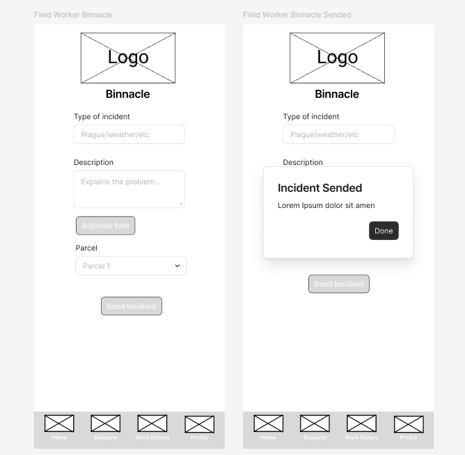

# Capítulo V: Solution UI/UX Design

---

## 5.1. Product design

### 5.1.1. Style Guidelines

En esta sección, presentaremos el concepto de diseño para la página web y la aplicación móvil, para proporcionar a nuestros usuarios una interfaz amigable y funcional. Con este propósito en mente, hemos optado por utilizar elementos visuales que sean fáciles de percibir y que resulten atractivos a la vista.

#### 5.1.1.1. General Style Guidelines

Nuestra paleta de colores está inspirada en el entorno vitivinícola artesanal, integrando tonos que evocan la tierra, la vid, la tradición y la tecnología. La combinación de colores cromáticos y acromáticos permite construir una interfaz visualmente armoniosa, funcional y con identidad propia.

A continuación, se presenta una breve descripción de los colores que se utilizarán en nuestra aplicación:

**Chromatic Colors:**

#8B0000 (Vino Tinto): Este tono profundo representa la esencia del vino artesanal. Se utiliza para encabezados, botones destacados y elementos de identidad visual, transmitiendo pasión y tradición vitivinícola.

  

#556B2F (Verde Oliva): Inspirado en el follaje de la vid, este verde aporta un aire natural y equilibrado. Ideal para botones activos y elementos de navegación que requieran conexión con lo rural.

  

#5D4037 (Marrón Bodega): Evoca la madera de barricas y estructuras rústicas de las bodegas. Se usa en contenedores o secciones que requieren solidez y profundidad visual.

  

#CFAE75 (Oro Antiguo): Remite a lo clásico y lo valioso, como premios o herencia vinícola. Se aplica en distintivos de calidad y logros destacados.

  

#DAA520 (Dorado Metálico): Un tono brillante que transmite sofisticación. Se usa en badges o acciones premium para reforzar el valor percibido.

  

#FF7700 (Anaranjado): Vibrante y cálido, este color es ideal para llamadas a la acción o mensajes informativos sin ser intrusivo.

  

#32CD32 (Verde Lima): Energético y fresco, se utiliza para estados exitosos o notificaciones positivas, promoviendo una sensación de avance y productividad.

  

#FF6347 (Rojo Tomate): Utilizado para errores o advertencias, este color mantiene la calidez sin perder visibilidad y claridad en su función.

  

Estos colores reflejan la esencia viva del campo, la uva, el vino y los materiales naturales presentes en el día a día del productor artesanal.

**Achromatic Colors:**

#F5F5DC (Beige Suave): Un color neutro y cálido que recuerda etiquetas artesanales y materiales orgánicos. Se emplea como fondo base para mejorar la legibilidad sin fatigar la vista.

  

#708090 (Gris Pizarra): Este gris azulado se emplea para textos secundarios, divisores y fondos neutros. Aporta elegancia, estructura y profesionalismo sin restar protagonismo a los colores principales.

  

#FFFFFF / #000000 (Blanco / Negro): Utilizados para mantener un alto contraste y legibilidad. Blancos en fondos y negros para textos principales, adaptados a diversos contextos de luz en entornos rurales.

  

**Icon**

  

El ícono de ElixirLine representa el corazón de la producción vitivinícola artesanal: un barril de madera tradicional, símbolo de trabajo manual, tradición y del tiempo necesario para alcanzar la excelencia en cada cosecha.

En el centro del barril se encuentra una botella de vino de color representativo del vino tinto, que refleja la esencia del producto final y la pasión que acompaña todo el proceso. Esta botella transmite claridad de propósito, calidad y compromiso con la autenticidad.

El diseño combina la estética rústica del mundo rural con un enfoque moderno y minimalista, utilizando formas simples pero significativas.

  

### 5.1.2. Information Architecture

Esta sección se enfoca en los elementos esenciales de contenido visual, estilos, etiquetas, y más, que se considerarán en el desarrollo de aplicación móvil y la landing page.

#### 5.1.2.1. Organization Systems

1. **Visual Organization of Content**

- **Jerárquica (Visual Hierarchy):**
    - Aplicación Móvil:
        - Pantalla principal muestra primero:
            - Actividades agrícolas o de vinificación programadas para hoy.
            - Acciones rápidas: registrar nueva tarea o acceder al calendario.
        - Área secundaria para: historial de tareas, gestión de lotes, reportes y configuración.
    - Landing Page:
        - Sección "Who we are" y misión de ElixirLine.
        - Beneficios destacados para vinicultores y trabajadores.
        - Testimonios.
        - Preguntas frecuentes.
        - Sección de Contacto y Ubicación
        - Footer con enlaces a contacto, políticas y redes sociales.

- **Secuencial (Step-by-Step Process):**
    - Proceso para registrar una tarea agrícola o de bodega:
        1. Seleccionar tipo de actividad (poda, riego, cosecha, fermentación, etc.).
        2. Indicar fecha, lote y trabajador asignado.
        3. Añadir insumos o herramientas utilizadas.
        4. Confirmar y guardar.
        5. Visualizar resumen en el historial o generar reporte.

- **Matricial (Matrix Organization):**
    - Vista de actividades por lote y por fase del proceso (campo y bodega): permite comparar el avance o estado de diferentes lotes según tareas realizadas, responsables o fechas, en una cuadrícula interactiva.

2. **Categorization Schemes**

- **Alfabético:** Listado de insumos y tareas organizadas alfabéticamente para facilitar su selección durante el registro.

- **Cronológico:** Historial de actividades agrícolas y de bodega organizado de la más reciente a la más antigua, accesible desde la sección de reportes.

- **Por Tópicos:**
    - Sección de ayuda dividida en categorías como:
        1. Registro de tareas
        2. Uso de la app sin conexión
        3. Sincronización de datos
        4. Gestión de usuarios

- **Según Audiencia:**
    - En la Landing Page:
        - Segmento para vinicultores (“Optimiza la gestión de tu viñedo artesanal”).
        - Segmento para trabajadores de campo (“Tareas claras, registro fácil”).
    - Durante el onboarding en la app:
        - Contenido adaptado según si el usuario es responsable de bodega, de campo o supervisor técnico.

#### 5.1.2.2. Labelling Systems

Para garantizar la simplicidad y evitar la confusión entre visitantes y usuarios, hemos definido un sistema de etiquetado claro, consistente y basado en el mínimo número de palabras posible.  
Todas las etiquetas fueron diseñadas para ser intuitivas y facilitar la navegación, la búsqueda y el entendimiento inmediato de las funcionalidades del sistema.

**1. Principios a seguir:**

- Uso de palabras cortas, claras y específicas.
- Consistencia de términos entre la Landing Page y la Mobile App.
- Asociación directa entre las etiquetas y la acción o información representada.
- Evitar tecnicismos innecesarios o frases ambiguas.
- Uso de términos universales y en inglés.

**2. Etiquetas Principales**

<table>
  <thead>
    <tr>
      <th>Plataforma</th>
      <th>Sección</th>
      <th>Etiqueta</th>
      <th>Descripción</th>
    </tr>
  </thead>
  <tbody>
    <tr>
      <td>Landing Page</td>
      <td>Home</td>
      <td>Home</td>
      <td>Página principal de bienvenida</td>
    </tr>
    <tr>
      <td>Landing Page</td>
      <td>About Us</td>
      <td>About Us</td>
      <td>Información sobre la app y propósito de ElixirLine</td>
    </tr>
    <tr>
      <td>Landing Page</td>
      <td>Pricing</td>
      <td>Pricing</td>
      <td>Planes y precios del servicio</td>
    </tr>
    <tr>
      <td>Landing Page</td>
      <td>Team Members</td>
      <td>Our Team</td>
      <td>Presentación del equipo de desarrollo</td>
    </tr>
    <tr>
      <td>Landing Page</td>
      <td>Testimonials</td>
      <td>Testimonials</td>
      <td>Opiniones de usuarios reales</td>
    </tr>
    <tr>
      <td>Landing Page</td>
      <td>FAQ</td>
      <td>FAQ</td>
      <td>Preguntas frecuentes sobre uso y funcionamiento</td>
    </tr>
    <tr>
      <td>Landing Page</td>
      <td>Login</td>
      <td>Sign In</td>
      <td>Ingreso de usuario registrado</td>
    </tr>
    <tr>
      <td>Landing Page</td>
      <td>Register</td>
      <td>Sign Up</td>
      <td>Registro de nuevo usuario</td>
    </tr>
    <tr>
      <td>Mobile App</td>
      <td>Dashboard</td>
      <td>Dashboard</td>
      <td>Vista principal con tareas programadas</td>
    </tr>
    <tr>
      <td>Mobile App</td>
      <td>Activities</td>
      <td>Tasks</td>
      <td>Listado y registro de tareas agrícolas o de bodega</td>
    </tr>
    <tr>
      <td>Mobile App</td>
      <td>Lots</td>
      <td>Lots</td>
      <td>Gestión de lotes/productores asociados</td>
    </tr>
    <tr>
      <td>Mobile App</td>
      <td>Inputs</td>
      <td>Inputs</td>
      <td>Registro y seguimiento de insumos</td>
    </tr>
    <tr>
      <td>Mobile App</td>
      <td>Calendar</td>
      <td>Calendar</td>
      <td>Visualización de tareas por día o mes</td>
    </tr>
    <tr>
      <td>Mobile App</td>
      <td>Reports</td>
      <td>Reports</td>
      <td>Generación y consulta de reportes</td>
    </tr>
    <tr>
      <td>Mobile App</td>
      <td>Offline Mode</td>
      <td>Offline Mode</td>
      <td>Funcionalidad para trabajar sin conexión</td>
    </tr>
    <tr>
      <td>Mobile App</td>
      <td>Profile</td>
      <td>Profile</td>
      <td>Información personal y preferencias del usuario</td>
    </tr>
    <tr>
      <td>Mobile App</td>
      <td>Support Center</td>
      <td>Support Center</td>
      <td>Centro de ayuda y soporte técnico</td>
    </tr>
    <tr>
      <td>Mobile App</td>
      <td>Settings</td>
      <td>Settings</td>
      <td>Configuraciones generales de la aplicación</td>
    </tr>
    <tr>
      <td>Mobile App</td>
      <td>Log Out</td>
      <td>Log Out</td>
      <td>Cierre de sesión del usuario</td>
    </tr>
  </tbody>
</table>

**3. Asociaciones entre Etiquetas:**

- Home lleva a About Us, Pricing, Testimonials y Our Team como extensiones para conocer el producto.
- Sign In y Sign Up están asociadas a la conversión del visitante en usuario registrado de la Mobile App.
- Dashboard se conecta directamente con Tasks, Calendar y Inputs para el manejo diario de la producción.
- Lots y Inputs se relacionan para una trazabilidad completa de cada cultivo o proceso de vinificación.
- Reports se vincula con Calendar y Tasks para generar información consolidada de las actividades.
- Support Center complementa el FAQ para brindar ayuda ante problemas o consultas técnicas.

El sistema de etiquetado garantiza rapidez de navegación, reducción del esfuerzo cognitivo y consistencia en todo el ecosistema digital, permitiendo a los visitantes y usuarios adaptarse intuitivamente tanto en la Landing Page como en la aplicación móvil de ElixirLine.

#### 5.1.2.3. SEO Tags and Meta Tags

Para mejorar la visibilidad del sitio web de <strong>ElixirLine</strong> en motores de búsqueda y garantizar una correcta visualización en dispositivos móviles, se definieron un conjunto de <strong>etiquetas SEO (Search Engine Optimization)</strong> y <strong>metaetiquetas</strong> esenciales. Estas etiquetas optimizan el posicionamiento orgánico, mejoran la experiencia de navegación e incrementan la tasa de conversión al reflejar claramente el propósito de la plataforma.

<h4>A. Web SEO Tags (Landing Page)</h4>

<table>
  <thead>
    <tr>
      <th>Etiqueta</th>
      <th>Contenido propuesto</th>
      <th>Función</th>
    </tr>
  </thead>
  <tbody>
    <tr>
      <td>&lt;title&gt;</td>
      <td>ElixirLine – From the grape to the bottle</td>
      <td>Título que aparece en la pestaña del navegador y resultados de búsqueda</td>
    </tr>
    <tr>
      <td>&lt;meta name="description"&gt;</td>
      <td>Mobile platform to manage artisanal winemaking – plan, assign, and track every task from field to bottle. Offline-ready and user-friendly.</td>
      <td>Resumen breve y convincente que aparece en buscadores; mejora el CTR</td>
    </tr>
    <tr>
      <td>&lt;meta name="keywords"&gt;</td>
      <td>ElixirLine, vineyard app, wine production, fieldwork tracking, artisan wine, agro technology</td>
      <td>Palabras clave relevantes que asocian la web a temas específicos</td>
    </tr>
    <tr>
      <td>&lt;meta name="author"&gt;</td>
      <td>MetaSoft Team – Universidad Peruana de Ciencias Aplicadas, 2025</td>
      <td>Indica el equipo creador del contenido</td>
    </tr>
    <tr>
      <td>&lt;meta name="viewport"&gt;</td>
      <td>width=device-width, initial-scale=1.0</td>
      <td>Garantiza un diseño adaptable y correcto en dispositivos móviles</td>
    </tr>
    <tr>
      <td>&lt;meta charset="UTF-8"&gt;</td>
      <td>UTF-8</td>
      <td>Permite el uso de caracteres internacionales (tildes, ñ, etc.)</td>
    </tr>
  </tbody>
</table>

Además de las incorporaciones de:
<ul>
  <li><strong>Etiquetas <code>alt</code></strong> descriptivas para imágenes, facilitando la accesibilidad y el SEO visual.</li>
  <li><strong>Open Graph Tags</strong> (<code>og:title</code>, <code>og:description</code>, <code>og:image</code>) para optimizar la apariencia del sitio al compartirlo en redes sociales.</li>
  <li><strong>Datos estructurados con schema.org</strong> para marcar elementos como testimonios, productos y preguntas frecuentes (FAQ).</li>
</ul>

<h4>B. App Store Optimization (ASO)</h4>

Como ElixirLine será también una aplicación móvil, se definieron elementos clave para su publicación y descubrimiento en tiendas digitales como Google Play Store y App Store.

<table>
  <thead>
    <tr>
      <th>Elemento ASO</th>
      <th>Valor propuesto</th>
    </tr>
  </thead>
  <tbody>
    <tr>
      <td>App Title</td>
      <td>ElixirLine: Vineyard & Wine Manager</td>
    </tr>
    <tr>
      <td>App Subtitle</td>
      <td>Plan, track and manage your artisanal winemaking process</td>
    </tr>
    <tr>
      <td>App Description</td>
      <td>ElixirLine is a mobile-first solution for small and medium wine producers. Organize vineyard tasks, record activities in the field—even offline—and monitor the entire winemaking cycle. Simple, reliable, and built for rural users.</td>
    </tr>
    <tr>
      <td>App Keywords</td>
      <td>winemaking, vineyard, task planner, agro app, field tracking, artisan wine, production manager</td>
    </tr>
    <tr>
      <td>Target Audience</td>
      <td>Artisanal wine producers, rural field workers, agricultural technicians</td>
    </tr>
    <tr>
      <td>Category</td>
      <td>Agriculture / Productivity</td>
    </tr>
    <tr>
      <td>Capturas sugeridas</td>
      <td>Interfaz de tareas, calendario agrícola, bitácora offline, vista de reportes</td>
    </tr>
    <tr>
      <td>Iconografía</td>
      <td>Barril rústico con botella central (símbolo visual de tradición + tecnología)</td>
    </tr>
  </tbody>
</table>

La combinación de etiquetas SEO web y elementos ASO móviles garantiza una experiencia optimizada de descubrimiento, usabilidad y posicionamiento de ElixirLine en todos los canales digitales.

#### 5.1.2.4. Searching Systems

En esta sección se definen los sistemas de búsqueda diseñados para evitar que los usuarios se sientan perdidos ante el volumen creciente de datos agrícolas y de producción dentro de <strong>ElixirLine</strong>. Se detallan los mecanismos disponibles tanto en la <strong>aplicación móvil</strong> como en la <strong>landing page</strong>, los filtros incluidos, y el formato de visualización posterior a la búsqueda.

<h4>A. Aplicación Móvil / WebApp</h4>

<strong>Objetivo:</strong> Permitir al vinicultor o trabajador de campo localizar tareas, lotes, insumos o reportes de manera rápida, incluso sin conexión constante a internet.

<table>
  <thead>
    <tr>
      <th>Funcionalidad</th>
      <th>Descripción</th>
      <th>Filtros disponibles</th>
      <th>Visualización del resultado</th>
    </tr>
  </thead>
  <tbody>
    <tr>
      <td>Buscador global</td>
      <td>Campo de búsqueda en el dashboard que permite encontrar tareas, lotes o insumos por nombre.</td>
      <td>Tipo (actividad / insumo / lote) Fecha de registro Estado (pendiente / en curso / completado)</td>
      <td>Listado interactivo con tarjetas resumen. Al hacer clic, lleva al detalle de la actividad o lote.</td>
    </tr>
    <tr>
      <td>Búsqueda por lote</td>
      <td>Permite visualizar todas las actividades asociadas a un lote específico.</td>
      <td>Rango de fechas Tipo de tarea (riego, poda, fermentación)</td>
      <td>Vista tipo cronograma / lista filtrada por lote, con indicadores de estado por tarea.</td>
    </tr>
    <tr>
      <td>Historial de tareas</td>
      <td>Funcionalidad tipo "bitácora digital" que permite filtrar actividades pasadas.</td>
      <td>Responsable asignado Estado de ejecución Fecha</td>
      <td>Tabla o vista tipo timeline con íconos por tipo de tarea y colores por estado.</td>
    </tr>
    <tr>
      <td>Modo offline</td>
      <td>Permite buscar entre registros locales sin necesidad de conexión.</td>
      <td>Palabra clave + filtros básicos (tipo, estado)</td>
      <td>Resultados locales mostrados de forma similar a la vista online, con ícono de "sincronización pendiente".</td>
    </tr>
  </tbody>
</table>

<h4>B. Landing Page</h4>

<strong>Objetivo:</strong> Facilitar el acceso a secciones clave del sitio (planes, equipo, preguntas frecuentes, contacto) sin que el visitante se sienta perdido.

<table>
  <thead>
    <tr>
      <th>Funcionalidad</th>
      <th>Descripción</th>
      <th>Filtros disponibles</th>
      <th>Visualización del resultado</th>
    </tr>
  </thead>
  <tbody>
    <tr>
      <td>Buscador de navegación</td>
      <td>Campo tipo "search bar" en el header (por implementar) para ubicar contenido de la landing.</td>
      <td>Título o palabra clave Sección objetivo (FAQ, Testimonios, Suscripciones, Contacto)</td>
      <td>Auto-scroll a la sección buscada con animación suave.</td>
    </tr>
    <tr>
      <td>Preguntas frecuentes</td>
      <td>Sección FAQ dividida por categorías de consulta (uso, planes, soporte).</td>
      <td>Palabras clave o selección de categoría</td>
      <td>Despliegue tipo acordeón con la respuesta directa resaltada.</td>
    </tr>
  </tbody>
</table>

El diseño de estos sistemas de búsqueda responde a criterios de simplicidad, rapidez y eficiencia en contextos rurales. Se prioriza una <strong>navegación intuitiva y la visualización resumida de resultados</strong>, permitiendo al usuario acceder al contenido deseado con el menor número de pasos posibles.

#### 5.1.2.5. Navigation Systems

En esta sección se describen las <strong>acciones y técnicas</strong> que guiarán a los usuarios a través del <strong>Landing Page</strong> y de la <strong>aplicación móvil</strong> de <strong>ElixirLine</strong>, permitiéndoles recorrer el contenido, interactuar fluidamente con el sistema y cumplir sus objetivos sin perderse. Las decisiones de navegación fueron pensadas para usuarios con poca experiencia digital y para contextos rurales, donde la simplicidad y claridad de recorrido son esenciales.

<h4>A. Aplicación Móvil</h4>

<table>
  <thead>
    <tr>
      <th>Elemento de Navegación</th>
      <th>Descripción</th>
      <th>Beneficio para el Usuario</th>
    </tr>
  </thead>
  <tbody>
    <tr>
      <td>Barra de navegación inferior (tab bar)</td>
      <td>Accesos rápidos a Dashboard, Tasks, Calendar, Reports y Profile</td>
      <td>Permite moverse entre funcionalidades clave con un solo toque</td>
    </tr>
    <tr>
      <td>Menú lateral (hamburger)</td>
      <td>Para acceder a secciones complementarias como Configuración, Ayuda o Contacto</td>
      <td>Organiza funciones secundarias sin saturar la vista principal</td>
    </tr>
    <tr>
      <td>Navegación jerárquica</td>
      <td>Ej. Desde Dashboard → Lista de tareas → Detalle de tarea → Editar</td>
      <td>Facilita el seguimiento lógico y progresivo de las actividades</td>
    </tr>
    <tr>
      <td>Breadcrumbs</td>
      <td>Indicadores que muestran en qué parte del flujo está el usuario</td>
      <td>Evitan la desorientación y permiten regresar fácilmente</td>
    </tr>
    <tr>
      <td>Modo offline con navegación local</td>
      <td>Permite moverse entre secciones aunque no haya conexión</td>
      <td>Brinda autonomía al usuario en zonas sin internet</td>
    </tr>
  </tbody>
</table>

<h4>B. Landing Page</h4>

<table>
  <thead>
    <tr>
      <th>Elemento de Navegación</th>
      <th>Descripción</th>
      <th>Beneficio para el Usuario</th>
    </tr>
  </thead>
  <tbody>
    <tr>
      <td>Menú superior anclado (sticky nav)</td>
      <td>Contiene enlaces a Home, About, Pricing, Testimonials, FAQ y Contact</td>
      <td>Permite moverse rápidamente entre secciones clave desde cualquier parte de la página</td>
    </tr>
    <tr>
      <td>Scroll fluido (smooth scroll)</td>
      <td>El desplazamiento entre secciones ocurre de forma animada</td>
      <td>Mejora la orientación y hace más agradable el recorrido</td>
    </tr>
    <tr>
      <td>Botones de llamada a la acción (CTA)</td>
      <td>“Start free trial”, “Contáctanos”, “Ver planes”, ubicados estratégicamente</td>
      <td>Guían al usuario hacia conversiones deseadas como registro o contacto</td>
    </tr>
    <tr>
      <td>Footer con enlaces repetidos</td>
      <td>Accesos a Contacto, Soporte, Políticas, Redes sociales y Suscripción</td>
      <td>Facilita la navegación desde el final de la página</td>
    </tr>
    <tr>
      <td>Botón flotante de cambio de idioma</td>
      <td>Selector de idiomas (ES / EN) siempre visible</td>
      <td>Mejora la accesibilidad para diferentes audiencias</td>
    </tr>
  </tbody>
</table>

El sistema de navegación de ElixirLine está diseñado para ser <strong>intuitivo, predecible y accesible</strong>, asegurando que los usuarios puedan recorrer el contenido y utilizar la plataforma sin requerir experiencia previa en herramientas digitales complejas. Se guía al usuario paso a paso a través del flujo de valor, reduciendo la carga cognitiva y facilitando una interacción satisfactoria con el producto.

### 5.1.3. Landing Page UI Design
#### 5.1.3.1. Landing Page Wireframe
 

Link del Figma: https://www.figma.com/design/HjARGXSkBMmx8xQAX2oL9F/ElixirLine---Dise%C3%B1o-UI-UX?node-id=0-1

#### 5.1.3.2. Landing Page Mock-up

Link del Figma: https://www.figma.com/design/HjARGXSkBMmx8xQAX2oL9F/ElixirLine---Dise%C3%B1o-UI-UX?node-id=1-2

### 5.1.4. Mobile Applications UX/UI Design
#### 5.1.4.1. Mobile Applications Wireframes

**Auth View**

 

**Dashboard View**

 
 

**Binnacle View**

 

**History View**

 

**Winebatch View**

 

**Management View**

 

**Profile View**

 

**Notification settings**

**Edit Profile**

**Delete Profile**

Link del Figma: https://www.figma.com/design/HjARGXSkBMmx8xQAX2oL9F/ElixirLine---Dise%C3%B1o-UI-UX?node-id=1-5
#### 5.1.4.2. Mobile Applications Wireflow Diagrams
#### 5.1.4.3. Mobile Applications Mock-ups
**Auth View**

 

**Dashboard View**

 
 

**Binnacle View**

 

**History View**

 

**Winebatch View**

 

**Management View**

 

**Profile View**

 

Link del Figma: https://www.figma.com/design/HjARGXSkBMmx8xQAX2oL9F/ElixirLine---Dise%C3%B1o-UI-UX?node-id=1-6

#### 5.1.4.4. Mobile Applications User Flow Diagrams
#### 5.1.4.5. Mobile Applications Prototyping

